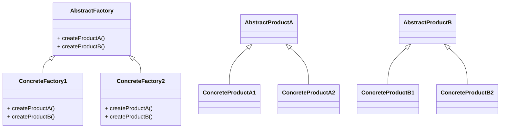

# Abstract Factory
> Version: dp_20231231_202019

- [Builder Design Pattern](#builder-design-pattern)
   * [Summary](#summary)
      + [Essence](#essence)
      + [Real examples](#real-examples)
   * [Implementation](#implementation)
      + [How to use it?](#how-to-use-it)
      + [Python code examples:](#python-code-examples)
   * [Analysis](#analysis)
      + [Cleaner Code?](#cleaner-code)
      + [Readable Code?](#readable-code)
      + [Replaceable code?](#replaceable-code)
      + [Testable code?](#testable-code)
      + [Advantages?](#advantages)
      + [Disadvantages?](#disadvantages)
   * [Remarks](#remarks)
      + [Concerns and Tips?](#concerns-and-tips)
      + [Execrises](#execrises)

## Summary

### Essence
The Abstract Factory design pattern provides an interface for creating families of related or dependent objects without specifying their concrete classes. It encapsulates the creation of objects, promoting loose coupling and flexibility. It improves code cleanliness, readability, and testability. It allows for the easy substitution of different families of objects. It requires the definition of abstract factory and product interfaces, as well as the implementation of concrete factory and product classes.

### Real examples

- Creating objects that belong to a family or have dependencies on each other.
- Hiding the concrete classes of objects from the client code.
- Providing a way to easily switch between different families of objects.




## Implementation
### How to use it?
To use the Abstract Factory design pattern, follow these steps:
1. Define an abstract factory interface that declares the creation methods for the related products.
2. Implement concrete factory classes that implement the abstract factory interface and provide the concrete implementation of the creation methods.
3. Define abstract product classes that declare the interface for the products created by the factory.
4. Implement concrete product classes that inherit from the abstract product classes and provide the specific implementation of the products.
5. Use the abstract factory and product interfaces in the client code to create families of related objects without knowing their specific classes.

### Python code examples:
```python
from abc import ABC, abstractmethod

class AbstractFactory(ABC):
    @abstractmethod
    def create_product_a(self):
        pass

    @abstractmethod
    def create_product_b(self):
        pass

class ConcreteFactory1(AbstractFactory):
    def create_product_a(self):
        return ConcreteProductA1()

    def create_product_b(self):
        return ConcreteProductB1()

class ConcreteFactory2(AbstractFactory):
    def create_product_a(self):
        return ConcreteProductA2()

    def create_product_b(self):
        return ConcreteProductB2()

class AbstractProductA(ABC):
    @abstractmethod
    def operation_a(self):
        pass


class ConcreteProductA1(AbstractProductA):
    def operation_a(self):
        return 'ConcreteProductA1 operation'


class ConcreteProductA2(AbstractProductA):
    def operation_a(self):
        return 'ConcreteProductA2 operation'

class AbstractProductB(ABC):
    @abstractmethod
    def operation_b(self):
        pass


class ConcreteProductB1(AbstractProductB):
    def operation_b(self):
        return 'ConcreteProductB1 operation'


class ConcreteProductB2(AbstractProductB):
    def operation_b(self):
        return 'ConcreteProductB2 operation'


factory1 = ConcreteFactory1()
product_a1 = factory1.create_product_a()
product_b1 = factory1.create_product_b()

factory2 = ConcreteFactory2()
product_a2 = factory2.create_product_a()
product_b2 = factory2.create_product_b()

print(product_a1.operation_a())
print(product_b1.operation_b())
print(product_a2.operation_a())
print(product_b2.operation_b())
```

- The Abstract Factory design pattern provides an interface for creating families of related objects without specifying their concrete classes. It promotes loose coupling, code cleanliness, and testability.   


## Analysis
### Cleaner Code?

- Encapsulates the creation of objects, reducing complexity and hiding details from the client code.
- Promotes the Single Responsibility Principle by separating object creation from the client code.
- Makes the code more flexible and maintainable by allowing the creation of objects without specifying their concrete classes.

### Readable Code?

- Provides a clear and consistent way to create objects, improving code readability.
- Abstracts the creation of objects, making the code easier to understand.
- Allows the client code to focus on the functionality of the objects rather than their creation.

### Replaceable code?

- Promotes loose coupling by abstracting the creation of objects.
- The client code depends only on the abstract factory and product interfaces, not on the concrete classes.
- Allows for the easy substitution of different families of objects.

### Testable code?

- Decouples the client code from the concrete classes of objects, making it easier to test.
- Allows for the use of mock objects in unit tests.
- Promotes dependency injection, making it easier to replace concrete factories and products with test doubles.

### Advantages?

- Provides a way to create families of related objects without specifying their concrete classes.
- Promotes loose coupling between the client code and the concrete classes of objects.
- Allows for the easy substitution of different families of objects.
- Enhances code flexibility and maintainability.
- Improves code readability and understandability.

### Disadvantages?

- May increase the number of classes and interfaces.
- May introduce additional complexity, especially with a large number of product families.
- Requires the creation of multiple concrete factory and product classes.


## Remarks
### Concerns and Tips?

- Consider the complexity and size of the project before using the Abstract Factory pattern.
- Use meaningful names for the abstract factory and product interfaces to improve code readability.
- Follow the Single Responsibility Principle when designing the concrete factory and product classes.
- Consider using a dependency injection container to manage object creation.
- The relationship between abstract factory, concrete factories, abstract products, and concrete products can be tricky to understand.
- Choosing the right level of abstraction for the interfaces can be challenging.
- Managing dependencies between concrete factories and products can be complex, especially with a large number of product families.
- The Abstract Factory pattern has been widely used in GUI frameworks, game development frameworks, and dependency injection containers.
- It has been proven to improve code flexibility, maintainability, and testability.


### Execrises

- Q: What is the purpose of the Abstract Factory design pattern?

  - A: The purpose of the Abstract Factory design pattern is to provide an interface for creating families of related or dependent objects without specifying their concrete classes.
- Q: How does the Abstract Factory design pattern promote loose coupling?

  - A: The Abstract Factory design pattern promotes loose coupling by abstracting the creation of objects. The client code depends only on the abstract factory and product interfaces, not on the concrete classes.
- Q: How does the Abstract Factory design pattern improve code readability?

  - A: The Abstract Factory design pattern improves code readability by providing a clear and consistent way to create objects. It abstracts the creation of objects, making the code more readable and easier to understand.
- Q: How does the Abstract Factory design pattern make code easier to test?

  - A: The Abstract Factory design pattern makes code easier to test by decoupling the client code from the concrete classes of objects. It allows for the use of mock objects in unit tests, as the client code only depends on the abstract factory and product interfaces.
- Q: What are the advantages of using the Abstract Factory design pattern?

  - A: The advantages of using the Abstract Factory design pattern include providing a way to create families of related objects without specifying their concrete classes, promoting loose coupling between the client code and the concrete classes, allowing for the easy substitution of different families of objects, enhancing code flexibility and maintainability, and improving code readability and understandability.
- Q: What are the disadvantages of using the Abstract Factory design pattern?

  - A: The disadvantages of using the Abstract Factory design pattern include an increase in the number of classes and interfaces, potential complexity when dealing with a large number of product families, and the need to create multiple concrete factory and product classes.
- Q: How can the Abstract Factory design pattern be used in a GUI framework?

  - A: In a GUI framework, an abstract factory can be used to create different types of UI elements such as buttons, text boxes, and checkboxes. Each concrete factory can create the specific type of UI elements for a particular operating system or theme.
- Q: How can the Abstract Factory design pattern be used in a game development framework?

  - A: In a game development framework, an abstract factory can be used to create different types of game objects such as characters, weapons, and enemies. Each concrete factory can create the specific type of game objects for a particular game genre or level.

