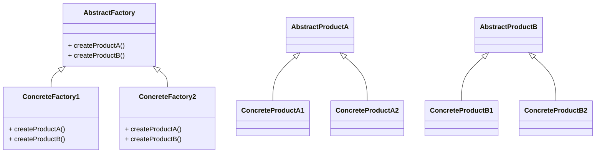

# Abstract Factory
> Version: dp_20231231_234226

- [Builder Design Pattern](#builder-design-pattern)
   * [Summary](#summary)
      + [Essence](#essence)
      + [Real examples](#real-examples)
   * [Implementation](#implementation)
      + [How to use it?](#how-to-use-it)
      + [Python code examples:](#python-code-examples)
   * [Analysis](#analysis)
      + [Cleaner Code?](#cleaner-code)
      + [Readable Code?](#readable-code)
      + [Replaceable code?](#replaceable-code)
      + [Testable code?](#testable-code)
      + [Advantages?](#advantages)
      + [Disadvantages?](#disadvantages)
   * [Remarks](#remarks)
      + [Concerns and Tips?](#concerns-and-tips)
      + [Execrises](#execrises)

## Summary

### Essence
The Abstract Factory design pattern provides an interface for creating families of related or dependent objects without specifying their concrete classes. It encapsulates the creation of objects into a single factory interface, allowing the client code to create objects without being aware of their concrete classes. This promotes loose coupling, scalability, code readability, and testability.

### Real examples

- Creating objects that belong to a family or have dependencies on each other.
- Hiding the concrete classes of the objects from the client code.
- Providing a way to create objects without specifying their concrete classes.




## Implementation
### How to use it?
To use the Abstract Factory design pattern, follow these steps:
1. Define an abstract factory interface that declares the creation methods for the related products.
2. Implement concrete factory classes that implement the abstract factory interface and provide the concrete implementation of the creation methods.
3. Define abstract product classes that declare the interface for the products created by the factory.
4. Implement concrete product classes that inherit from the abstract product classes and provide the concrete implementation of the product interface.
5. Use the factory interface to create the products, without being aware of their concrete classes.

### Python code examples:
```python
from abc import ABC, abstractmethod

class AbstractFactory(ABC):
    @abstractmethod
    def create_product_a(self):
        pass

    @abstractmethod
    def create_product_b(self):
        pass

class ConcreteFactory1(AbstractFactory):
    def create_product_a(self):
        return ConcreteProductA1()

    def create_product_b(self):
        return ConcreteProductB1()

class ConcreteFactory2(AbstractFactory):
    def create_product_a(self):
        return ConcreteProductA2()

    def create_product_b(self):
        return ConcreteProductB2()

class AbstractProductA(ABC):
    @abstractmethod
    def operation_a(self):
        pass

    @abstractmethod
    def operation_shared(self):
        pass

class ConcreteProductA1(AbstractProductA):
    def operation_a(self):
        return 'ConcreteProductA1.operation_a()'

    def operation_shared(self):
        return 'ConcreteProductA1.operation_shared()'

class ConcreteProductA2(AbstractProductA):
    def operation_a(self):
        return 'ConcreteProductA2.operation_a()'

    def operation_shared(self):
        return 'ConcreteProductA2.operation_shared()'

class AbstractProductB(ABC):
    @abstractmethod
    def operation_b(self):
        pass

    @abstractmethod
    def operation_shared(self):
        pass

class ConcreteProductB1(AbstractProductB):
    def operation_b(self):
        return 'ConcreteProductB1.operation_b()'

    def operation_shared(self):
        return 'ConcreteProductB1.operation_shared()'

class ConcreteProductB2(AbstractProductB):
    def operation_b(self):
        return 'ConcreteProductB2.operation_b()'

    def operation_shared(self):
        return 'ConcreteProductB2.operation_shared()'

factory1 = ConcreteFactory1()
product_a1 = factory1.create_product_a()
product_b1 = factory1.create_product_b()
print(product_a1.operation_a())
print(product_a1.operation_shared())
print(product_b1.operation_b())
print(product_b1.operation_shared())

factory2 = ConcreteFactory2()
product_a2 = factory2.create_product_a()
product_b2 = factory2.create_product_b()
print(product_a2.operation_a())
print(product_a2.operation_shared())
print(product_b2.operation_b())
print(product_b2.operation_shared())
```

- The Abstract Factory design pattern provides an interface for creating families of related objects without specifying their concrete classes. It promotes loose coupling, scalability, code readability, and testability.   


## Analysis
### Maintainability: 
To what extent is your code characterized by cleanliness and readability?
#### Cleaner Code?

- Encapsulates the creation of related objects into a single factory interface.
- Reduces dependencies and makes the code more modular and maintainable.

#### Readable Code?

- Provides a clear and consistent way to create objects.
- Hides the concrete classes from the client code, making it easier to understand and navigate.


### Testability: 
Can your code be methodically and comprehensively tested?


### Adaptability: 
How readily can your code be substituted or modified?
#### Replaceable code?

- Decouples the client code from the concrete classes of the objects.
- Allows the client code to work with the abstract factory interface, which can be implemented by different concrete factories without affecting the client code.


### Scalability:
Are your architectural components characterized by loose coupling?


### Tradeoffs:
#### Advantages?

- Provides a way to create families of related or dependent objects.
- Hides the concrete classes of the objects from the client code.
- Reduces dependencies and makes the code more modular and maintainable.
- Promotes loose coupling and scalability.
- Improves code readability and testability.

#### Disadvantages?

- Can introduce additional complexity, especially with a large number of product families or variants.
- Requires the creation of multiple classes for each product family or variant.
- May not be suitable for simple or small-scale applications.


## Remarks
### Concerns and Tips?

- Consider the complexity and number of product families or variants.
- Follow the Single Responsibility Principle when defining interfaces.
- Use meaningful names to improve code readability.
- Consider using dependency injection for flexibility and easier testing.
- Be aware of the potential increase in code size and development effort.
- Not suitable for simple or small-scale applications.


### Execrises

- Q: What is the purpose of the Abstract Factory design pattern?

  - A: The purpose of the Abstract Factory design pattern is to provide an interface for creating families of related or dependent objects without specifying their concrete classes.
- Q: How does the Abstract Factory design pattern promote loose coupling?

  - A: The Abstract Factory design pattern promotes loose coupling by abstracting the creation of objects and hiding the concrete classes from the client code. It allows the client code to work with the abstract factory interface, which can be implemented by different concrete factories without affecting the client code.
- Q: How does the Abstract Factory design pattern improve code readability?

  - A: The Abstract Factory design pattern improves code readability by providing a clear and consistent way to create objects. It abstracts the creation logic and hides the concrete classes from the client code, making it easier to understand and navigate.
- Q: What are the advantages of using the Abstract Factory design pattern?

  - A: The advantages of using the Abstract Factory design pattern are:
- Provides a way to create families of related or dependent objects.
- Hides the concrete classes of the objects from the client code.
- Allows the client code to work with the abstract factory interface, reducing dependencies and making the code more modular and maintainable.
- Promotes loose coupling and scalability by abstracting the creation of objects and allowing the addition of new product families or variants without modifying the existing client code.
- Improves code readability and testability by providing a clear and consistent way to create objects.
- Q: What are the disadvantages of using the Abstract Factory design pattern?

  - A: The disadvantages of using the Abstract Factory design pattern are:
- Can introduce additional complexity, especially when dealing with a large number of product families or variants.
- Requires the creation of multiple classes for each product family or variant, which can increase the code size and development effort.
- May not be suitable for simple or small-scale applications where the creation of objects is straightforward and does not require abstraction.

