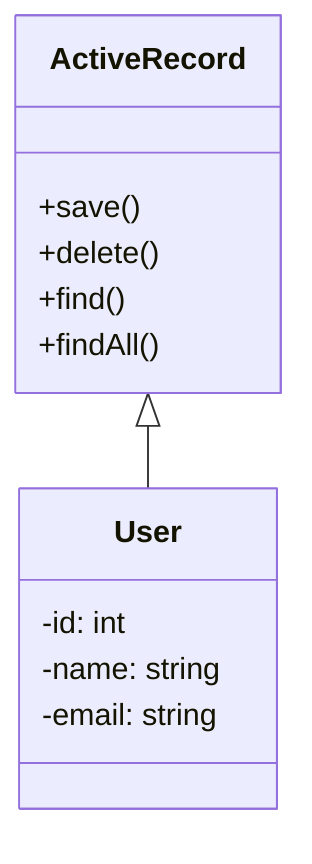

# Active Record
> Version: dp_20231231_202019

- [Builder Design Pattern](#builder-design-pattern)
   * [Summary](#summary)
      + [Essence](#essence)
      + [Real examples](#real-examples)
   * [Implementation](#implementation)
      + [How to use it?](#how-to-use-it)
      + [Python code examples:](#python-code-examples)
   * [Analysis](#analysis)
      + [Cleaner Code?](#cleaner-code)
      + [Readable Code?](#readable-code)
      + [Replaceable code?](#replaceable-code)
      + [Testable code?](#testable-code)
      + [Advantages?](#advantages)
      + [Disadvantages?](#disadvantages)
   * [Remarks](#remarks)
      + [Concerns and Tips?](#concerns-and-tips)
      + [Execrises](#execrises)

## Summary

### Essence
The Active Record design pattern provides an object-oriented interface to a database table, encapsulating the data access logic within the domain object itself. It simplifies database operations, reduces the need for complex SQL queries, and improves code organization.

### Real examples

- Storing and retrieving user data in a database.
- Managing product inventory and stock levels.
- Logging and tracking system events.




## Implementation
### How to use it?
To use the Active Record design pattern, define a class for each table in the database, with each class representing a row in the table. The class should have methods for saving, deleting, finding, and retrieving all records.

### Python code examples:
```python
from sqlalchemy import Column, Integer, String
from sqlalchemy.ext.declarative import declarative_base

Base = declarative_base()

class User(Base):
    __tablename__ = 'users'

    id = Column(Integer, primary_key=True)
    name = Column(String)
    email = Column(String)

    def save(self):
        # Save the user to the database
        pass

    def delete(self):
        # Delete the user from the database
        pass

    @classmethod
    def find(cls, id):
        # Find a user by ID
        pass

    @classmethod
    def findAll(cls):
        # Find all users
        pass
```
   


## Analysis
### Cleaner Code?
Encapsulates the data access logic within the domain object, reducing the need for separate data access layers.

### Readable Code?
Performs database operations using object-oriented methods instead of complex SQL queries.

### Replaceable code?
Keeps the data access logic within the domain object, promoting loose coupling and making components easier to maintain and modify.

### Testable code?
Allows for easy testing of the domain logic by mocking or stubbing the database operations.

### Advantages?

- Simplifies database operations by providing an object-oriented interface.
- Reduces the need for writing complex SQL queries.
- Improves code organization and maintainability.
- Allows for easy testing of the domain logic.
- Provides a consistent and intuitive way to interact with the database.

### Disadvantages?

- Can lead to bloated domain objects if not properly managed.
- May not be suitable for complex database operations that require advanced SQL queries.
- Tight coupling between the domain objects and the database schema.


## Remarks
### Concerns and Tips?

- Tight coupling between domain objects and the database schema can make it difficult to change the database structure.
- Bloated domain objects can make the codebase harder to maintain and understand.
- Keep the domain objects focused on their core responsibilities and avoid adding unnecessary functionality.
- Use proper naming conventions for methods and attributes to improve code readability.
- Consider using a code generator or ORM tool to automate the generation of domain objects and database schema.


### Execrises

- Q: What is the purpose of the Active Record design pattern?

  - A: The purpose of the Active Record design pattern is to provide an object-oriented interface to a database table, allowing developers to perform database operations using objects instead of writing SQL queries directly.
- Q: How does the Active Record pattern help in making code clean?

  - A: The Active Record pattern encapsulates the data access logic within the domain object, reducing the need for separate data access layers and keeping the codebase organized.
- Q: What are the advantages of using the Active Record pattern?

  - A: Some advantages of using the Active Record pattern include simplifying database operations, reducing the need for complex SQL queries, improving code organization, and allowing for easy testing of the domain logic.
- Q: What are the disadvantages of using the Active Record pattern?

  - A: Some disadvantages of using the Active Record pattern include the potential for bloated domain objects, limitations in handling complex database operations, and tight coupling between the domain objects and the database schema.

