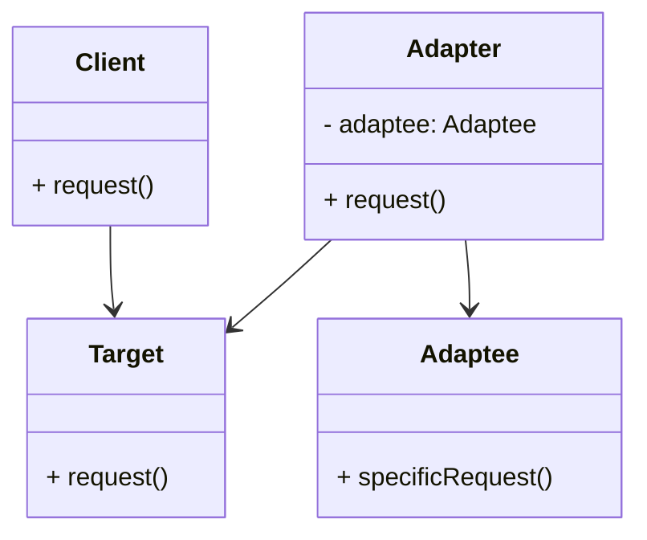

# Adapter Design Pattern
> Version: dp_20231231_202019

- [Builder Design Pattern](#builder-design-pattern)
   * [Summary](#summary)
      + [Essence](#essence)
      + [Real examples](#real-examples)
   * [Implementation](#implementation)
      + [How to use it?](#how-to-use-it)
      + [Python code examples:](#python-code-examples)
   * [Analysis](#analysis)
      + [Cleaner Code?](#cleaner-code)
      + [Readable Code?](#readable-code)
      + [Replaceable code?](#replaceable-code)
      + [Testable code?](#testable-code)
      + [Advantages?](#advantages)
      + [Disadvantages?](#disadvantages)
   * [Remarks](#remarks)
      + [Concerns and Tips?](#concerns-and-tips)
      + [Execrises](#execrises)

## Summary

### Essence
The Adapter design pattern converts the interface of a class into another interface that clients expect. It allows classes with incompatible interfaces to work together.

### Real examples

- Adapting a third-party library to work with your codebase.
- Converting data from one format to another.
- Wrapping a legacy system with a modern interface.
- Integrating different components with incompatible interfaces.




## Implementation
### How to use it?
To use the Adapter design pattern, follow these steps:
1. Identify the incompatible interfaces between the client and the adaptee.
2. Create an interface (target) that the client expects.
3. Implement the target interface in an adapter class.
4. Create an instance of the adaptee class.
5. In the adapter class, delegate the calls from the target interface to the adaptee object.
6. Use the adapter object in the client code to interact with the adaptee object through the target interface.

### Python code examples:
```python

# Adaptee class

class Adaptee:
    def specific_request(self):
        return 'Adaptee specific request'


# Target interface

class Target:
    def request(self):
        pass


# Adapter class

class Adapter(Target):
    def __init__(self, adaptee):
        self.adaptee = adaptee

    def request(self):
        return self.adaptee.specific_request()


# Client code

adaptee = Adaptee()
adapter = Adapter(adaptee)
result = adapter.request()
print(result)  # Output: 'Adaptee specific request'

```

- The Python code example demonstrates the Adapter design pattern. It includes an Adaptee class, a Target interface, and an Adapter class that implements the Target interface and delegates the calls to the Adaptee object. The client code interacts with the Adaptee object through the Adapter object.   


## Analysis
### Cleaner Code?

- Separates the client code from the adaptee code, improving code organization.
- Allows the client code to work with multiple adaptee implementations without modifying the client code.
- Encapsulates the complexity of adapting the adaptee interface, making the client code simpler and cleaner.

### Readable Code?

- Clearly defines the interface that the client code expects, making the code more self-explanatory.
- Makes it easier for other developers to understand and work with the code, as they only need to interact with the target interface.

### Replaceable code?

- Enables loose coupling between the client and adaptee, allowing for flexibility in changing or replacing the adaptee without affecting the client code.

### Testable code?

- Allows for easier unit testing of the client code, as the adapter can be mocked or replaced with a test double.
- Enables testing of the adaptee code in isolation, as it can be tested separately from the client code.

### Advantages?

- Enables the integration of incompatible components or systems.
- Allows for the reuse of existing code without modifying it.
- Improves code organization and separation of concerns.
- Enhances code readability and maintainability.
- Facilitates unit testing and testability of the code.

### Disadvantages?

- Introduces an additional layer of abstraction, which can increase complexity.
- May result in a performance overhead due to the need for additional method calls.
- Can lead to a proliferation of adapter classes if there are many incompatible interfaces.


## Remarks
### Concerns and Tips?

- Considerations: The adapter pattern may introduce additional complexity and indirection.
- Design: Adapting complex or large-scale systems may require careful planning and design.
- Performance: The performance impact of the additional method calls should be considered in performance-critical applications.
- Tips: Identify the incompatible interfaces early in the design process.
- Tips: Use clear and descriptive names for the adapter class and methods.
- Tips: Consider using dependency injection to decouple the client code from the adapter implementation.
- Tips: Test the adapter class thoroughly to ensure it correctly adapts the adaptee interface.
- Tips: Document the adapter class and its usage to facilitate understanding and maintenance.
- Tricky: Choosing the right level of abstraction for the target interface can be challenging.
- Tricky: Handling complex or incompatible interfaces may require additional design considerations.
- Tricky: Balancing the trade-off between code simplicity and performance overhead can be tricky.
- Study: [Refactoring Guru](https://refactoring.guru/design-patterns/adapter)
- Study: [SourceMaking](https://sourcemaking.com/design_patterns/adapter)
- Study: [Tutorialspoint](https://www.tutorialspoint.com/design_pattern/adapter_pattern.htm)


### Execrises

- Q: What is the purpose of the Adapter design pattern?

  - A: The purpose of the Adapter design pattern is to convert the interface of a class into another interface that clients expect.
- Q: How does the Adapter pattern help in making code clean?

  - A: The Adapter pattern separates the client code from the adaptee code, improves code organization, and encapsulates the complexity of adapting the adaptee interface.
- Q: How does the Adapter pattern help in making code readable?

  - A: The Adapter pattern clearly defines the interface that the client code expects, making the code more self-explanatory and easier for other developers to understand and work with.
- Q: How does the Adapter pattern help in making code easy to be tested?

  - A: The Adapter pattern allows for easier unit testing of the client code by enabling the adapter to be mocked or replaced with a test double. It also enables testing of the adaptee code in isolation.
- Q: How does the Adapter pattern help in making components loose couple?

  - A: The adapter acts as an intermediary between the client and the adaptee, decoupling them from each other. The client code only depends on the target interface, not the concrete implementation of the adaptee.
- Q: What are the advantages of using the Adapter pattern?

  - A: The advantages of using the Adapter pattern include the integration of incompatible components or systems, reuse of existing code, improved code organization and readability, and facilitation of unit testing and testability.
- Q: What are the disadvantages of using the Adapter pattern?

  - A: The disadvantages of using the Adapter pattern include increased complexity due to an additional layer of abstraction, potential performance overhead, and the possibility of a proliferation of adapter classes.
- Q: Can you give an example of a real product usage of the Adapter pattern?

  - A: One example is adapting a third-party library to work with your codebase.
- Q: What are some common use cases of the Adapter pattern?

  - A: Some common use cases of the Adapter pattern include converting data formats, wrapping legacy systems with modern interfaces, and integrating components with incompatible interfaces.

