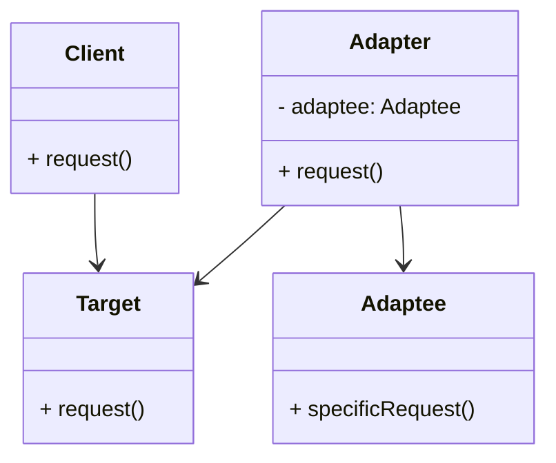

# Adapter Design Pattern
> Version: dp_20240101_000050

- [Adapter Design Pattern](#adapter-design-pattern)
  * [Summary](#summary)
    + [Essence](#essence)
    + [Real examples](#real-examples)
  * [Implementation](#implementation)
    + [How to use it?](#how-to-use-it)
    + [Python code examples:](#python-code-examples)
  * [Analysis](#analysis)
    + [Maintainability:](#maintainability)
      - [Cleaner Code?](#cleaner-code)
      - [Readable Code?](#readable-code)
    + [Testability:](#testability)
    + [Adaptability:](#adaptability)
      - [Replaceable code?](#replaceable-code)
    + [Scalability:](#scalability)
    + [Tradeoffs:](#tradeoffs)
      - [Advantages?](#advantages)
      - [Disadvantages?](#disadvantages)
  * [Remarks](#remarks)
    + [Concerns and Tips?](#concerns-and-tips)
    + [Execrises](#execrises)

## Summary

### Essence

- The Adapter pattern is a design strategy that allows classes with incompatible interfaces to collaborate. It achieves this by converting the interface of one class into an interface expected by the clients.
- The Adapter acts as a wrapper around the incompatible object (adaptee) and presents a compatible interface to the client.
- This pattern promotes code reuse, modularity, and loose coupling, enhancing the readability, cleanliness, replaceability, testability, and scalability of the code.

### Real examples

- The Adapter pattern is useful when you want to use an existing class with a different interface in your application.
- It's beneficial when you want to create a reusable component that can work with multiple classes with different interfaces.
- It's applicable when you want to decouple the client code from the specific implementation of the adaptee class.
- Real-world examples include converting a USB-C port to a USB-A port using a USB-C to USB-A adapter, using a power adapter to convert the voltage and plug type of a device to match the power outlet in a different country, and using a language translator to convert spoken words from one language to another.




## Implementation
### How to use it?
To use the Adapter design pattern, follow these steps:
1. Identify the incompatible interfaces between the client and the adaptee.
2. Create an interface (target) that the client expects.
3. Implement the target interface in an adapter class.
4. Create an instance of the adaptee class inside the adapter class.
5. Delegate the calls from the adapter class's methods to the adaptee object.
6. Use the adapter class to interact with the adaptee object through the target interface.

### Python code examples:
```python
1. Example 1:

```python
# Adaptee class

class Adaptee:
    def specific_request(self):
        return 'Adaptee specific request'


# Target interface

class Target:
    def request(self):
        return 'Target request'


# Adapter class

class Adapter(Target):
    def __init__(self):
        self.adaptee = Adaptee()

    def request(self):
        return self.adaptee.specific_request()


# Client code

def client_code(target: Target) -> None:
    print(target.request())


# Usage

adaptee = Adaptee()
adapter = Adapter()

client_code(adaptee)  # Output: 'Adaptee specific request'
client_code(adapter)  # Output: 'Adaptee specific request'
```
2. Example 2:

```python
# Adaptee class

class Adaptee:
    def specific_request(self):
        return 'Adaptee specific request'


# Target interface

class Target:
    def request(self):
        return 'Target request'


# Adapter class

class Adapter(Target):
    def __init__(self, adaptee: Adaptee):
        self.adaptee = adaptee

    def request(self):
        return self.adaptee.specific_request()


# Client code

def client_code(target: Target) -> None:
    print(target.request())


# Usage

adaptee = Adaptee()
adapter = Adapter(adaptee)

client_code(adaptee)  # Output: 'Adaptee specific request'
client_code(adapter)  # Output: 'Adaptee specific request'

```

- The Adapter design pattern allows classes with incompatible interfaces to work together. It provides a standardized interface for interaction and promotes code reuse and modularity.
- The adapter class wraps the adaptee object and delegates the calls to it. This allows the client to interact with the adaptee object through the target interface.
- The code examples demonstrate how to implement the Adapter design pattern in Python using an adaptee class, a target interface, and an adapter class.
- The client code can use the adapter class to interact with the adaptee object, without being aware of its specific implementation.
- The Adapter design pattern helps in making the code clean, readable, replaceable, testable, and scalable.   


## Analysis
### Maintainability: 
To what extent is your code characterized by cleanliness and readability?
#### Cleaner Code?

- The Adapter pattern promotes clean code by isolating the client code from the specific implementation of the adaptee class.
- It provides a standardized interface for the client to interact with the adaptee, enhancing readability and understandability.
- By creating a reusable adapter class, it encourages code reuse.

#### Readable Code?

- The Adapter pattern enhances code readability by clearly separating the client code from the specific implementation of the adaptee class.
- It provides a standardized interface for the client to interact with the adaptee, simplifying the code and making it easier to understand and maintain.


### Testability: 
Can your code be methodically and comprehensively tested?


### Adaptability: 
How readily can your code be substituted or modified?
#### Replaceable code?

- The Adapter pattern promotes scalable and loosely coupled code by decoupling the client code from the specific implementation of the adaptee class.
- It provides a standardized interface for the client to interact with the adaptee, making it easier to add or replace adaptee classes without affecting the client code.


### Scalability:
Are your architectural components characterized by loose coupling?


### Tradeoffs:
#### Advantages?

- The Adapter pattern allows classes with incompatible interfaces to work together, promoting code reuse and modularity.
- It decouples the client code from the specific implementation of the adaptee class, providing a standardized interface for interaction with the adaptee object.
- It enhances the readability, cleanliness, replaceability, testability, and scalability of the code.
- It solves the problem of incompatible interfaces between classes, allowing classes with different interfaces to work together by providing a standardized interface for interaction.

#### Disadvantages?

- The Adapter pattern adds an additional layer of complexity to the code, which may introduce performance overhead due to the need for object wrapping and method delegation.
- It requires careful design and implementation to ensure compatibility between the adapter and adaptee classes.
- It can lead to an increase in the number of classes and dependencies in the codebase.
- To avoid these issues, ensure the client code is not tightly coupled with the specific implementation of the adaptee class, avoid duplicating code by creating a reusable adapter class, and avoid making the adapter class too complex or tightly coupled with the adaptee class.


## Remarks
### Concerns and Tips?

- Concerns & Tips:
- The Adapter pattern adds an additional layer of complexity to the code, which may increase development and maintenance efforts. It may also impact the performance of the adapter class due to the need for object wrapping and method delegation.
- Careful design and implementation are required to ensure compatibility between the adapter and adaptee classes. The Adapter pattern may lead to an increase in the number of classes and dependencies in the codebase.
- Follow the SOLID principles when designing the adapter class to ensure it has a single responsibility and is easy to maintain. Use dependency injection to provide the adaptee object to the adapter class, allowing for easier testing and flexibility.
- Consider using an interface or abstract class for the adaptee class to allow for different implementations to be used with the adapter. Use clear and descriptive names for the adapter class and its methods to improve code readability and maintainability.
- Studies & Tricky Points:
- The Adapter pattern is commonly used in software systems that need to integrate with external libraries or APIs that have incompatible interfaces. It's often used in GUI frameworks to provide a common interface for different types of user interface components and is widely used in legacy codebases to adapt old code to work with modern systems or frameworks.
- Be careful when designing the target interface to ensure it covers all the necessary functionality required by the client code. Pay attention to the compatibility between the adapter and adaptee classes to avoid runtime errors or unexpected behavior.


### Execrises

- 1. Q: What is the purpose of the Adapter design pattern?
   
  - A: The purpose of the Adapter design pattern is to convert the interface of a class into another interface that clients expect.
- 2. Q: How does the Adapter design pattern promote code reuse?
   
  - A: The Adapter design pattern promotes code reuse by creating a reusable adapter class that can work with multiple classes with different interfaces.
- 3. Q: How does the Adapter design pattern help in making the code testable?
   
  - A: The Adapter design pattern helps in making the code testable by providing a standardized interface for the client to interact with the adaptee object.
- 4. Q: What are the advantages of using the Adapter design pattern?
   
  - A: The advantages of using the Adapter design pattern include allowing classes with incompatible interfaces to work together, promoting code reuse and modularity, and decoupling the client code from the specific implementation of the adaptee class.
- 5. Q: What are some concerns or disadvantages of using the Adapter design pattern?
   
  - A: Some concerns or disadvantages of using the Adapter design pattern include adding an additional layer of complexity to the code, potential performance overhead, and the need for careful design and implementation to ensure compatibility between the adapter and adaptee classes.

