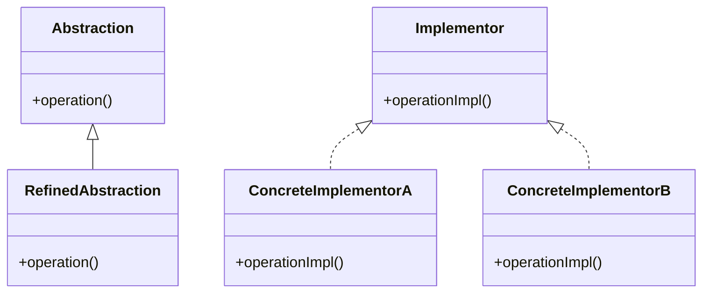

# Bridge Design Pattern
> Version: dp_20231231_202019

- [Builder Design Pattern](#builder-design-pattern)
   * [Summary](#summary)
      + [Essence](#essence)
      + [Real examples](#real-examples)
   * [Implementation](#implementation)
      + [How to use it?](#how-to-use-it)
      + [Python code examples:](#python-code-examples)
   * [Analysis](#analysis)
      + [Cleaner Code?](#cleaner-code)
      + [Readable Code?](#readable-code)
      + [Replaceable code?](#replaceable-code)
      + [Testable code?](#testable-code)
      + [Advantages?](#advantages)
      + [Disadvantages?](#disadvantages)
   * [Remarks](#remarks)
      + [Concerns and Tips?](#concerns-and-tips)
      + [Execrises](#execrises)

## Summary

### Essence
The Bridge design pattern decouples an abstraction from its implementation, allowing them to vary independently. This promotes code modularity, extensibility, and improved readability.

### Real examples

- In a GUI framework, the Bridge pattern can be used to separate the high-level windowing system from the low-level windowing system. This allows the windowing system to be easily replaced or extended without affecting the rest of the framework.
- In a remote control application, the Bridge pattern can be used to separate the remote control device from the controlled device. This allows different types of remote control devices to be used with different types of controlled devices.
- In a database driver, the Bridge pattern can be used to separate the database-specific code from the generic database access code. This allows the database driver to be easily replaced or extended without affecting the rest of the application.

## Implementation
### How to use it?
To use the Bridge design pattern, follow these steps:
1. Identify the abstraction and its implementation that need to be decoupled.
2. Create an abstraction interface that defines the operations that the abstraction can perform.
3. Create concrete implementations of the abstraction interface.
4. Create a bridge interface that connects the abstraction and its implementation.
5. Implement the bridge interface in the concrete implementations.
6. Use the abstraction interface to perform operations, without being aware of the specific implementation.

## Analysis
### Cleaner Code?

- Separates the abstraction from its implementation, making the code more modular and easier to understand.
- Promotes the Single Responsibility Principle by separating the responsibilities of the abstraction and its implementation into separate classes.
- Allows for easier code maintenance and extensibility, as changes to the implementation do not affect the abstraction or other parts of the code.

### Readable Code?

- Improves code readability by clearly separating the abstraction from its implementation.
- Provides a clear structure and organization, making it easier to understand the code.
- Allows for easier navigation and comprehension of the code, as the responsibilities are clearly defined and separated.

### Replaceable code?

- Promotes loose coupling by separating the abstraction from its implementation.
- Allows for the abstraction and implementation to vary independently, making it easier to replace or extend either without affecting the other.
- Reduces dependencies between the abstraction and its implementation, making the code more flexible and maintainable.

### Testable code?

- Makes code easier to test by decoupling the abstraction from its implementation.
- Allows for easier mocking and stubbing of the implementation, making it easier to isolate and test the abstraction.
- Promotes testability by separating the concerns of the abstraction and its implementation, making it easier to write focused and targeted tests.

### Advantages?

- Decouples the abstraction from its implementation, allowing them to vary independently.
- Promotes code modularity and extensibility.
- Improves code readability and maintainability.
- Enables easy replacement or extension of the implementation.
- Supports the Single Responsibility Principle.
- Facilitates code testing and testability.

### Disadvantages?

- Adds complexity to the code structure.
- Requires additional classes and interfaces.
- May introduce overhead due to the indirection between the abstraction and its implementation.
- Requires careful design and consideration of the abstraction and implementation relationship.

## Remarks
### Concerns and Tips?

- One concern with the Bridge pattern is the potential for increased complexity and overhead.
- Another concern is the need for careful design and consideration of the abstraction and implementation relationship.
- It is important to ensure that the abstraction and implementation are properly aligned and that changes to one do not affect the other.
- When using the Bridge pattern, focus on defining clear and concise interfaces for the abstraction and implementation.
- Use dependency injection to decouple the abstraction from its implementation.
- Consider using a factory pattern to create the bridge and the concrete implementations.
- Keep the bridge interface and the abstraction interface as simple as possible to avoid unnecessary complexity.
- Test the abstraction and its implementation separately to ensure they work correctly together.
- One tricky aspect of the Bridge pattern is determining the right level of abstraction and the right level of implementation.
- Another tricky aspect is managing the dependencies between the abstraction and its implementation.
- It is important to design the bridge interface and the abstraction interface in a way that allows for easy extension and modification.

### Execrises

- Q: What is the purpose of the Bridge design pattern?

  - A: The purpose of the Bridge design pattern is to decouple an abstraction from its implementation so that the two can vary independently.
- Q: How does the Bridge pattern promote clean code?

  - A: The Bridge pattern promotes clean code by separating the abstraction from its implementation, allowing for modularity, extensibility, and improved readability.
- Q: What are the advantages of using the Bridge pattern?

  - A: The advantages of using the Bridge pattern include decoupling of abstraction and implementation, code modularity, improved readability, easy replacement or extension of the implementation, support for the Single Responsibility Principle, and facilitation of code testing and testability.
- Q: What are the disadvantages of using the Bridge pattern?

  - A: The disadvantages of using the Bridge pattern include increased complexity, additional classes and interfaces, potential overhead, and the need for careful design and consideration of the abstraction and implementation relationship.
- Q: How does the Bridge pattern promote loose coupling?

  - A: The Bridge pattern promotes loose coupling by separating the abstraction from its implementation, allowing them to vary independently and reducing dependencies between them.
- Q: What are some real usage examples of the Bridge pattern?

  - A: Some real usage examples of the Bridge pattern include GUI frameworks, remote control applications, and database drivers.
- Q: How does the Bridge pattern help in making code easy to be tested?

  - A: The Bridge pattern makes code easy to be tested by decoupling the abstraction from its implementation, allowing for easier mocking and stubbing of the implementation and promoting testability.
- Q: What are some programming tips for using the Bridge pattern?

  - A: Some programming tips for using the Bridge pattern include defining clear and concise interfaces, using dependency injection, considering a factory pattern, keeping interfaces simple, and testing the abstraction and implementation separately.

