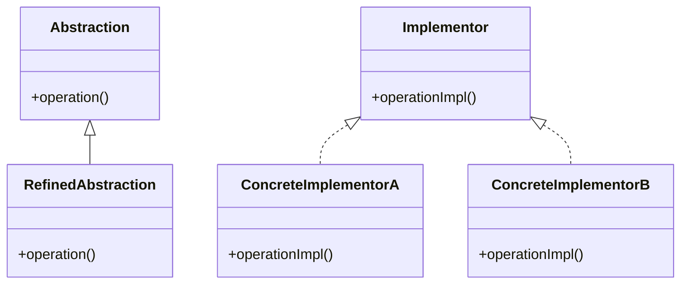

# Bridge Design Pattern
> Version: dp_20231231_234226

- [Builder Design Pattern](#builder-design-pattern)
   * [Summary](#summary)
      + [Essence](#essence)
      + [Real examples](#real-examples)
   * [Implementation](#implementation)
      + [How to use it?](#how-to-use-it)
      + [Python code examples:](#python-code-examples)
   * [Analysis](#analysis)
      + [Cleaner Code?](#cleaner-code)
      + [Readable Code?](#readable-code)
      + [Replaceable code?](#replaceable-code)
      + [Testable code?](#testable-code)
      + [Advantages?](#advantages)
      + [Disadvantages?](#disadvantages)
   * [Remarks](#remarks)
      + [Concerns and Tips?](#concerns-and-tips)
      + [Execrises](#execrises)

## Summary

### Essence
The Bridge design pattern separates the abstraction from its implementation, allowing them to vary independently. It promotes loose coupling and code reuse, improves code maintainability, extensibility, and testability. The purpose of the Bridge design pattern is to decouple an abstraction from its implementation so that the two can vary independently.

### Real examples

- In a GUI framework, the Bridge pattern can be used to separate the graphical components (abstraction) from the platform-specific code (implementation). This allows the components to be easily ported to different platforms without affecting the rest of the codebase.
- In a database driver, the Bridge pattern can be used to separate the high-level database operations (abstraction) from the low-level database-specific code (implementation). This allows the driver to support multiple database systems without changing the client code.
- When you want to decouple an abstraction from its implementation.
- When you want to have multiple implementations of an abstraction.
- When you want to hide the implementation details from the client code.
- When you want to change the implementation of an abstraction at runtime.




## Implementation
### How to use it?
To use the Bridge design pattern, follow these steps:
1. Identify the abstraction and implementation classes.
2. Create an abstraction interface that defines the operations.
3. Create concrete implementations of the abstraction interface.
4. Create a bridge class that connects the abstraction and implementation.
5. Use the bridge class to decouple the abstraction from its implementation.

### Python code examples:
```python

# Abstraction

class Shape:
    def __init__(self, color):
        self.color = color

    def draw(self):
        pass


# Implementations

class RedColor:
    def apply_color(self):
        return 'red'


class BlueColor:
    def apply_color(self):
        return 'blue'


# Refined Abstractions

class Circle(Shape):
    def draw(self):
        return f'Drawing a circle in {self.color.apply_color()} color'


class Square(Shape):
    def draw(self):
        return f'Drawing a square in {self.color.apply_color()} color'


# Usage

red_circle = Circle(RedColor())
print(red_circle.draw())  # Output: 'Drawing a circle in red color'

blue_square = Square(BlueColor())
print(blue_square.draw())  # Output: 'Drawing a square in blue color'

```

- The Bridge pattern allows for decoupling an abstraction from its implementation. In this example, the Shape abstraction is separated from the color implementation, allowing different shapes to be drawn with different colors.   


## Analysis
### Maintainability: 
To what extent is your code characterized by cleanliness and readability?
#### Cleaner Code?

- The Bridge pattern helps in making the code clean by separating the abstraction from its implementation. This allows the code to be more modular and easier to understand.
- It promotes the Single Responsibility Principle by separating the responsibilities of the abstraction and implementation into separate classes.
- It allows for easier maintenance and extensibility of the codebase, as changes to the implementation do not affect the abstraction.

#### Readable Code?

- The Bridge pattern improves code readability by clearly separating the abstraction from its implementation.
- It makes it easier to understand the codebase as the responsibilities of the abstraction and implementation are clearly defined.
- It allows for easier navigation and comprehension of the code, as the implementation details are encapsulated within the implementation classes.


### Testability: 
Can your code be methodically and comprehensively tested?


### Adaptability: 
How readily can your code be substituted or modified?
#### Replaceable code?

- The Bridge pattern helps in making the code replaceable by decoupling the abstraction from its implementation.
- It allows for easy swapping of different implementations of the abstraction without affecting the client code.
- It promotes code reuse by allowing the same abstraction to be used with different implementations.


### Scalability:
Are your architectural components characterized by loose coupling?


### Tradeoffs:
#### Advantages?

- Decouples the abstraction from its implementation, allowing them to vary independently.
- Promotes code reuse by allowing the same abstraction to be used with different implementations.
- Improves code maintainability and extensibility by encapsulating the implementation details.
- Enhances code readability and understandability by separating the responsibilities of the abstraction and implementation.
- Facilitates unit testing and mocking of the abstraction and implementation classes.
- Solves the problem of coupling an abstraction to its implementation.

#### Disadvantages?

- Adds complexity to the codebase by introducing additional classes and relationships.
- Requires careful design and planning to ensure the proper separation of the abstraction and implementation.
- May result in increased development time and effort due to the need for creating and managing the bridge classes.
- Avoids tight coupling between the abstraction and its implementation.
- Avoids code duplication by promoting code reuse.
- Avoids the need to modify the client code when changing the implementation of the abstraction.


## Remarks
### Concerns and Tips?

- The Bridge pattern may introduce additional complexity and overhead to the codebase.
- It requires careful design and planning to ensure the proper separation of the abstraction and implementation.
- The bridge classes may become a bottleneck if not properly designed and implemented.
- Start by identifying the abstraction and implementation classes.
- Define an abstraction interface that defines the operations.
- Implement concrete implementations of the abstraction interface.
- Create a bridge class that connects the abstraction and implementation.
- Use the bridge class to decouple the abstraction from its implementation.
- Test the code by mocking the dependencies and verifying the behavior of the abstraction and implementation classes.
- It can be challenging to determine the right level of abstraction and the appropriate number of bridge classes.
- Care must be taken to ensure that the abstraction and implementation are properly synchronized and compatible.
- The Bridge pattern may not be suitable for simple systems with only one implementation of the abstraction.
- The Bridge pattern is widely used in software development to decouple abstractions from their implementations.
- It has been successfully applied in various domains, including GUI frameworks, database drivers, and networking libraries.
- Many popular programming languages and frameworks provide built-in support for the Bridge pattern, such as Java's AWT and Swing libraries.


### Execrises

- Q: What is the purpose of the Bridge design pattern?

  - A: The purpose of the Bridge design pattern is to decouple an abstraction from its implementation so that the two can vary independently.
- Q: How does the Bridge pattern improve code maintainability?

  - A: The Bridge pattern improves code maintainability by encapsulating the implementation details and allowing for easy modification or replacement of the implementation without affecting the abstraction.
- Q: Can you give an example of a real product that uses the Bridge pattern?

  - A: One example is a GUI framework that separates the graphical components (abstraction) from the platform-specific code (implementation), allowing for easy portability to different platforms.
- Q: What are the advantages of using the Bridge pattern?

  - A: The advantages of using the Bridge pattern include decoupling of the abstraction and implementation, code reuse, improved maintainability and extensibility, enhanced readability and understandability, and easier unit testing and mocking.
- Q: What are the disadvantages of using the Bridge pattern?

  - A: The disadvantages of using the Bridge pattern include increased complexity, the need for careful design and planning, and potential overhead due to the bridge classes.
- Q: How does the Bridge pattern promote code reuse?

  - A: The Bridge pattern promotes code reuse by allowing the same abstraction to be used with different implementations, making it easier to swap or add new implementations without modifying the client code.

