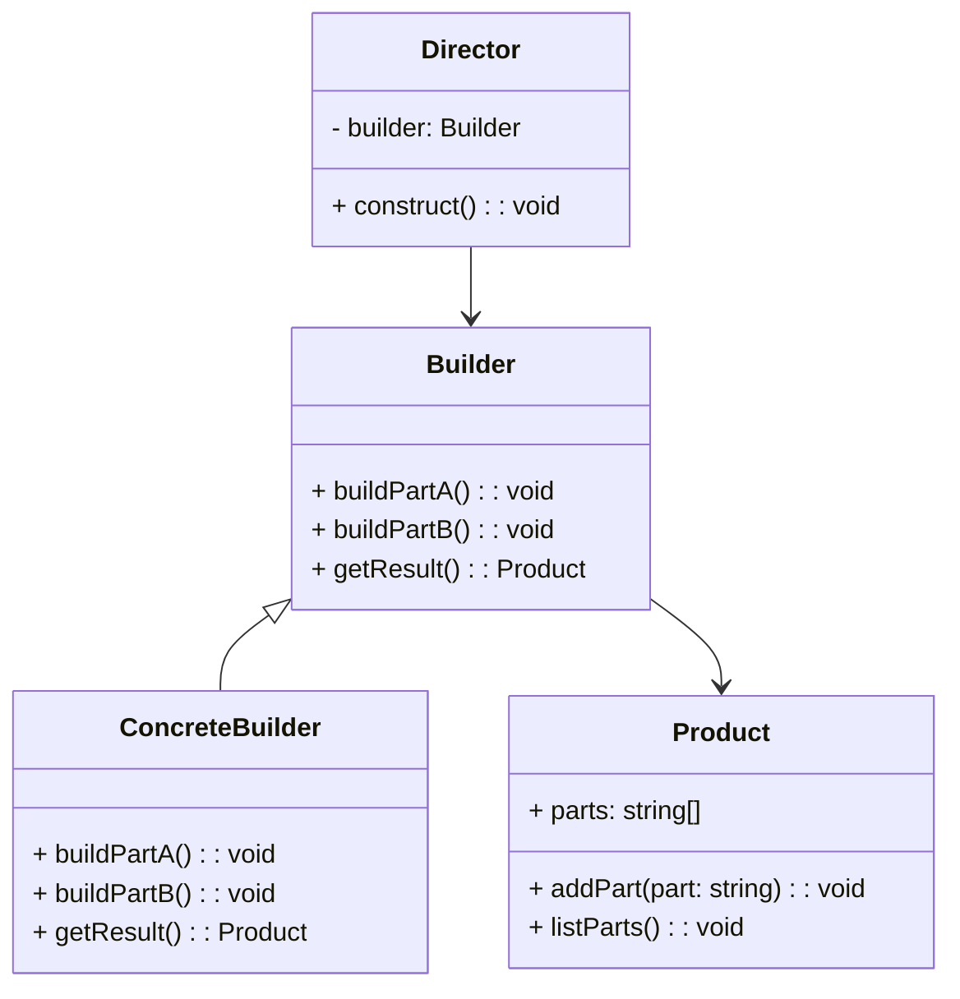

# Builder Design Pattern
> Version: dp_20240101_000050

- [Builder Design Pattern](#builder-design-pattern)
  * [Summary](#summary)
    + [Essence](#essence)
    + [Real examples](#real-examples)
  * [Implementation](#implementation)
    + [How to use it?](#how-to-use-it)
    + [Python code examples:](#python-code-examples)
  * [Analysis](#analysis)
    + [Maintainability:](#maintainability)
      - [Cleaner Code?](#cleaner-code)
      - [Readable Code?](#readable-code)
    + [Testability:](#testability)
    + [Adaptability:](#adaptability)
      - [Replaceable code?](#replaceable-code)
    + [Scalability:](#scalability)
    + [Tradeoffs:](#tradeoffs)
      - [Advantages?](#advantages)
      - [Disadvantages?](#disadvantages)
  * [Remarks](#remarks)
    + [Concerns and Tips?](#concerns-and-tips)
    + [Execrises](#execrises)

## Summary

### Essence
The Builder design pattern separates the construction of a complex object from its representation, allowing the same construction process to create different representations. It provides a step-by-step approach to construct the object, promoting code reuse, maintainability, testability, and scalability.

### Real examples

- Building a car: The Builder pattern can be used to construct a car object with different configurations, such as the type of engine, number of seats, and color.
- Creating a meal: The Builder pattern can be used to construct a meal object with different components, such as a main course, side dish, and dessert.
- Generating a report: The Builder pattern can be used to construct a report object with different sections, such as a title, header, body, and footer.




## Implementation
### How to use it?
To use the Builder design pattern, follow these steps:
1. Create a Builder interface or abstract class that defines the steps to construct the object.
2. Create concrete builder classes that implement the Builder interface and provide specific implementations for each step.
3. Create a Director class that controls the construction process by using a Builder object.
4. Use the Director to construct the object by calling the appropriate methods on the Builder.
5. Retrieve the constructed object from the Builder using a getResult() method.

### Python code examples:
```python
from abc import ABC, abstractmethod

class Builder(ABC):
    @abstractmethod
    def build_part_a(self):
        pass

    @abstractmethod
    def build_part_b(self):
        pass

    @abstractmethod
    def get_result(self):
        pass


class ConcreteBuilder(Builder):
    def __init__(self):
        self.product = Product()

    def build_part_a(self):
        self.product.add_part('Part A')

    def build_part_b(self):
        self.product.add_part('Part B')

    def get_result(self):
        return self.product


class Product:
    def __init__(self):
        self.parts = []

    def add_part(self, part):
        self.parts.append(part)

    def list_parts(self):
        print('Parts:', ', '.join(self.parts))


def main():
    director = Director()
    builder = ConcreteBuilder()
    director.construct(builder)
    product = builder.get_result()
    product.list_parts()


if __name__ == '__main__':
    main()
```
The code demonstrates the Builder pattern in Python. It defines a Builder interface, a ConcreteBuilder class, and a Product class. The Director class controls the construction process, and the main function demonstrates how to use the pattern.   


## Analysis
### Maintainability: 
To what extent is your code characterized by cleanliness and readability?
#### Cleaner Code?

- Separation of concerns: The Builder pattern separates the construction logic from the client code, resulting in cleaner and more maintainable code.
- Encapsulation of construction steps: Each step of the construction process is encapsulated in a separate method, making the code easier to understand and modify.
- Reusability: The Builder pattern allows the same construction process to be used for different representations of the object, promoting code reuse.

#### Readable Code?

- Clear and intuitive API: The Builder pattern provides a clear and intuitive API for constructing the object, making the code more readable and self-explanatory.
- Method chaining: The Builder pattern often uses method chaining, which allows the construction process to be expressed in a fluent and readable manner.


### Testability: 
Can your code be methodically and comprehensively tested?


### Adaptability: 
How readily can your code be substituted or modified?
#### Replaceable code?

- Flexibility in object creation: The Builder pattern allows the client code to specify the desired configuration of the object without knowing the specific steps involved in its construction. This makes it easier to replace or modify the construction process without affecting the client code.
- Easy substitution of builders: The Builder pattern allows different concrete builders to be used interchangeably, making it easy to replace or switch between different construction algorithms or strategies.


### Scalability:
Are your architectural components characterized by loose coupling?


### Tradeoffs:
#### Advantages?

- Separation of concerns: The Builder pattern separates the construction logic from the client code, resulting in cleaner and more maintainable code.
- Flexibility in object creation: The Builder pattern allows the client code to specify the desired configuration of the object without knowing the specific steps involved in its construction.
- Reusability: The Builder pattern allows the same construction process to be used for different representations of the object, promoting code reuse.
- Testability: The Builder pattern makes it easier to mock and test the construction process by providing a clear separation between the construction logic and the client code.
- Scalability: The Builder pattern allows new builders and construction steps to be added without modifying the existing code, making it easy to scale the construction process.
- Solves the problem of creating complex objects with multiple configuration options in a flexible and maintainable way.

#### Disadvantages?

- Increased complexity: The Builder pattern introduces additional classes and interfaces, which can increase the complexity of the codebase.
- Overhead: The Builder pattern requires the construction process to be executed step by step, which can introduce additional overhead compared to directly creating the object.
- Potential for inconsistent objects: If the client code does not correctly use the Builder pattern, it is possible to create inconsistent or incomplete objects.
- Avoid tightly coupling the construction logic with the client code.
- Avoid creating complex objects directly in the client code.
- Avoid modifying the existing code when adding new builders or construction steps.


## Remarks
### Concerns and Tips?

- Concerns:
- - The Builder pattern can introduce additional complexity to the codebase.
- - The construction process may have performance overhead compared to directly creating the object.
- - The pattern requires careful usage to avoid creating inconsistent or incomplete objects.
- Programming tips:
- - Use meaningful names for the Builder methods to make the code more readable.
- - Consider using method chaining to express the construction process in a fluent and readable manner.
- - Use the Builder pattern when the construction of an object is complex and involves multiple steps.
- Trickys:
- - Remember to call the appropriate methods on the Builder to construct the object.
- - Ensure that the client code uses the Builder pattern correctly to avoid creating inconsistent or incomplete objects.
- - Use the Director class to control the construction process and retrieve the constructed object from the Builder.
- Additional studies:
- - "Design Patterns: Elements of Reusable Object-Oriented Software" by Erich Gamma, Richard Helm, Ralph Johnson, and John Vlissides
- - "Head First Design Patterns" by Eric Freeman, Elisabeth Robson, Bert Bates, and Kathy Sierra


### Execrises

- Q: What is the purpose of the Builder design pattern?

  - A: The purpose of the Builder design pattern is to separate the construction of a complex object from its representation, allowing the same construction process to create different representations.
- Q: How does the Builder pattern help in making the code clean and maintainable?

  - A: The Builder pattern separates the construction logic from the client code, resulting in cleaner and more maintainable code. It also promotes code reuse and encapsulation of construction steps.
- Q: How does the Builder pattern help in making the code testable?

  - A: The Builder pattern makes it easier to mock and test the construction process by providing a clear separation between the construction logic and the client code. Each step of the construction process can be unit tested independently.
- Q: What are the advantages of using the Builder pattern?

  - A: The advantages of using the Builder pattern include separation of concerns, flexibility in object creation, reusability, testability, and scalability.
- Q: What are the disadvantages of using the Builder pattern?

  - A: The disadvantages of using the Builder pattern include increased complexity, potential overhead in the construction process, and the possibility of creating inconsistent objects if the pattern is not used correctly.

