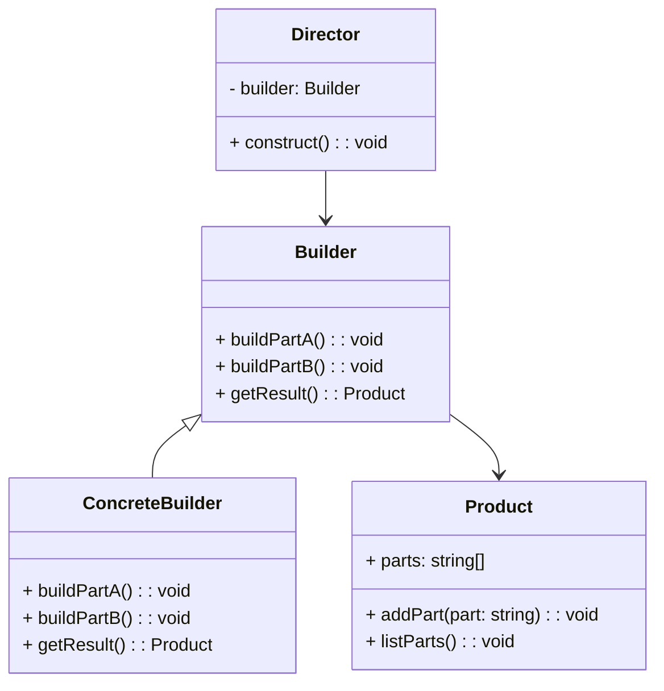

# Builder Design Pattern
> Version: dp_20231231_202019

- [Builder Design Pattern](#builder-design-pattern)
   * [Summary](#summary)
      + [Essence](#essence)
      + [Real examples](#real-examples)
   * [Implementation](#implementation)
      + [How to use it?](#how-to-use-it)
      + [Python code examples:](#python-code-examples)
   * [Analysis](#analysis)
      + [Cleaner Code?](#cleaner-code)
      + [Readable Code?](#readable-code)
      + [Replaceable code?](#replaceable-code)
      + [Testable code?](#testable-code)
      + [Advantages?](#advantages)
      + [Disadvantages?](#disadvantages)
   * [Remarks](#remarks)
      + [Concerns and Tips?](#concerns-and-tips)
      + [Execrises](#execrises)

## Summary

### Essence
The Builder design pattern separates the construction of a complex object from its representation. It provides a step-by-step approach to construct the object. The construction process is hidden from the client code. The Builder pattern helps in making the code clean, readable, and easy to test. It promotes loose coupling between components. The Builder pattern is useful when the construction process involves multiple steps and different representations.

### Real examples

- Building a car: The Builder pattern can be used to construct a car object with different configurations, such as engine type, color, and interior options.
- Creating a meal: The Builder pattern can be used to construct a meal object with different components, such as a main course, side dishes, and drinks.
- Generating a report: The Builder pattern can be used to construct a report object with different sections, such as a title, header, body, and footer.
- When the construction of an object involves multiple steps and complex logic.
- When the construction process needs to create different representations of the same object.
- When the construction process needs to be independent of the parts that make up the object.
- When the construction process needs to be flexible and extensible.




## Implementation
### How to use it?
To use the Builder design pattern:
1. Define the complex object that needs to be constructed.
2. Create an abstract Builder class with methods to build different parts of the object.
3. Create concrete Builder classes that implement the abstract Builder and provide specific implementations for building the parts.
4. Create a Director class that controls the construction process using the Builder.
5. Use the Director to construct the object by calling the appropriate methods on the Builder.
6. Retrieve the constructed object from the Builder.

### Python code examples:
```python
from abc import ABC, abstractmethod

class Builder(ABC):
    @abstractmethod
    def build_part_a(self):
        pass

    @abstractmethod
    def build_part_b(self):
        pass

    @abstractmethod
    def get_result(self):
        pass


class ConcreteBuilder(Builder):
    def __init__(self):
        self.product = Product()

    def build_part_a(self):
        self.product.add_part('Part A')

    def build_part_b(self):
        self.product.add_part('Part B')

    def get_result(self):
        return self.product


class Product:
    def __init__(self):
        self.parts = []

    def add_part(self, part):
        self.parts.append(part)

    def list_parts(self):
        print('Parts:', ', '.join(self.parts))


def main():
    director = Director()
    builder = ConcreteBuilder()

    director.construct(builder)
    product = builder.get_result()
    product.list_parts()


if __name__ == '__main__':
    main()
```
The Python code example demonstrates the implementation of the Builder design pattern. It defines an abstract Builder class, a concrete Builder class, and a Product class. The Director class controls the construction process, and the client code uses the Director and Builder to construct the object.   


## Analysis
### Cleaner Code?
The Builder design pattern encapsulates the construction logic in a separate Builder class, which allows the client code to focus on the high-level object creation without being concerned about the details of the construction process.

### Readable Code?
The Builder design pattern provides a clear and structured way to construct complex objects. The step-by-step approach makes it easy to understand the construction process and the different parts of the object being built.

### Replaceable code?
The Builder design pattern helps in making components loosely coupled by abstracting the construction process from the client code. The client code only interacts with the Builder interface, allowing different implementations of the Builder to be used without affecting the client code.

### Testable code?
The Builder design pattern makes the code easy to be tested by allowing the construction process to be separated from the object creation. This enables unit testing of the construction logic without the need to create the actual complex object.

### Advantages?

- Allows the construction of complex objects step by step.
- Provides flexibility to create different representations of the same object.
- Separates the construction logic from the client code.
- Makes the code more readable and maintainable.
- Enables easy testing of the construction logic.
- Solves the problem of constructing complex objects with multiple steps and different representations.

### Disadvantages?

- Increases the complexity of the code by introducing additional classes.
- Requires the implementation of multiple classes for each different representation of the object.
- May not be suitable for simple object construction scenarios.
- May introduce additional complexity to the code.
- May not be suitable for simple object construction scenarios.


## Remarks
### Concerns and Tips?

- Concerns:
- - The Builder pattern may introduce additional complexity to the code.
- - It may not be suitable for simple object construction scenarios.
- Programming Tips:
- - Use the Builder pattern when the construction process involves multiple steps and different representations.
- - Design the Builder interface to provide methods for building different parts of the object.
- - Implement concrete Builder classes to provide specific implementations for building the parts.
- - Use a Director class to control the construction process and retrieve the constructed object from the Builder.
- - Test the construction logic separately from the object creation.
- Trickys:
- - Understanding the separation of the construction process from the client code.
- - Implementing the abstract Builder class and the concrete Builder classes.
- - Managing the different parts and representations of the object being built.


### Execrises

- Q: What is the purpose of the Builder design pattern?

  - A: The purpose of the Builder design pattern is to separate the construction of a complex object from its representation, allowing the same construction process to create different representations.
- Q: How does the Builder pattern help in making the code clean?

  - A: The Builder pattern encapsulates the construction logic in a separate Builder class, which allows the client code to focus on the high-level object creation without being concerned about the details of the construction process.
- Q: How does the Builder pattern promote loose coupling?

  - A: The Builder pattern abstracts the construction process from the client code, allowing different implementations of the Builder to be used without affecting the client code.
- Q: What are the advantages of using the Builder pattern?

  - A: The advantages of using the Builder pattern include the ability to construct complex objects step by step, flexibility to create different representations of the same object, separation of construction logic from client code, improved code readability and maintainability, and easy testing of the construction logic.
- Q: What are the disadvantages of using the Builder pattern?

  - A: The disadvantages of using the Builder pattern include increased code complexity, the need for multiple classes for different representations of the object, and potential unsuitability for simple object construction scenarios.

