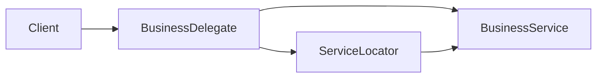

# Business Delegate
> Version: dp_20231231_202019

- [Builder Design Pattern](#builder-design-pattern)
   * [Summary](#summary)
      + [Essence](#essence)
      + [Real examples](#real-examples)
   * [Implementation](#implementation)
      + [How to use it?](#how-to-use-it)
      + [Python code examples:](#python-code-examples)
   * [Analysis](#analysis)
      + [Cleaner Code?](#cleaner-code)
      + [Readable Code?](#readable-code)
      + [Replaceable code?](#replaceable-code)
      + [Testable code?](#testable-code)
      + [Advantages?](#advantages)
      + [Disadvantages?](#disadvantages)
   * [Remarks](#remarks)
      + [Concerns and Tips?](#concerns-and-tips)
      + [Execrises](#execrises)

## Summary

### Essence
The Business Delegate design pattern separates the presentation layer from the business layer in a client-server application. It acts as a gateway between the client and the business layer, abstracting the details of the business services and providing a simplified interface for the client to interact with. This improves code modularity, reusability, testability, and readability.

### Real examples
1. Separating the presentation layer from the business layer in a client-server application.
2. Providing a centralized interface for the client to interact with the business layer.
3. Hiding the complexity of the underlying implementation from the client.
4. Improving the maintainability and flexibility of the application by decoupling the client from the business layer.




## Implementation
### How to use it?
To use the Business Delegate design pattern, follow these steps:
1. Create a Business Delegate class that acts as a gateway between the client and the business layer.
2. Implement the Business Delegate class to abstract the details of the business services and provide a simplified interface for the client.
3. Create a Service Locator class that is responsible for locating the business services.
4. Implement the business services and register them with the Service Locator.
5. In the client code, use the Business Delegate to interact with the business layer.

### Python code examples:
```python

from typing import List

# Business Delegate

class BusinessDelegate:
    def __init__(self, service_locator):
        self.service_locator = service_locator

    def do_task(self, task: str) -> None:
        service = self.service_locator.get_service()
        service.do_task(task)

# Business Service

class BusinessService:
    def do_task(self, task: str) -> None:
        print(f'Doing task: {task}')

# Service Locator

class ServiceLocator:
    def get_service(self) -> BusinessService:
        return BusinessService()

# Client

def main():
    service_locator = ServiceLocator()
    business_delegate = BusinessDelegate(service_locator)
    business_delegate.do_task('Task 1')

if __name__ == '__main__':
    main()

```

- The Python code example demonstrates the implementation of the Business Delegate design pattern. The Business Delegate acts as a gateway between the client and the business layer, abstracting the details of the business services. The Service Locator is responsible for locating the business services. The client code uses the Business Delegate to interact with the business layer.   


## Analysis
### Cleaner Code?
The Business Delegate design pattern helps in making clean code by separating the presentation layer from the business layer. This separation of concerns improves the modularity and maintainability of the codebase. It also eliminates code duplication by providing a centralized interface for the client to interact with the business layer.

### Readable Code?
The Business Delegate design pattern improves code readability by abstracting the details of the business services and providing a simplified interface for the client. This makes the code easier to understand and reduces cognitive load on the developers. It also encapsulates complex business logic behind the Business Delegate, allowing the client code to focus on high-level interactions.

### Replaceable code?
The Business Delegate design pattern promotes loose coupling between the client and the business layer. It introduces an intermediary component that abstracts the details of the services and allows for easy switching between different implementations. This improves maintainability and flexibility of the application.

### Testable code?
The Business Delegate design pattern makes the code easy to be tested by decoupling the client from the business layer. It allows for easier unit testing of the client code without complex setup and dependencies on the actual services. It also enables easier mocking and stubbing of the business services during testing.

### Advantages?
1. Separation of concerns: The Business Delegate separates the presentation layer from the business layer, improving modularity and maintainability.
2. Code reusability: It provides a centralized interface, eliminating duplicate code in multiple client components.
3. Flexibility: Easy switching between different implementations of the business services.
4. Testability: Decoupling allows for easier unit testing of the client code.

### Disadvantages?
1. Increased complexity: The introduction of an additional component adds complexity to the architecture.
2. Performance overhead: The use of the Business Delegate may introduce a performance overhead due to abstraction and indirection.
3. Potential for misuse: Improper implementation can lead to bottlenecks or unnecessary complexity.


## Remarks
### Concerns and Tips?
1. Concerns: Potential for misuse or overuse, performance overhead.
2. Programming tips: Use dependency injection, appropriate design patterns, and interfaces/abstract classes.
3. Tricky aspects: Proper implementation of the Service Locator, management of the Business Delegate instance in the client code.
4. Studies: Widely used in enterprise applications, leads to reduced coupling, improved code readability, and easier testing.


### Execrises

- 1. Q: What is the purpose of the Business Delegate design pattern?
   
  - A: The purpose of the Business Delegate design pattern is to separate the presentation layer from the business layer in a client-server application.
2. Q: How does the Business Delegate promote loose coupling?
   
  - A: The Business Delegate acts as a gateway between the client and the business layer, abstracting the details of the business services and allowing for easy switching between different implementations.
3. Q: What are the advantages of using the Business Delegate design pattern?
   
  - A: The advantages include separation of concerns, code reusability, flexibility, and testability.

