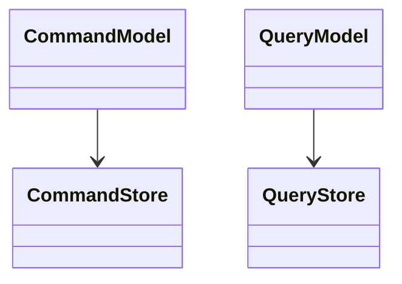

# CQRS (Command Query Responsibility Segregation)
> Version: dp_20231231_202019

- [Builder Design Pattern](#builder-design-pattern)
   * [Summary](#summary)
      + [Essence](#essence)
      + [Real examples](#real-examples)
   * [Implementation](#implementation)
      + [How to use it?](#how-to-use-it)
      + [Python code examples:](#python-code-examples)
   * [Analysis](#analysis)
      + [Cleaner Code?](#cleaner-code)
      + [Readable Code?](#readable-code)
      + [Replaceable code?](#replaceable-code)
      + [Testable code?](#testable-code)
      + [Advantages?](#advantages)
      + [Disadvantages?](#disadvantages)
   * [Remarks](#remarks)
      + [Concerns and Tips?](#concerns-and-tips)
      + [Execrises](#execrises)

## Summary

### Essence
CQRS is a design pattern that separates the read and write operations of an application into distinct models. This separation allows for better scalability, performance, and flexibility in handling complex business logic.

### Real examples

- E-commerce platforms: CQRS can be used to separate the write operations for managing product inventory and orders from the read operations for displaying product information and order history.
- Analytics systems: CQRS can be used to separate the write operations for collecting and processing raw data from the read operations for generating reports and visualizations.
- Social media platforms: CQRS can be used to separate the write operations for creating and updating posts from the read operations for displaying the user's feed and notifications.




## Implementation
### How to use it?
To use CQRS, you need to identify the read and write operations in your application and separate them into distinct models. Each model should have its own data store optimized for its specific purpose. The models can communicate through events or other mechanisms to keep them synchronized.

### Python code examples:
```python
from typing import List

# Command Model

class Order:
    def __init__(self, order_id: str, products: List[str]) -> None:
        self.order_id = order_id
        self.products = products

    def process(self) -> None:
        # Process the order
        pass

# Query Model

class OrderQuery:
    def get_order(self, order_id: str) -> Order:
        # Retrieve the order from the data store
        pass
```
The code example demonstrates the separation of the command model (Order) and the query model (OrderQuery) in a simple e-commerce application. The command model handles the processing of orders, while the query model retrieves orders from the data store.   


## Analysis
### Cleaner Code?
CQRS enforces a clear separation of concerns by dividing the application into distinct models for handling commands and queries. This separation improves code organization and maintainability.

### Readable Code?
CQRS improves code readability by providing explicit models for handling commands and queries. Developers can easily understand the purpose and responsibilities of each model.

### Replaceable code?
CQRS promotes loose coupling between the read and write models, allowing them to be developed and deployed independently. This flexibility makes it easier to replace or modify one model without affecting the other.

### Testable code?
CQRS makes code easier to test by isolating the write and read operations. Each model can be tested independently, ensuring that the business logic and data retrieval are functioning correctly.

### Advantages?

- Scalability: CQRS allows for scaling the read and write models independently based on their specific requirements.
- Performance: By optimizing the read and write models separately, CQRS can improve the performance of the application.
- Flexibility: CQRS provides flexibility in choosing different data stores and technologies for the read and write models.
- Maintainability: The separation of concerns in CQRS makes the codebase more maintainable and easier to understand.

### Disadvantages?

- Complexity: Implementing CQRS adds complexity to the application architecture and requires careful synchronization between the read and write models.
- Eventual consistency: CQRS may introduce eventual consistency between the read and write models, which can be challenging to handle in certain scenarios.
- Learning curve: Developers need to understand the concepts and principles of CQRS to effectively implement it in their applications.


## Remarks
### Concerns and Tips?

- Eventual consistency: CQRS may introduce eventual consistency between the read and write models, which can be a concern in applications requiring strong consistency.
- Increased complexity: Implementing CQRS adds complexity to the application architecture and may require additional effort for development and maintenance.
- Learning curve: Developers need to understand the concepts and principles of CQRS to effectively implement it in their applications.
- Programming tips: Start with a small, isolated part of the application to implement CQRS and gradually expand it to other areas if needed. Use event-driven architecture or other mechanisms to keep the read and write models synchronized. Consider the trade-offs between consistency and performance when designing the data stores for the read and write models.


### Execrises

- Q: What is the purpose of CQRS?

  - A: The purpose of CQRS is to separate the read and write operations of an application to improve scalability, performance, and flexibility.
- Q: How does CQRS help in making code clean?

  - A: CQRS enforces a clear separation of concerns by dividing the application into distinct models for handling commands and queries.
- Q: What are the advantages of using CQRS?

  - A: Some advantages of CQRS include scalability, performance, flexibility, and maintainability.
- Q: What are the disadvantages of using CQRS?

  - A: Some disadvantages of CQRS include increased complexity, eventual consistency, and a learning curve for developers.
- Q: How can CQRS be used in e-commerce platforms?

  - A: CQRS can be used to separate the write operations for managing product inventory and orders from the read operations for displaying product information and order history.

