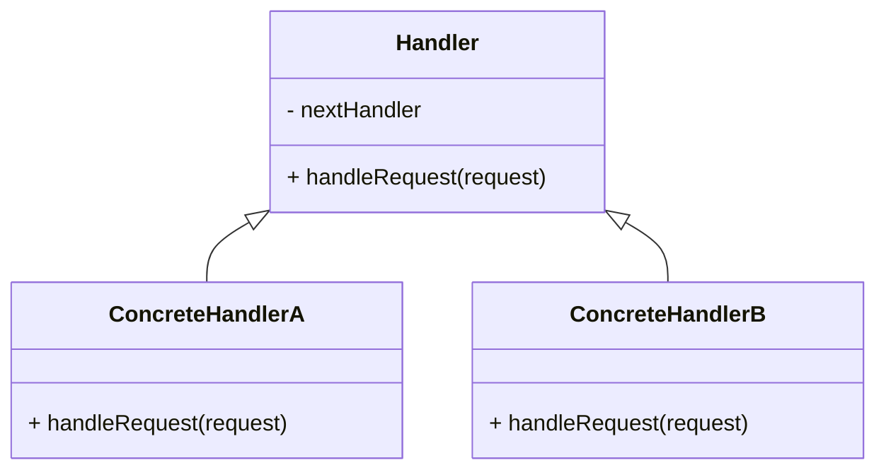

# Chain of Responsibility
> Version: dp_20231231_202019

- [Builder Design Pattern](#builder-design-pattern)
   * [Summary](#summary)
      + [Essence](#essence)
      + [Real examples](#real-examples)
   * [Implementation](#implementation)
      + [How to use it?](#how-to-use-it)
      + [Python code examples:](#python-code-examples)
   * [Analysis](#analysis)
      + [Cleaner Code?](#cleaner-code)
      + [Readable Code?](#readable-code)
      + [Replaceable code?](#replaceable-code)
      + [Testable code?](#testable-code)
      + [Advantages?](#advantages)
      + [Disadvantages?](#disadvantages)
   * [Remarks](#remarks)
      + [Concerns and Tips?](#concerns-and-tips)
      + [Execrises](#execrises)

## Summary

### Essence
The Chain of Responsibility design pattern decouples senders and receivers of a request by allowing multiple objects to handle the request. It creates a chain of objects where each object has a reference to the next object in the chain. When a request is made, it is passed along the chain until an object is found that can handle the request. This promotes loose coupling and flexibility in the system.

### Real examples

- Handling requests in a web application middleware pipeline
- Implementing a multi-level approval process
- Implementing a workflow management system
- Implementing a logging system with different log levels
- Implementing a command processing system




## Implementation
### How to use it?
To use the Chain of Responsibility design pattern, follow these steps:
1. Create an abstract Handler class with a method to handle requests and a reference to the next handler.
2. Create concrete handler classes that extend the Handler class and implement the handleRequest method.
3. Set up the chain by linking the handlers together.
4. Send a request to the first handler in the chain.

### Python code examples:
```python
class Handler:
    def __init__(self, next_handler=None):
        self.next_handler = next_handler

    def handle_request(self, request):
        if self.next_handler:
            return self.next_handler.handle_request(request)
        else:
            return None


class ConcreteHandlerA(Handler):
    def handle_request(self, request):
        if request == 'A':
            return 'Handled by ConcreteHandlerA'
        else:
            return super().handle_request(request)


class ConcreteHandlerB(Handler):
    def handle_request(self, request):
        if request == 'B':
            return 'Handled by ConcreteHandlerB'
        else:
            return super().handle_request(request)


# Usage
handler_a = ConcreteHandlerA()
handler_b = ConcreteHandlerB()
handler_a.next_handler = handler_b

result = handler_a.handle_request('A')
print(result)  # Output: Handled by ConcreteHandlerA

result = handler_a.handle_request('B')
print(result)  # Output: Handled by ConcreteHandlerB

result = handler_a.handle_request('C')
print(result)  # Output: None
```

- The code defines a chain of handlers where each handler has a reference to the next handler. When a request is made, it is passed along the chain until a handler can handle it. This promotes loose coupling and flexibility in the system.   


## Analysis
### Cleaner Code?
Promotes the Single Responsibility Principle by assigning a single responsibility to each handler in the chain. Each handler focuses on a specific aspect of the request. Allows for the addition or removal of handlers without affecting the client code.

### Readable Code?
Separates the logic for handling requests into individual handler classes. Each handler class focuses on a specific aspect of the request, making the code easier to understand and modify.

### Replaceable code?
Promotes loose coupling by decoupling senders and receivers of a request. The sender does not need to know which object will handle the request, and the receiver does not need to know who sent the request. Allows for flexible and dynamic handling of requests.

### Testable code?
Allows for the isolation of individual handlers, making it easy to test each handler independently without the need to test the entire chain. Improves testability and reduces the complexity of writing test cases.

### Advantages?

- Decouples senders and receivers of a request
- Allows for flexible and dynamic handling of requests
- Promotes loose coupling and flexibility in the system
- Supports the Single Responsibility Principle
- Easy to add or remove handlers without affecting the client code

### Disadvantages?

- Requests may go unhandled if the chain is not properly configured
- Can introduce complexity with long chains or circular dependencies
- May impact performance with large chains


## Remarks
### Concerns and Tips?

- Ensure that the chain is properly configured to handle all possible requests
- Be mindful of the performance impact if the chain becomes too large
- Avoid creating circular dependencies in the chain
- Make sure that requests are not left unhandled in the chain
- Use meaningful names for the handler classes to indicate their responsibilities
- Keep the chain of handlers simple and focused on a specific aspect of the request
- Test each handler independently to ensure proper functionality
- Use dependency injection to set up the chain of handlers
- Consider using a configuration file or database to dynamically configure the chain


### Execrises

- Q: What is the purpose of the Chain of Responsibility design pattern?

  - A: The purpose of the Chain of Responsibility design pattern is to decouple senders and receivers of a request by allowing multiple objects to handle the request.
- Q: How does the Chain of Responsibility design pattern promote loose coupling?

  - A: The Chain of Responsibility design pattern promotes loose coupling by decoupling senders and receivers of a request. The sender does not need to know which object will handle the request, and the receiver does not need to know who sent the request.
- Q: How does the Chain of Responsibility design pattern support the Single Responsibility Principle?

  - A: The Chain of Responsibility design pattern supports the Single Responsibility Principle by assigning a single responsibility to each handler in the chain. Each handler focuses on a specific aspect of the request.
- Q: What are the advantages of using the Chain of Responsibility design pattern?

  - A: The advantages of using the Chain of Responsibility design pattern include decoupling senders and receivers, flexible handling of requests, loose coupling, support for the Single Responsibility Principle, and ease of adding or removing handlers.
- Q: What are the disadvantages of using the Chain of Responsibility design pattern?

  - A: The disadvantages of using the Chain of Responsibility design pattern include the possibility of unhandled requests, complexity with long chains or circular dependencies, and potential performance impact with large chains.

