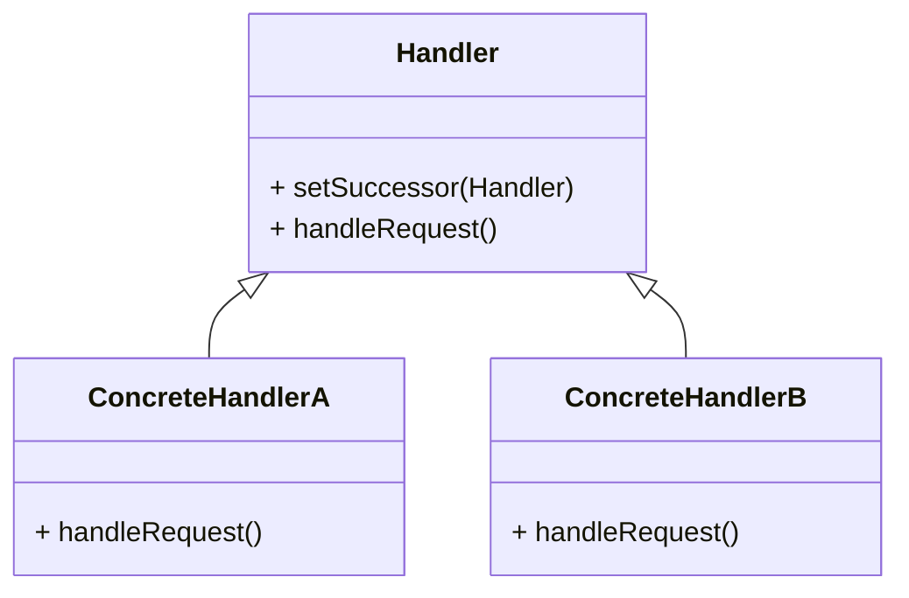

# Chain of Responsibility
> Version: dp_20231231_234226

- [Builder Design Pattern](#builder-design-pattern)
   * [Summary](#summary)
      + [Essence](#essence)
      + [Real examples](#real-examples)
   * [Implementation](#implementation)
      + [How to use it?](#how-to-use-it)
      + [Python code examples:](#python-code-examples)
   * [Analysis](#analysis)
      + [Cleaner Code?](#cleaner-code)
      + [Readable Code?](#readable-code)
      + [Replaceable code?](#replaceable-code)
      + [Testable code?](#testable-code)
      + [Advantages?](#advantages)
      + [Disadvantages?](#disadvantages)
   * [Remarks](#remarks)
      + [Concerns and Tips?](#concerns-and-tips)
      + [Execrises](#execrises)

## Summary

### Essence
The Chain of Responsibility design pattern decouples the sender of a request from its receiver by creating a chain of objects. Each object has a reference to the next object in the chain. When a request is made, it is passed along the chain until an object is found that can handle the request. This pattern promotes loose coupling, flexibility, and code reusability. Key points: 1. Decouples sender and receiver. 2. Creates a chain of objects. 3. Requests are passed along the chain. 4. Promotes loose coupling, flexibility, and code reusability.

### Real examples

- Handling requests in a web application middleware pipeline.
- Implementing a multi-level approval process in a workflow management system.
- Implementing a logging system with different levels of loggers.
- Implementing a hierarchical menu system with submenus.
- Implementing a message processing system with specific message processors.

## Implementation
### How to use it?
To use the Chain of Responsibility design pattern, follow these steps:
1. Create an abstract Handler class with a method to set the successor and a method to handle the request.
2. Create concrete Handler classes that extend the abstract Handler class and implement the handleRequest method.
3. In each concrete Handler class, check if it can handle the request. If not, pass the request to the successor.
4. Create an instance of the first concrete Handler class and set the successors using the setSuccessor method.
5. Call the handleRequest method on the first concrete Handler class, passing the request as a parameter.

## Analysis
### Maintainability: 
To what extent is your code characterized by cleanliness and readability?
#### Cleaner Code?

- Separates the code that handles the request from the code that sends the request.
- Each handler class has a single responsibility.
- Allows for easy addition of new handlers without modifying existing code.

#### Readable Code?

- Provides a clear and structured way to handle requests.
- Descriptive names for handler classes improve code understandability.
- The flow of requests can be easily traced.

### Testability: 
Can your code be methodically and comprehensively tested?

### Adaptability: 
How readily can your code be substituted or modified?
#### Replaceable code?

- Allows for easy addition or modification of handlers without affecting client code.
- New handlers can be inserted into the chain without modifying existing code.
- Existing handlers can be modified without affecting other handlers.

### Scalability:
Are your architectural components characterized by loose coupling?

### Tradeoffs:
#### Advantages?

- Promotes loose coupling and flexibility.
- Implements the single responsibility principle.
- Improves code reusability and maintainability.
- Provides a clear and structured way to handle requests.
- Allows for easy extension and modification of the chain.
- Enhances code readability and understandability.
- Enables dynamic configuration and customization of the chain.
- Facilitates independent testing of each handler.

#### Disadvantages?

- May introduce overhead due to chain traversal.
- Long chains may affect performance.
- Managing the order of handlers can be difficult.
- Requests may be unhandled if no appropriate handler is in the chain.

## Remarks
### Concerns and Tips?

- Managing the order of handlers can be tricky.
- Avoid creating long chains for better performance.
- Be cautious when modifying the chain at runtime.
- Concerns, programming tips, and tricky aspects should be considered.

### Execrises

- Q: What is the purpose of the Chain of Responsibility design pattern?
- 
  - A: The purpose of the Chain of Responsibility design pattern is to decouple the sender of a request from its receiver by allowing multiple objects to handle the request.
- Q: How does the Chain of Responsibility design pattern promote loose coupling?
- 
  - A: The Chain of Responsibility design pattern promotes loose coupling by decoupling the sender of a request from its receiver. The sender does not need to know which object will handle the request, and the receiver does not need to know who sent the request.
- Q: How does the Chain of Responsibility design pattern improve code readability?
- 
  - A: The Chain of Responsibility design pattern improves code readability by providing a clear and structured way to handle requests. Each handler class can have a descriptive name that reflects its responsibility, making it easier for developers to understand the code.
- Q: How does the Chain of Responsibility design pattern help in making the code testable?
- 
  - A: The Chain of Responsibility design pattern helps in making the code testable by allowing each handler to be tested independently. Each handler can have its own unit tests to ensure that it handles the requests correctly.
- Q: What are the advantages of using the Chain of Responsibility design pattern?
- 
  - A: The advantages of using the Chain of Responsibility design pattern include promoting loose coupling and flexibility, implementing the single responsibility principle, improving code reusability and maintainability, providing a clear and structured way to handle requests, allowing for easy extension and modification of the chain, enhancing code readability and understandability, enabling dynamic configuration and customization of the chain, and facilitating independent testing of each handler.
- Q: What are the disadvantages of using the Chain of Responsibility design pattern?
- 
  - A: The disadvantages of using the Chain of Responsibility design pattern include potential overhead due to the traversal of the chain, the possibility of a long chain affecting performance, the difficulty in managing the order of handlers, and the risk of requests being unhandled if there is no appropriate handler in the chain.

