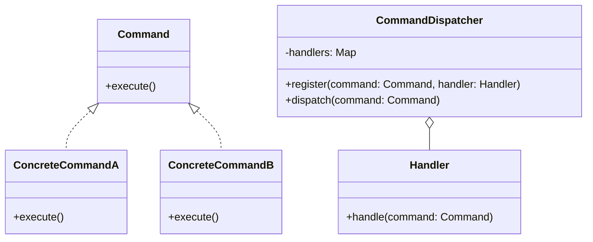

# Command Dispatcher
> Version: dp_20231231_202019

- [Builder Design Pattern](#builder-design-pattern)
   * [Summary](#summary)
      + [Essence](#essence)
      + [Real examples](#real-examples)
   * [Implementation](#implementation)
      + [How to use it?](#how-to-use-it)
      + [Python code examples:](#python-code-examples)
   * [Analysis](#analysis)
      + [Cleaner Code?](#cleaner-code)
      + [Readable Code?](#readable-code)
      + [Replaceable code?](#replaceable-code)
      + [Testable code?](#testable-code)
      + [Advantages?](#advantages)
      + [Disadvantages?](#disadvantages)
   * [Remarks](#remarks)
      + [Concerns and Tips?](#concerns-and-tips)
      + [Execrises](#execrises)

## Summary

### Essence
The Command Dispatcher design pattern decouples the sender of a request from the receiver by encapsulating commands as objects and using a dispatcher to find and execute the appropriate handler for each command.

### Real examples

- Handling different types of requests in a web application
- Handling user input in a game engine
- Handling remote procedure calls in a distributed system




## Implementation
### How to use it?
To use the Command Dispatcher design pattern, follow these steps:
1. Define a command interface or base class with an execute method.
2. Implement concrete command classes that implement the command interface.
3. Define a handler interface or base class with a handle method.
4. Implement concrete handler classes that implement the handler interface.
5. Create a command dispatcher class that maintains a mapping of commands to handlers.
6. Register the commands and their corresponding handlers with the command dispatcher.
7. Use the command dispatcher to dispatch commands to their respective handlers.

### Python code examples:
```python

from abc import ABC, abstractmethod

class Command(ABC):
    @abstractmethod
    def execute(self):
        pass


class ConcreteCommandA(Command):
    def execute(self):
        print('Executing ConcreteCommandA')


class ConcreteCommandB(Command):
    def execute(self):
        print('Executing ConcreteCommandB')


class CommandDispatcher:
    def __init__(self):
        self.handlers = {}

    def register(self, command, handler):
        self.handlers[command] = handler

    def dispatch(self, command):
        if command in self.handlers:
            self.handlers[command].handle(command)
        else:
            print('No handler found for command:', command)


class Handler:
    @abstractmethod
    def handle(self, command):
        pass


class ConcreteHandlerA(Handler):
    def handle(self, command):
        if isinstance(command, ConcreteCommandA):
            command.execute()
        else:
            print('Invalid command type for handler A')


class ConcreteHandlerB(Handler):
    def handle(self, command):
        if isinstance(command, ConcreteCommandB):
            command.execute()
        else:
            print('Invalid command type for handler B')


command_dispatcher = CommandDispatcher()
command_dispatcher.register(ConcreteCommandA(), ConcreteHandlerA())
command_dispatcher.register(ConcreteCommandB(), ConcreteHandlerB())

command_dispatcher.dispatch(ConcreteCommandA())
command_dispatcher.dispatch(ConcreteCommandB())
command_dispatcher.dispatch('InvalidCommand')

```

- The Python code example demonstrates the implementation of the Command Dispatcher design pattern. It defines command and handler classes, a command dispatcher class, and registers commands with their corresponding handlers. The dispatcher can then execute commands by dispatching them to the appropriate handler.   


## Analysis
### Cleaner Code?

- Separates the sender of a request from the receiver, improving organization and maintainability
- Promotes the Single Responsibility Principle by encapsulating each command as an object with a single responsibility
- Allows for the addition of new commands and handlers without modifying existing code, making the codebase more extensible

### Readable Code?

- Provides a clear separation of concerns, making the code easier to understand and reason about
- Promotes code reuse by encapsulating common functionality in command and handler classes
- Allows for the use of descriptive class and method names, making the code more self-explanatory

### Replaceable code?

- Promotes loose coupling between the sender and receiver of a request
- Allows for the addition of new commands and handlers without affecting existing code
- Enables the use of dependency injection to provide different implementations of commands and handlers at runtime

### Testable code?

- Encapsulates behavior in command and handler objects, making code easier to test
- Enables the use of mock objects to simulate different command and handler behaviors during testing
- Promotes the use of dependency injection, making it easier to replace dependencies with mock objects for testing purposes

### Advantages?

- Decouples the sender of a request from the receiver, improving organization and maintainability
- Promotes the Single Responsibility Principle by encapsulating each command as an object with a single responsibility
- Allows for the addition of new commands and handlers without modifying existing code, making the codebase more extensible
- Improves code readability by providing a clear separation of concerns
- Enables easier testing of individual commands and handlers
- Promotes loose coupling between the sender and receiver of a request
- Allows for the use of dependency injection to provide different implementations of commands and handlers at runtime

### Disadvantages?

- Introduces additional complexity to the codebase, especially with a large number of commands and handlers
- Requires careful design and planning for mapping commands to handlers
- May result in increased memory usage due to the creation of command and handler objects
- Can be overkill for simple applications with a limited number of commands and handlers


## Remarks
### Concerns and Tips?

- Concerns:
- - Potential increased memory usage due to the creation of command and handler objects
- - Potential performance overhead when dispatching commands to handlers
- Programming Tips:
- - Use descriptive names for commands and handlers to improve code readability
- - Follow the Single Responsibility Principle by ensuring each command and handler has a clear responsibility
- - Use dependency injection to provide different implementations of commands and handlers
- - Consider using object pooling or other memory optimization techniques
- - Optimize the dispatcher implementation and use efficient data structures for command-handler mapping
- Trickys:
- - Designing the mapping between commands and handlers
- - Managing dependencies between commands and handlers
- Escaped Studies: None


### Execrises

- Q: What is the purpose of the Command Dispatcher design pattern?

  - A: The purpose of the Command Dispatcher design pattern is to decouple the sender of a request from the receiver, allowing multiple receivers to handle the request.
- Q: How does the Command Dispatcher design pattern help in making code clean?

  - A: The Command Dispatcher design pattern helps in making code clean by separating concerns and promoting the Single Responsibility Principle. It also allows for the addition of new commands and handlers without modifying existing code.
- Q: How does the Command Dispatcher design pattern promote loose coupling?

  - A: The Command Dispatcher design pattern promotes loose coupling by only requiring knowledge of the command and handler interfaces. It allows for the addition of new commands and handlers without affecting existing code.
- Q: What are the advantages of using the Command Dispatcher design pattern?

  - A: The advantages of using the Command Dispatcher design pattern include better organization and maintainability of the codebase, extensibility, code reuse, and improved testability.
- Q: What are the disadvantages of using the Command Dispatcher design pattern?

  - A: The disadvantages of using the Command Dispatcher design pattern include increased complexity, careful design and planning required for mapping commands to handlers, potential increased memory usage, and potential performance overhead.
- Q: How can the Command Dispatcher design pattern be implemented in Python?

  - A: The Command Dispatcher design pattern can be implemented in Python using classes and interfaces to define commands, handlers, and the dispatcher. Dependency injection can be used to provide different implementations of commands and handlers.
- Q: What are some use cases for the Command Dispatcher design pattern?

  - A: Some use cases for the Command Dispatcher design pattern include handling different types of requests in a web application, handling user input in a game engine, and handling remote procedure calls in a distributed system.

