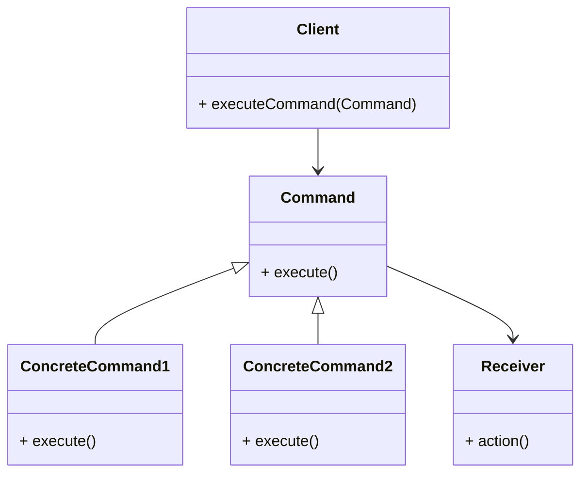

# Command Design Pattern
> Version: dp_20240101_000050

- [Command Design Pattern](#command-design-pattern)
  * [Summary](#summary)
    + [Essence](#essence)
    + [Real examples](#real-examples)
  * [Implementation](#implementation)
    + [How to use it?](#how-to-use-it)
    + [Python code examples:](#python-code-examples)
  * [Analysis](#analysis)
    + [Maintainability:](#maintainability)
      - [Cleaner Code?](#cleaner-code)
      - [Readable Code?](#readable-code)
    + [Testability:](#testability)
    + [Adaptability:](#adaptability)
      - [Replaceable code?](#replaceable-code)
    + [Scalability:](#scalability)
    + [Tradeoffs:](#tradeoffs)
      - [Advantages?](#advantages)
      - [Disadvantages?](#disadvantages)
  * [Remarks](#remarks)
    + [Concerns and Tips?](#concerns-and-tips)
    + [Execrises](#execrises)

## Summary

### Essence
The essence of the Command design pattern is to encapsulate a request as an object, which allows for the separation of the sender and receiver of a request. It also provides a way to parameterize clients with queues, requests, and operations.

### Real examples

- 1. In a text editor, the Command design pattern can be used to implement undo and redo functionality.
- 2. In a remote control for a television, the Command design pattern can be used to map each button on the remote control to a specific command.
- 3. In a job scheduling system, the Command design pattern can be used to represent different types of jobs as commands.




## Implementation
### How to use it?
To use the Command design pattern, follow these steps:
1. Create a Command interface with an execute() method.
2. Implement the Command interface with concrete command classes.
3. Create a Receiver class that contains the actual implementation of the command.
4. Create a Client class that executes the command by calling the execute() method on the command object.
5. Use the Client class to execute different commands.

### Python code examples:
```python
1. Implementation of the Command interface:
```python
from abc import ABC, abstractmethod


class Command(ABC):
    @abstractmethod
    def execute(self):
        pass
```
2. Implementation of a concrete command:
```python
class ConcreteCommand(Command):
    def __init__(self, receiver):
        self.receiver = receiver
    
    def execute(self):
        self.receiver.action()
```
3. Implementation of the receiver:
```python
class Receiver:
    def action(self):
        print('Performing action')
```
4. Usage of the command:
```python
receiver = Receiver()
command = ConcreteCommand(receiver)
command.execute()

```
The Command design pattern in Python allows for the encapsulation of requests as objects. It separates the sender and receiver of a request and provides a way to execute different commands. The code example demonstrates the implementation of the Command interface, a concrete command, and a receiver.   


## Analysis
### Maintainability: 
To what extent is your code characterized by cleanliness and readability?
#### Cleaner Code?
The Command design pattern helps in making the code clean by separating the responsibilities of the sender and receiver of a request. It encapsulates a request as an object, which allows for better organization and modularity of code. It also promotes the Single Responsibility Principle by ensuring that each command class has a single responsibility.

#### Readable Code?
The Command design pattern makes the code more readable by providing a clear and explicit way to represent and execute commands. Each command class encapsulates a specific action or operation, making it easier for developers to understand and maintain the code. It also allows for the use of descriptive and meaningful class and method names, which further enhances code readability.


### Testability: 
Can your code be methodically and comprehensively tested?


### Adaptability: 
How readily can your code be substituted or modified?
#### Replaceable code?
The Command design pattern helps in making the code replaceable by decoupling the sender and receiver of a request. The sender does not need to know the specific receiver or how the request is handled. This allows for easier substitution of different receivers or commands without affecting the sender or other parts of the code. It also promotes the Open-Closed Principle by allowing for the addition of new commands without modifying existing code.


### Scalability:
Are your architectural components characterized by loose coupling?


### Tradeoffs:
#### Advantages?

- 1. Separation of concerns: The Command design pattern separates the sender and receiver of a request, allowing for better organization and modularity of code.
- 2. Undo and redo functionality: The Command design pattern provides a way to implement undo and redo functionality by encapsulating each action as a command.
- 3. Flexibility and extensibility: The Command design pattern allows for the addition of new commands without modifying existing code, making it easier to extend the functionality of the system.
- 4. Testability: The Command design pattern makes it easier to unit test individual commands without the need for complex setup or dependencies.
- 5. Scalability: The Command design pattern promotes loose coupling, making it easier to add or remove commands or receivers without affecting other parts of the system.

#### Disadvantages?

- 1. Increased complexity: The Command design pattern introduces additional classes and indirection, which can increase the complexity of the code.
- 2. Overhead: The Command design pattern can introduce some overhead in terms of memory and performance, especially when dealing with a large number of commands.
- 3. Limited use cases: The Command design pattern is most useful in scenarios where there is a need for undo and redo functionality or the ability to dynamically execute different commands.


## Remarks
### Concerns and Tips?

- 1. The Command design pattern helps in making the code clean, readable, replaceable, testable, and scalable.
- 2. It separates the responsibilities of the sender and receiver of a request.
- 3. It encapsulates a request as an object.
- 4. It promotes the Single Responsibility Principle.
- 5. It allows for better organization and modularity of code.
- 6. It provides a clear and explicit way to represent and execute commands.
- 7. It enhances code readability and maintainability.
- 8. It allows for the use of descriptive and meaningful class and method names.
- 9. It decouples the sender and receiver of a request.
- 10. It allows for easier substitution of different receivers or commands.
- 11. It promotes the Open-Closed Principle.
- 12. It provides a clear separation between the execution and implementation of a command.
- 13. It promotes the Dependency Inversion Principle.
- 14. It allows for easier unit testing of individual commands.
- 15. It promotes loose coupling and modularity of code.
- 16. It allows for the addition or removal of commands or receivers without affecting other parts of the system.


### Execrises

- Q: What is the purpose of the Command design pattern?
- 
  - A: The purpose of the Command design pattern is to encapsulate a request as an object and provide a way to execute different commands.
- Q: How does the Command design pattern promote loose coupling?
- 
  - A: The Command design pattern separates the sender and receiver of a request, allowing for easier substitution of different commands or receivers without affecting other parts of the code.
- Q: How can the Command design pattern be used to implement undo and redo functionality?
- 
  - A: Each command can be executed or undone as needed, allowing for the implementation of undo and redo functionality.
- Q: What are some advantages of using the Command design pattern?
- 
  - A: Some advantages of using the Command design pattern include separation of concerns, undo and redo functionality, flexibility and extensibility, testability, and scalability.
- Q: What are some disadvantages of using the Command design pattern?
- 
  - A: Some disadvantages of using the Command design pattern include increased complexity, overhead in terms of memory and performance, and limited use cases.
- Q: How can the Command design pattern be tested?
- 
  - A: The Command design pattern allows for easier unit testing of individual commands by separating the execution of a command from its implementation. Mock or stub objects can be used to test the behavior of the command.
- Q: When is the Command design pattern most useful?
- 
  - A: The Command design pattern is most useful in scenarios where there is a need for undo and redo functionality or the ability to dynamically execute different commands.

