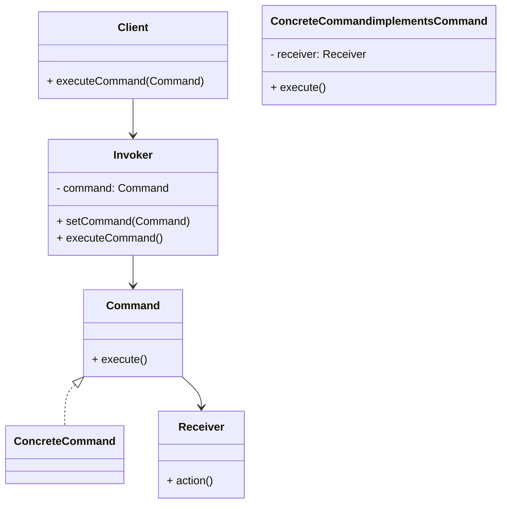

# Command Design Pattern
> Version: dp_20231231_202019

- [Builder Design Pattern](#builder-design-pattern)
   * [Summary](#summary)
      + [Essence](#essence)
      + [Real examples](#real-examples)
   * [Implementation](#implementation)
      + [How to use it?](#how-to-use-it)
      + [Python code examples:](#python-code-examples)
   * [Analysis](#analysis)
      + [Cleaner Code?](#cleaner-code)
      + [Readable Code?](#readable-code)
      + [Replaceable code?](#replaceable-code)
      + [Testable code?](#testable-code)
      + [Advantages?](#advantages)
      + [Disadvantages?](#disadvantages)
   * [Remarks](#remarks)
      + [Concerns and Tips?](#concerns-and-tips)
      + [Execrises](#execrises)

## Summary

### Essence
The essence of the Command design pattern is to encapsulate a request as an object, allowing clients to parameterize clients with queues, requests, and operations. It decouples the sender and receiver of a request by introducing an intermediate object.

### Real examples

- 1. Undo/Redo functionality in text editors
- 2. Remote control devices
- 3. Transaction management
- 4. Task scheduling




## Implementation
### How to use it?
To use the Command design pattern, follow these steps:
1. Create a Command interface with an execute() method.
2. Implement the Command interface with concrete command classes.
3. Create a Receiver class that contains the actual implementation of the command.
4. Create an Invoker class that sets and executes the command.
5. Create a Client class that uses the Invoker to execute commands.

### Python code examples:
```python
from abc import ABC, abstractmethod

class Command(ABC):
    @abstractmethod
    def execute(self):
        pass


class ConcreteCommand(Command):
    def __init__(self, receiver):
        self.receiver = receiver

    def execute(self):
        self.receiver.action()


class Receiver:
    def action(self):
        print('Receiver: Performing action')


class Invoker:
    def __init__(self):
        self.command = None

    def set_command(self, command):
        self.command = command

    def execute_command(self):
        self.command.execute()


receiver = Receiver()
command = ConcreteCommand(receiver)
invoker = Invoker()
invoker.set_command(command)
invoker.execute_command()
```
The Python code example demonstrates the Command design pattern. It defines a Command interface with an execute() method, a ConcreteCommand class that implements the Command interface, a Receiver class that contains the actual implementation of the command, and an Invoker class that sets and executes the command.   


## Analysis
### Cleaner Code?
The Command design pattern helps in making clean code by separating the responsibilities of the sender and receiver of a request. It encapsulates a request as an object, allowing for better organization and modularity. It also promotes the Single Responsibility Principle by ensuring that each command class has a single responsibility.

### Readable Code?
The Command design pattern makes the code more readable by providing a clear and consistent way to represent and execute commands. Each command class encapsulates a specific action, making it easier to understand the purpose and behavior of the code.

### Replaceable code?
The Command design pattern helps in making code replaceable by decoupling the sender and receiver of a request. The sender only needs to know how to execute a command, without needing to know the details of the receiver. This allows for better separation of concerns and promotes modularity.

### Testable code?
The Command design pattern makes the code easy to be tested by decoupling the sender and receiver of a request. The sender only needs to know how to execute a command, without needing to know the details of the receiver. This allows for easier unit testing of the sender and receiver independently.

### Advantages?

- 1. Decouples the sender and receiver of a request
- 2. Allows for the parameterization of clients with queues, requests, and operations
- 3. Supports undo/redo functionality
- 4. Promotes the Single Responsibility Principle
- 5. Enhances code organization and modularity
- 6. Facilitates unit testing of the sender and receiver independently

### Disadvantages?

- 1. Can lead to an increase in the number of classes and complexity
- 2. May introduce additional overhead due to the use of command objects
- 3. Requires careful design to avoid potential performance issues


## Remarks
### Concerns and Tips?

- 1. Potential performance issues due to the use of command objects
- 2. Increased complexity and number of classes
- 3. Careful design is required to ensure proper encapsulation and separation of concerns
- 4. Use the Command design pattern when you need to decouple the sender and receiver of a request
- 5. Consider using the Command pattern for implementing undo/redo functionality
- 6. Carefully design the command classes to ensure proper encapsulation and separation of concerns
- 7. Use the Command pattern to enhance code organization and modularity
- 8. Unit test the sender and receiver independently to ensure proper functionality
- 9. Careful design is required to avoid potential performance issues
- 10. The number of classes and complexity may increase
- 11. Additional overhead may be introduced due to the use of command objects


### Execrises

- Q: What is the purpose of the Command design pattern?

  - A: The purpose of the Command design pattern is to encapsulate a request as an object and decouple the sender and receiver of the request.
- Q: How does the Command design pattern support undo/redo functionality?

  - A: The Command design pattern allows for the execution and undo/redo of specific commands, making it suitable for implementing undo/redo functionality.
- Q: How does the Command design pattern promote the Single Responsibility Principle?

  - A: The Command design pattern ensures that each command class has a single responsibility, promoting the Single Responsibility Principle.
- Q: How does the Command design pattern enhance code organization and modularity?

  - A: The Command design pattern encapsulates commands as objects, allowing for better organization and modularity of code.
- Q: How does the Command design pattern facilitate unit testing?

  - A: The Command design pattern decouples the sender and receiver of a request, allowing for easier unit testing of the sender and receiver independently.

