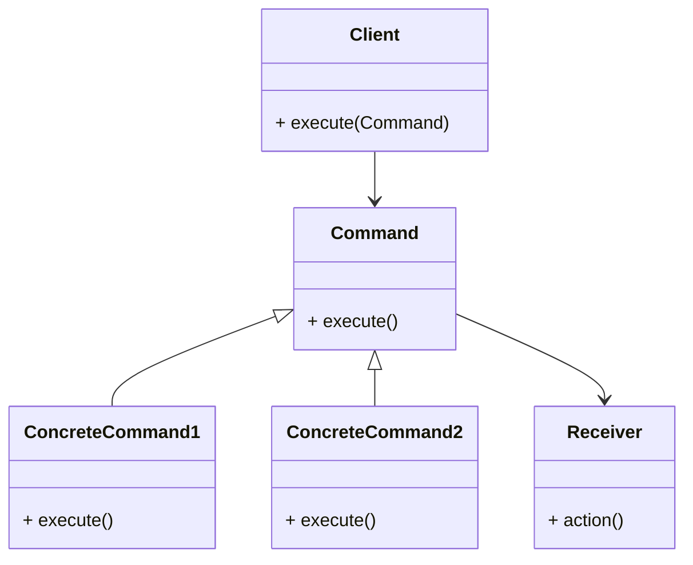

# Commander Design Pattern
> Version: dp_20231231_202019

- [Builder Design Pattern](#builder-design-pattern)
   * [Summary](#summary)
      + [Essence](#essence)
      + [Real examples](#real-examples)
   * [Implementation](#implementation)
      + [How to use it?](#how-to-use-it)
      + [Python code examples:](#python-code-examples)
   * [Analysis](#analysis)
      + [Cleaner Code?](#cleaner-code)
      + [Readable Code?](#readable-code)
      + [Replaceable code?](#replaceable-code)
      + [Testable code?](#testable-code)
      + [Advantages?](#advantages)
      + [Disadvantages?](#disadvantages)
   * [Remarks](#remarks)
      + [Concerns and Tips?](#concerns-and-tips)
      + [Execrises](#execrises)

## Summary

### Essence
The Commander design pattern encapsulates a request as an object, allowing clients to parameterize clients with queues, requests, and operations. It decouples the sender of a request from its receiver, allowing multiple receivers to handle the request.

### Real examples

- Implementing undo/redo functionality in a text editor
- Mapping user actions to commands in a remote control
- Scheduling and executing tasks in a job scheduling system
- Implementing player actions in a game




## Implementation
### How to use it?
To use the Commander design pattern, follow these steps:
1. Create a Command interface with an execute() method.
2. Implement the Command interface with concrete command classes.
3. Create a Receiver class that performs the actual action.
4. Create a Client class that executes the commands.
5. Instantiate the concrete command objects and set their receivers.
6. Pass the concrete command objects to the client and execute them.

### Python code examples:
```python
from abc import ABC, abstractmethod

class Command(ABC):
    @abstractmethod
    def execute(self):
        pass


class ConcreteCommand1(Command):
    def __init__(self, receiver):
        self.receiver = receiver

    def execute(self):
        self.receiver.action1()


class ConcreteCommand2(Command):
    def __init__(self, receiver):
        self.receiver = receiver

    def execute(self):
        self.receiver.action2()


class Receiver:
    def action1(self):
        print('Action 1')

    def action2(self):
        print('Action 2')


class Client:
    def __init__(self):
        self.commands = []

    def add_command(self, command):
        self.commands.append(command)

    def execute_commands(self):
        for command in self.commands:
            command.execute()


receiver = Receiver()
command1 = ConcreteCommand1(receiver)
command2 = ConcreteCommand2(receiver)

client = Client()
client.add_command(command1)
client.add_command(command2)
client.execute_commands()
```

- The above Python code demonstrates the implementation of the Commander design pattern. It defines a Command interface and concrete command classes that encapsulate specific actions. The Receiver class performs the actual actions, and the Client class executes the commands. The code shows how to add commands to the client and execute them.   


## Analysis
### Cleaner Code?

- Promotes separation of concerns by encapsulating each command as an object
- Allows easy addition of new commands without modifying existing code
- Eliminates duplicate code and promotes code reuse

### Readable Code?

- Makes the code more readable by encapsulating each command as an object with a clear and descriptive name
- Simplifies understanding of program flow by executing command objects without knowing implementation details
- Uses interfaces and abstractions to improve code readability and understandability

### Replaceable code?

- Promotes loose coupling by decoupling the sender of a request from its receiver
- Allows for easy replacement or modification of the receiver without affecting the client
- Enables easy extension of the client with new commands without modifying existing code

### Testable code?

- Simplifies testing by decoupling the sender from the receiver
- Facilitates unit testing of individual commands
- Allows creation of mock objects for testing purposes
- Enables use of dependency injection for testing

### Advantages?

- Encapsulates requests as objects, allowing for parameterization of clients
- Decouples the sender of a request from its receiver
- Promotes loose coupling and modularity
- Enhances code readability and understandability
- Makes the code easier to test

### Disadvantages?

- May introduce additional complexity and overhead
- Requires creation of multiple classes and interfaces
- Applicability should be evaluated on a case-by-case basis


## Remarks
### Concerns and Tips?

- Concerns: Potential increase in code complexity and overhead
- Programming tips: Use meaningful and descriptive names, consider using dependency injection, use interfaces or abstract classes
- Tricky aspects: Determining appropriate level of abstraction for commands and receivers
- Further studies: Application of the Command pattern in distributed systems and game development


### Execrises

- Q: What is the purpose of the Commander design pattern?

  - A: The Commander design pattern is used to encapsulate a request as an object, allowing clients to parameterize clients with queues, requests, and operations.
- Q: How does the Commander pattern promote loose coupling?

  - A: The Commander pattern decouples the sender of a request from its receiver, allowing for the receiver to be easily replaced or modified without affecting the client. It also allows for the client to be easily extended with new commands without modifying existing code.
- Q: How does the Commander pattern help in making the code more maintainable?

  - A: The Commander pattern allows for the easy addition of new commands without modifying existing code, making the code more maintainable and extensible. It also promotes code reuse and eliminates duplicate code.
- Q: How does the Commander pattern help in making the code easier to test?

  - A: The Commander pattern decouples the sender from the receiver, making the code easier to test. It allows for easier unit testing of individual commands and facilitates the use of mock objects and dependency injection for testing purposes.
- Q: What are some advantages of using the Commander pattern?

  - A: Some advantages of using the Commander pattern include encapsulating requests as objects, decoupling the sender from the receiver, promoting loose coupling and modularity, enhancing code readability and understandability, and making the code easier to test.
- Q: What are some disadvantages of using the Commander pattern?

  - A: Some disadvantages of using the Commander pattern include potential increase in code complexity and overhead, increased codebase and development effort, and the need to evaluate its applicability on a case-by-case basis.
- Q: Can you provide an example of how the Commander pattern can be used in a real-world scenario?

  - A: In a text editor, the Command pattern can be used to implement undo and redo functionality. Each command represents a specific action, and the editor can execute or undo/redo these commands as needed.

