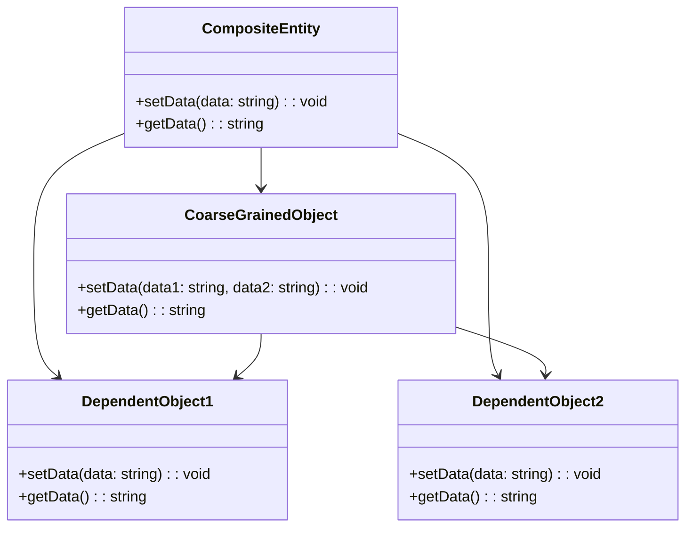

# Composite Entity
> Version: dp_20231231_202019

- [Builder Design Pattern](#builder-design-pattern)
   * [Summary](#summary)
      + [Essence](#essence)
      + [Real examples](#real-examples)
   * [Implementation](#implementation)
      + [How to use it?](#how-to-use-it)
      + [Python code examples:](#python-code-examples)
   * [Analysis](#analysis)
      + [Cleaner Code?](#cleaner-code)
      + [Readable Code?](#readable-code)
      + [Replaceable code?](#replaceable-code)
      + [Testable code?](#testable-code)
      + [Advantages?](#advantages)
      + [Disadvantages?](#disadvantages)
   * [Remarks](#remarks)
      + [Concerns and Tips?](#concerns-and-tips)
      + [Execrises](#execrises)

## Summary

### Essence
The Composite Entity design pattern is used to represent a group of objects as a single entity. It provides a way to treat a group of objects the same way as a single object.

### Real examples

- Representing complex data structures as a single entity.
- Managing a group of related objects as a whole.
- Providing a simplified interface to manipulate a group of objects.




## Implementation
### How to use it?
To use the Composite Entity design pattern, follow these steps:
1. Create the dependent objects that will be part of the composite entity.
2. Create the coarse-grained object that will manage the dependent objects.
3. Create the composite entity that will encapsulate the dependent objects and the coarse-grained object.
4. Use the composite entity to manipulate the dependent objects as a single entity.

### Python code examples:
```python

# Example implementation of the Composite Entity design pattern in Python

class DependentObject1:
    def __init__(self):
        self.data = ''

    def set_data(self, data):
        self.data = data

    def get_data(self):
        return self.data


class DependentObject2:
    def __init__(self):
        self.data = ''

    def set_data(self, data):
        self.data = data

    def get_data(self):
        return self.data


class CoarseGrainedObject:
    def __init__(self):
        self.dependent_object1 = DependentObject1()
        self.dependent_object2 = DependentObject2()

    def set_data(self, data1, data2):
        self.dependent_object1.set_data(data1)
        self.dependent_object2.set_data(data2)

    def get_data(self):
        return f'{self.dependent_object1.get_data()}, {self.dependent_object2.get_data()}'


class CompositeEntity:
    def __init__(self):
        self.coarse_grained_object = CoarseGrainedObject()

    def set_data(self, data1, data2):
        self.coarse_grained_object.set_data(data1, data2)

    def get_data(self):
        return self.coarse_grained_object.get_data()


# Usage
composite_entity = CompositeEntity()
composite_entity.set_data('Data 1', 'Data 2')
data = composite_entity.get_data()
print(data)  # Output: Data 1, Data 2

```

- The Python code example demonstrates the implementation of the Composite Entity design pattern. It defines dependent objects, a coarse-grained object, and a composite entity. The composite entity encapsulates the dependent objects and provides a simplified interface to manipulate them as a single entity.   


## Analysis
### Cleaner Code?

- Encapsulates the complexity of managing a group of objects into a single entity, reducing code duplication and improving code organization.
- Provides a clear separation of concerns by separating the dependent objects from the coarse-grained object, allowing for easier maintenance and modification of the code.

### Readable Code?

- Improves code readability by providing a high-level interface to manipulate a group of objects, making the code more intuitive and easier to understand.
- Promotes code reuse by encapsulating the common functionality of the dependent objects into the composite entity, reducing code duplication and improving code readability.

### Replaceable code?

- Promotes loose coupling by encapsulating the dependent objects and the coarse-grained object into separate entities, allowing for easier modification and replacement of the objects without affecting the other objects.
- Provides a clear separation of concerns, allowing for easier maintenance and modification of the code.

### Testable code?

- Makes the code easier to test by providing a single entry point to manipulate a group of objects, allowing for easier creation of test cases and reducing the complexity of testing.
- Promotes modular design by encapsulating the dependent objects and the coarse-grained object into separate entities, allowing for easier isolation of the code during testing.

### Advantages?

- Simplifies the manipulation of a group of related objects.
- Provides a high-level interface to interact with the group of objects.
- Promotes code reuse and reduces code duplication.
- Improves code organization and maintainability.
- Allows for easier modification and replacement of objects.
- Enhances code readability and understandability.
- Facilitates easier testing and debugging.
- Solves the problem of managing a group of related objects as a single entity.

### Disadvantages?

- May introduce additional complexity and overhead.
- Requires careful design and implementation to ensure proper encapsulation and separation of concerns.
- May not be suitable for all scenarios and may require customization for specific use cases.


## Remarks
### Concerns and Tips?

- The Composite Entity design pattern promotes loose coupling and separation of concerns.
- Care must be taken to ensure proper encapsulation and separation of concerns.
- The design and implementation should be flexible enough to accommodate changes and modifications to the group of objects.
- The performance and efficiency of the composite entity should be considered, especially when dealing with large groups of objects.
- Recommended resources for further study: 'Design Patterns: Elements of Reusable Object-Oriented Software' by Erich Gamma, Richard Helm, Ralph Johnson, and John Vlissides, 'Head First Design Patterns' by Eric Freeman and Elisabeth Robson, 'Design Patterns in Python' by Rahul Verma.


### Execrises

- Q: What is the purpose of the Composite Entity design pattern?

  - A: The purpose of the Composite Entity design pattern is to represent a group of objects as a single entity and provide a simplified interface to manipulate them.
- Q: How does the Composite Entity design pattern help in making clean code?

  - A: The Composite Entity design pattern helps in making clean code by encapsulating the complexity of managing a group of objects into a single entity and promoting code reuse.
- Q: How does the Composite Entity design pattern promote loose coupling?

  - A: The Composite Entity design pattern promotes loose coupling by encapsulating the dependent objects and the coarse-grained object into separate entities.
- Q: What are the advantages of using the Composite Entity design pattern?

  - A: The advantages of using the Composite Entity design pattern include simplifying the manipulation of a group of objects, providing a high-level interface, promoting code reuse, improving code organization and maintainability, allowing for easier modification and replacement of objects, enhancing code readability and understandability, and facilitating easier testing and debugging.
- Q: What are the disadvantages of using the Composite Entity design pattern?

  - A: The disadvantages of using the Composite Entity design pattern include introducing additional complexity and overhead, requiring careful design and implementation, and not being suitable for all scenarios.
- Q: How can the Composite Entity design pattern be used to represent a customer's account in a banking system?

  - A: The Composite Entity design pattern can be used to represent a customer's account by encapsulating the transactions and balances as dependent objects and the account as the coarse-grained object.
- Q: How can the Composite Entity design pattern be used in a graphical user interface framework?

  - A: The Composite Entity design pattern can be used in a graphical user interface framework by encapsulating the components of a window as dependent objects and the window as the coarse-grained object.

