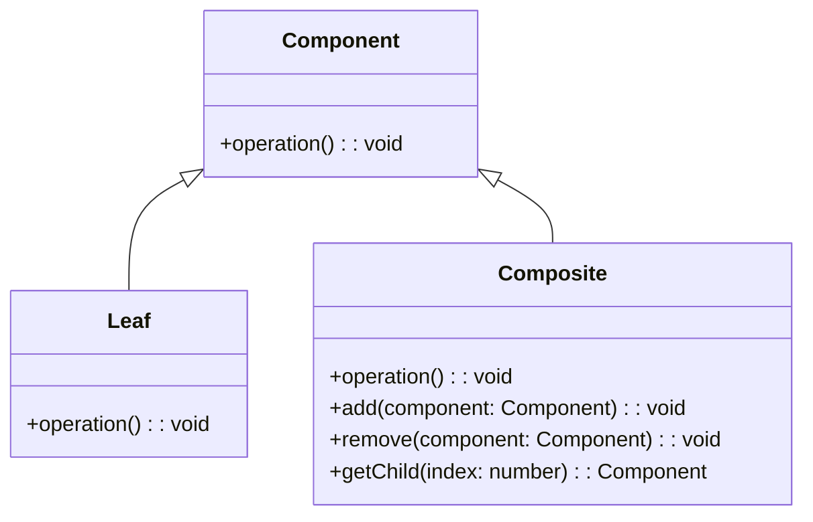

# Composite Design Pattern
> Version: dp_20231231_202019

- [Builder Design Pattern](#builder-design-pattern)
   * [Summary](#summary)
      + [Essence](#essence)
      + [Real examples](#real-examples)
   * [Implementation](#implementation)
      + [How to use it?](#how-to-use-it)
      + [Python code examples:](#python-code-examples)
   * [Analysis](#analysis)
      + [Cleaner Code?](#cleaner-code)
      + [Readable Code?](#readable-code)
      + [Replaceable code?](#replaceable-code)
      + [Testable code?](#testable-code)
      + [Advantages?](#advantages)
      + [Disadvantages?](#disadvantages)
   * [Remarks](#remarks)
      + [Concerns and Tips?](#concerns-and-tips)
      + [Execrises](#execrises)

## Summary

### Essence
The Composite design pattern allows objects to be composed into tree structures to represent part-whole hierarchies. It treats individual objects and compositions of objects uniformly.

### Real examples

- Representing part-whole hierarchies
- Treating individual objects and compositions of objects uniformly
- Performing operations on a group of objects as if they were a single object
- Creating tree-like structures




## Implementation
### How to use it?
To use the Composite design pattern:
1. Create a common interface or base class for both individual objects and composite objects.
2. Implement the common interface or base class in the individual object class.
3. Implement the common interface or base class in the composite object class and maintain a collection of child components.
4. Use the composite object to create a tree structure of components.
5. Use the common interface or base class to treat individual objects and composite objects uniformly.

### Python code examples:
```python

from abc import ABC, abstractmethod

class Component(ABC):
    @abstractmethod
    def operation(self):
        pass


class Leaf(Component):
    def operation(self):
        print('Leaf operation')


class Composite(Component):
    def __init__(self):
        self.components = []

    def operation(self):
        print('Composite operation')
        for component in self.components:
            component.operation()

    def add(self, component):
        self.components.append(component)

    def remove(self, component):
        self.components.remove(component)


leaf1 = Leaf()
leaf2 = Leaf()
composite = Composite()
composite.add(leaf1)
composite.add(leaf2)
composite.operation()

```

- The above Python code demonstrates the implementation of the Composite design pattern. It defines a common interface 'Component' and two concrete classes 'Leaf' and 'Composite'. The 'Composite' class can contain multiple 'Component' objects and treats them uniformly. The code creates a composite object and adds two leaf objects to it, then calls the 'operation' method on the composite object, which in turn calls the 'operation' method on each leaf object.   


## Analysis
### Cleaner Code?

- Simplifies code by providing a consistent interface for individual objects and composite objects.
- Promotes code modularity and reusability by separating the logic for individual objects and composite objects.

### Readable Code?

- Improves code readability by providing a clear and consistent way to represent part-whole hierarchies.
- Enhances code readability by separating the logic for individual objects and composite objects into separate classes.

### Replaceable code?

- Helps in making components loosely coupled by treating individual objects and compositions of objects uniformly.
- Allows components to be added or removed from the composite object without affecting the client code.

### Testable code?

- Makes code easier to test by providing a clear and consistent way to represent part-whole hierarchies.
- Simplifies testing by treating individual objects and compositions of objects uniformly.

### Advantages?

- Simplifies the client code by treating individual objects and compositions of objects uniformly.
- Allows the client code to work with any individual object or composition of objects without knowing the specific implementation details.
- Provides a way to represent complex hierarchies of objects in a unified manner.
- Promotes code modularity and reusability by separating the logic for individual objects and composite objects.
- Facilitates the addition or removal of components from the composite object without affecting the client code.

### Disadvantages?

- Can make the code more complex and harder to understand if not used appropriately.
- May introduce performance overhead when traversing the composite object hierarchy.
- Requires careful design to ensure that the composite object and individual objects have consistent interfaces.
- Can lead to a large number of classes if the hierarchy is too deep or complex.


## Remarks
### Concerns and Tips?

- The Composite pattern helps in making code clean, readable, replaceable, and easy to test.
- It simplifies code by providing a consistent interface for individual objects and composite objects.
- It improves code readability by providing a clear and consistent way to represent part-whole hierarchies.
- It helps in making components loosely coupled by treating individual objects and compositions of objects uniformly.
- It makes code easier to test by providing a clear and consistent way to represent part-whole hierarchies.
- The Composite pattern is useful for representing part-whole hierarchies, treating objects uniformly, and creating tree-like structures.
- It has advantages such as simplifying client code, allowing flexibility in working with objects, promoting modularity and reusability, and facilitating component management.
- However, it can make the code more complex, introduce performance overhead, require careful design, and lead to a large number of classes.


### Execrises

- Q: What is the purpose of the Composite design pattern?

  - A: The purpose of the Composite design pattern is to compose objects into tree structures to represent part-whole hierarchies and treat individual objects and compositions of objects uniformly.
- Q: How does the Composite pattern help in making code clean?

  - A: The Composite pattern helps in making code clean by providing a way to represent complex hierarchies of objects in a unified manner, separating the logic for individual objects and composite objects, and providing a consistent interface for performing operations on both individual objects and composite objects.
- Q: What are the advantages of using the Composite pattern?

  - A: The advantages of using the Composite pattern include simplifying the client code, allowing the client code to work with any individual object or composition of objects, providing a way to represent complex hierarchies of objects, promoting code modularity and reusability, and facilitating the addition or removal of components from the composite object without affecting the client code.
- Q: What are the disadvantages of using the Composite pattern?

  - A: The disadvantages of using the Composite pattern include making the code more complex and harder to understand if not used appropriately, introducing performance overhead when traversing the composite object hierarchy, requiring careful design to ensure consistent interfaces, and potentially leading to a large number of classes if the hierarchy is too deep or complex.

