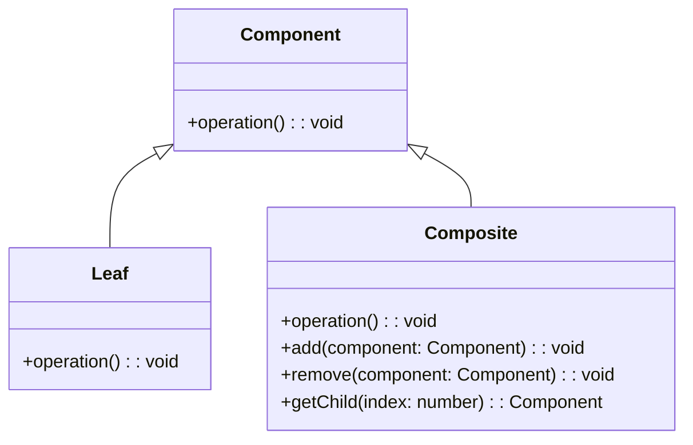

# Composite Design Pattern
> Version: dp_20240101_000050

- [Composite Design Pattern](#composite-design-pattern)
  * [Summary](#summary)
    + [Essence](#essence)
    + [Real examples](#real-examples)
  * [Implementation](#implementation)
    + [How to use it?](#how-to-use-it)
    + [Python code examples:](#python-code-examples)
  * [Analysis](#analysis)
    + [Maintainability:](#maintainability)
      - [Cleaner Code?](#cleaner-code)
      - [Readable Code?](#readable-code)
    + [Testability:](#testability)
    + [Adaptability:](#adaptability)
      - [Replaceable code?](#replaceable-code)
    + [Scalability:](#scalability)
    + [Tradeoffs:](#tradeoffs)
      - [Advantages?](#advantages)
      - [Disadvantages?](#disadvantages)
  * [Remarks](#remarks)
    + [Concerns and Tips?](#concerns-and-tips)
    + [Execrises](#execrises)

## Summary

### Essence
The Composite design pattern allows for the composition of objects into tree structures to represent part-whole hierarchies. It provides a unified interface for both individual objects and composite objects, promoting loose coupling and improving code readability and maintainability.

### Real examples

- GUI frameworks often use the Composite pattern to represent the hierarchy of UI elements, such as windows, panels, and buttons.
- File systems can be represented using the Composite pattern, where directories and files are treated uniformly as components.
- Organization charts can be modeled using the Composite pattern, where employees and departments are treated uniformly as components.




## Implementation
### How to use it?
To use the Composite design pattern, follow these steps:
1. Create a common interface or base class for both individual objects and composite objects.
2. Implement the common interface or base class in the individual object class.
3. Implement the common interface or base class in the composite object class and maintain a collection of child components.
4. In the composite object class, implement the operations by delegating them to child components.
5. Use the composite object to create a tree structure of objects.

### Python code examples:
```python
from abc import ABC, abstractmethod

class Component(ABC):
    @abstractmethod
    def operation(self):
        pass


class Leaf(Component):
    def operation(self):
        print('Leaf operation')


class Composite(Component):
    def __init__(self):
        self.components = []

    def operation(self):
        print('Composite operation')
        for component in self.components:
            component.operation()

    def add(self, component):
        self.components.append(component)

    def remove(self, component):
        self.components.remove(component)


# Usage
leaf1 = Leaf()
leaf2 = Leaf()
composite = Composite()
composite.add(leaf1)
composite.add(leaf2)
composite.operation()
```

- The above Python code demonstrates the implementation of the Composite design pattern. It defines a common interface 'Component' and two concrete classes 'Leaf' and 'Composite'. The 'Composite' class can contain multiple 'Component' objects and delegates the 'operation' method to its child components recursively.   


## Analysis
### Maintainability: 
To what extent is your code characterized by cleanliness and readability?
#### Cleaner Code?

- Provides a unified interface for both individual objects and composite objects, allowing clients to treat them uniformly without type checking.
- Promotes the Single Responsibility Principle by separating the code for individual objects and composite objects into separate classes.
- Allows for the addition of new types of components without modifying existing code, making the code more maintainable.

#### Readable Code?

- Improves code readability by providing a clear structure for representing part-whole hierarchies.
- Makes it easier to understand the relationships between objects and their compositions.
- Allows for the use of recursive algorithms, which can be easier to read and understand.


### Testability: 
Can your code be methodically and comprehensively tested?


### Adaptability: 
How readily can your code be substituted or modified?
#### Replaceable code?

- Helps in making the code replaceable by allowing clients to treat individual objects and composite objects uniformly.
- Allows for the substitution of individual objects with composite objects and vice versa without affecting the client code.
- Promotes the Open-Closed Principle by allowing the addition of new types of components without modifying existing code.


### Scalability:
Are your architectural components characterized by loose coupling?


### Tradeoffs:
#### Advantages?

- Provides a unified interface for both individual objects and composite objects.
- Allows for the addition of new types of components without modifying existing code.
- Supports recursive algorithms for performing operations on a tree structure.
- Promotes loose coupling between clients and components.
- Improves code readability and maintainability.

#### Disadvantages?

- Can result in a complex class hierarchy.
- May require additional code to handle the traversal of the tree structure.
- Can be less efficient than directly accessing individual objects.
- Should be used for part-whole hierarchies and dynamic object addition/removal.


## Remarks
### Concerns and Tips?

- Consider the potential for a complex class hierarchy when using the Composite pattern.
- Pay attention to the performance implications, especially with large tree structures.
- Use caching or other optimization techniques to improve efficiency.
- Test individual objects and composite objects separately to ensure correct behavior.
- Keep the class hierarchy as simple as possible to avoid unnecessary complexity.
- Study real-world examples to understand how the Composite pattern is used.


### Execrises

- Q: What is the purpose of the Composite design pattern?

  - A: The purpose of the Composite design pattern is to compose objects into tree structures to represent part-whole hierarchies and treat individual objects and compositions of objects uniformly.
- Q: How does the Composite pattern improve code maintainability?

  - A: The Composite pattern allows for the addition of new types of components without modifying existing code, making the code more maintainable.
- Q: How does the Composite pattern promote loose coupling?

  - A: The Composite pattern promotes loose coupling by allowing clients to treat individual objects and composite objects uniformly, reducing the dependencies between the client code and the components.
- Q: What are the advantages of using the Composite pattern?

  - A: The advantages of using the Composite pattern include providing a unified interface for both individual objects and composite objects, supporting recursive algorithms for performing operations on a tree structure, and improving code readability and maintainability.
- Q: What are the disadvantages of using the Composite pattern?

  - A: The disadvantages of using the Composite pattern include the potential for a complex class hierarchy, the need for additional code to handle the traversal of the tree structure, and the potential for lower efficiency compared to directly accessing individual objects.
- Q: How can the performance of the Composite pattern be improved?

  - A: The performance of the Composite pattern can be improved by using caching or other optimization techniques, and by carefully designing the algorithms for traversing the tree structure.
- Q: When should the Composite pattern be used?

  - A: The Composite pattern should be used when you want to represent part-whole hierarchies and treat individual objects and compositions of objects uniformly, and when you want to add or remove objects dynamically from a tree structure.
- Q: What are some real-world examples of the Composite pattern?

  - A: Some real-world examples of the Composite pattern include GUI frameworks, file systems, and organization charts.

