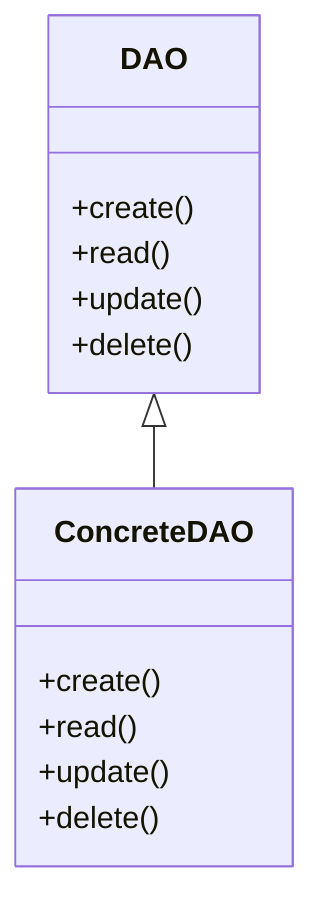

# Data Access Object (DAO)
> Version: dp_20231231_202019

- [Builder Design Pattern](#builder-design-pattern)
   * [Summary](#summary)
      + [Essence](#essence)
      + [Real examples](#real-examples)
   * [Implementation](#implementation)
      + [How to use it?](#how-to-use-it)
      + [Python code examples:](#python-code-examples)
   * [Analysis](#analysis)
      + [Cleaner Code?](#cleaner-code)
      + [Readable Code?](#readable-code)
      + [Replaceable code?](#replaceable-code)
      + [Testable code?](#testable-code)
      + [Advantages?](#advantages)
      + [Disadvantages?](#disadvantages)
   * [Remarks](#remarks)
      + [Concerns and Tips?](#concerns-and-tips)
      + [Execrises](#execrises)

## Summary

### Essence
The DAO design pattern provides an abstraction layer between the application and the data persistence layer. It encapsulates the CRUD operations for a specific data entity into a single class, promoting clean and modular code.

### Real examples

- Managing user accounts and permissions
- Handling product inventory
- Storing and retrieving customer orders
- Logging and auditing system activities




## Implementation
### How to use it?
To use the DAO design pattern, follow these steps:
1. Define a DAO interface that declares the CRUD operations for a specific data entity.
2. Implement the DAO interface with a concrete class that provides the actual implementation of the CRUD operations.
3. Use the DAO interface in the application code to perform data access and manipulation.

### Python code examples:
```python
from abc import ABC, abstractmethod


class DAO(ABC):
    @abstractmethod
    def create(self, data):
        pass

    @abstractmethod
    def read(self, id):
        pass

    @abstractmethod
    def update(self, id, data):
        pass

    @abstractmethod
    def delete(self, id):
        pass


class ConcreteDAO(DAO):
    def create(self, data):
        # Implementation for create operation
        pass

    def read(self, id):
        # Implementation for read operation
        pass

    def update(self, id, data):
        # Implementation for update operation
        pass

    def delete(self, id):
        # Implementation for delete operation
        pass
```

- The above code defines an abstract DAO class with abstract methods for CRUD operations. A concrete DAO class is then implemented with the actual implementation of the CRUD operations.   


## Analysis
### Cleaner Code?

- Separation of concerns: The DAO pattern separates the data access logic from the business logic, making the codebase more modular and maintainable.
- Single responsibility principle: Each DAO class is responsible for handling the CRUD operations for a specific data entity, ensuring clear and focused code.
- Code reuse: Encapsulating the data access logic into reusable DAO classes reduces code duplication.
- Encapsulation: The DAO classes provide a clean and consistent interface for data manipulation, hiding the underlying database implementation details.

### Readable Code?

- Clear and intuitive API: The DAO classes provide a well-defined set of methods for data manipulation, improving code readability.
- Standardized naming conventions: Following consistent naming conventions for CRUD operations makes the codebase easier to understand and navigate.
- Separation of concerns: Separating the data access logic from the business logic improves code organization and readability.
- Reduced complexity: The DAO pattern abstracts away the complexities of database operations, making the codebase more readable.

### Replaceable code?

- Dependency inversion: The DAO pattern promotes the use of interfaces for data access, allowing easy switching of databases or data access technologies.
- Reduced coupling: Decoupling the application from the underlying database implementation enables easier replacement of components without impacting the entire system.
- Modular architecture: The DAO pattern separates the data access logic into standalone DAO classes, facilitating individual component replacement or modification.
- Dependency injection: The DAO classes can be easily injected into other components, promoting loose coupling and testability.

### Testable code?

- Mocking and stubbing: The DAO classes can be easily mocked or stubbed during unit testing, enabling isolated testing of the business logic.
- Test data management: The DAO classes can provide methods for creating and managing test data, simplifying test scenario setup and teardown.
- Testability of business logic: Separating the data access logic from the business logic allows independent testing of the business logic.
- Test coverage: The DAO pattern encourages unit testing of the data access layer, ensuring thorough testing of CRUD operations.

### Advantages?

- Separation of concerns: The DAO pattern separates the data access logic from the business logic, improving code modularity.
- Code reuse: Encapsulating the data access logic into reusable DAO classes reduces code duplication.
- Encapsulation: The DAO classes provide a clean and consistent interface for data manipulation, hiding database implementation details.
- Testability: The DAO pattern facilitates testing of the business logic by allowing mocking or stubbing of the data access layer.

### Disadvantages?

- Increased complexity: The DAO pattern introduces an additional layer of abstraction, potentially increasing code complexity.
- Performance overhead: The use of the DAO pattern may introduce some performance overhead due to method invocations and object creations.
- Learning curve: Developers new to the DAO pattern may require time to understand and adapt to its concepts and conventions.
- Potential for code duplication: Improper management of the DAO pattern can lead to code duplication if similar data access logic is implemented in multiple DAO classes.


## Remarks
### Concerns and Tips?

- Performance: The use of the DAO pattern can introduce performance overhead.
- Complexity: The DAO pattern adds an abstraction layer, increasing code complexity.
- Code duplication: Improper management of the DAO pattern can lead to code duplication.
- Learning curve: Developers new to the DAO pattern may require time to understand and adapt.
- Programming tips: Use dependency injection, follow naming conventions, consider transaction management, and maintain focused DAO interfaces and implementations.
- Tricky aspects: Choosing the right level of abstraction, managing transactional operations, handling complex queries, and balancing code organization.
- Further studies: "Design Patterns: Elements of Reusable Object-Oriented Software" by Erich Gamma et al., "Clean Architecture: A Craftsman's Guide to Software Structure and Design" by Robert C. Martin, "Patterns of Enterprise Application Architecture" by Martin Fowler.


### Execrises

- Q: What is the purpose of the DAO design pattern?

  - A: The purpose of the DAO design pattern is to provide an abstraction layer between the application and the data persistence layer, allowing the application to access and manipulate data without directly interacting with the underlying database implementation.
- Q: How does the DAO pattern help in making the code clean?

  - A: The DAO pattern helps in making the code clean by separating the data access logic from the business logic, promoting code reuse, and encapsulating the data manipulation operations into a single class.
- Q: How does the DAO pattern help in making the code readable?

  - A: The DAO pattern helps in making the code readable by providing a clear and intuitive API for data manipulation, following standardized naming conventions, and separating the concerns of data access and business logic.
- Q: How does the DAO pattern help in making the code easy to be tested?

  - A: The DAO pattern helps in making the code easy to be tested by allowing for mocking and stubbing of the data access layer, providing methods for test data management, and enabling testability of the application's business logic.
- Q: How does the DAO pattern help in making components loose coupled?

  - A: The DAO pattern helps in making components loose coupled by promoting the use of interfaces for data access, reducing coupling with the underlying database implementation, and facilitating dependency injection.
- Q: What are the advantages of using the DAO pattern?

  - A: The advantages of using the DAO pattern include separation of concerns, code reuse, encapsulation, and testability.
- Q: What are the disadvantages of using the DAO pattern?

  - A: The disadvantages of using the DAO pattern include increased complexity, potential performance overhead, learning curve, and potential for code duplication.
- Q: How can the DAO pattern be implemented in Python?

  - A: The DAO pattern can be implemented in Python using abstract base classes (ABC) for defining the DAO interface and concrete classes for implementing the CRUD operations.
- Q: What are some concerns when using the DAO pattern?

  - A: Some concerns when using the DAO pattern include performance, complexity, code duplication, and the learning curve for developers who are new to the pattern.

