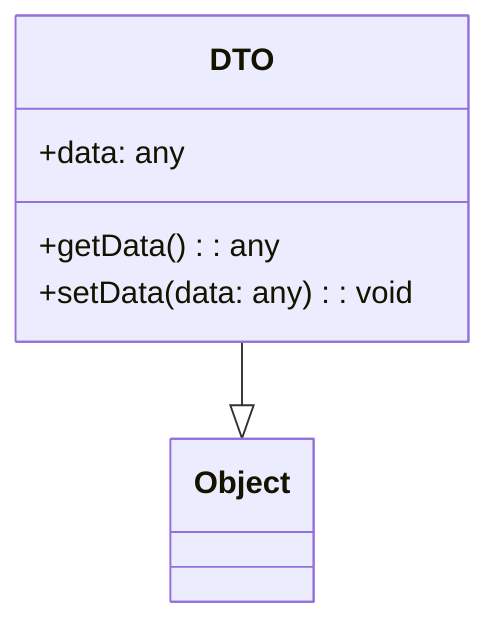

# Data Transfer Object (DTO)
> Version: dp_20231231_202019

- [Builder Design Pattern](#builder-design-pattern)
   * [Summary](#summary)
      + [Essence](#essence)
      + [Real examples](#real-examples)
   * [Implementation](#implementation)
      + [How to use it?](#how-to-use-it)
      + [Python code examples:](#python-code-examples)
   * [Analysis](#analysis)
      + [Cleaner Code?](#cleaner-code)
      + [Readable Code?](#readable-code)
      + [Replaceable code?](#replaceable-code)
      + [Testable code?](#testable-code)
      + [Advantages?](#advantages)
      + [Disadvantages?](#disadvantages)
   * [Remarks](#remarks)
      + [Concerns and Tips?](#concerns-and-tips)
      + [Execrises](#execrises)

## Summary

### Essence
The essence of the DTO design pattern is to encapsulate data and provide a standardized way to transfer it between different parts of an application.

### Real examples

- Transferring data between different layers or components of an application.
- Sending data over a network or between different processes.
- Exposing a simplified view of complex data structures to external systems.

## Implementation
### How to use it?
To use the DTO design pattern, follow these steps:
1. Create a DTO class with properties to represent the data you want to transfer.
2. Add getter and setter methods to access and modify the data.
3. Use the DTO object to transfer data between different layers or components of your application.

## Analysis
### Cleaner Code?

- Encapsulates data, promoting information hiding and reducing code complexity.
- Separates concerns of data transfer and data processing, making the code more modular and easier to understand.
- Provides a standardized way to transfer data, improving code consistency and maintainability.

### Readable Code?

- Provides a clear and structured representation of the data being transferred, improving code readability.
- Uses meaningful property names in the DTO, making the intent of the data explicit.
- Decouples data transfer logic from business logic, enhancing code readability and maintainability.

### Replaceable code?

- Helps in making code replaceable by decoupling data transfer logic from business logic.
- Promotes loose coupling between components, allowing independent evolution of code.
- Facilitates modular design, making components easily replaceable or modified without affecting others.

### Testable code?

- Provides a well-defined interface for accessing and modifying data, making it easier to write unit tests.
- Enables independent testing of code that uses DTOs and code that processes the data.
- Reduces code complexity, making it easier to write and maintain tests.

### Advantages?

- Simplifies data transfer between components.
- Promotes information hiding and reduces code complexity.
- Improves modularity and maintainability of code.
- Enhances readability and understandability of code.
- Facilitates testing of code.
- Reduces coupling between components.
- Provides a standardized way to transfer data.

### Disadvantages?

- Introduces additional code and complexity for conversion between DTOs and domain objects.
- May increase codebase size.
- Requires careful design and maintenance to ensure consistency between DTOs and domain objects.

## Remarks
### Concerns and Tips?

- Conversion between DTOs and domain objects can introduce additional code and complexity.
- DTOs may increase codebase size.
- Careful design and maintenance are required to ensure consistency between DTOs and domain objects.
- Use meaningful property names in DTOs to make the intent of the data explicit.
- Keep DTOs simple and focused on their purpose of data transfer.
- Consider using automated mapping tools or libraries to simplify conversion between DTOs and domain objects.
- Test code that uses DTOs independently of code that processes the data.
- Be mindful of performance implications when transferring large amounts of data using DTOs.
- Be careful not to confuse DTOs with domain objects or entities.
- Avoid overusing DTOs and creating unnecessary complexity in the code.

### Execrises

- 1. What is the purpose of the DTO design pattern?
- The purpose of the DTO design pattern is to transfer data between different layers or components of an application, without exposing the internal details of the data.
- 2. How does the DTO design pattern help in making the code clean?
- The DTO design pattern helps in making the code clean by encapsulating data, separating the concerns of data transfer and data processing, and providing a standardized way to transfer data.
- 3. What are the advantages of using DTOs?
- Some advantages of using DTOs include simplifying data transfer, promoting information hiding, improving code maintainability, and reducing coupling between components.
- 4. What are the disadvantages of using DTOs?
- Some disadvantages of using DTOs include increased code complexity, the need for careful design and maintenance, and potential performance implications.
- 5. How can DTOs help in making the code readable?
- DTOs help in making the code readable by providing a clear and structured representation of the data being transferred, using meaningful property names, and decoupling the data transfer logic from the business logic.

