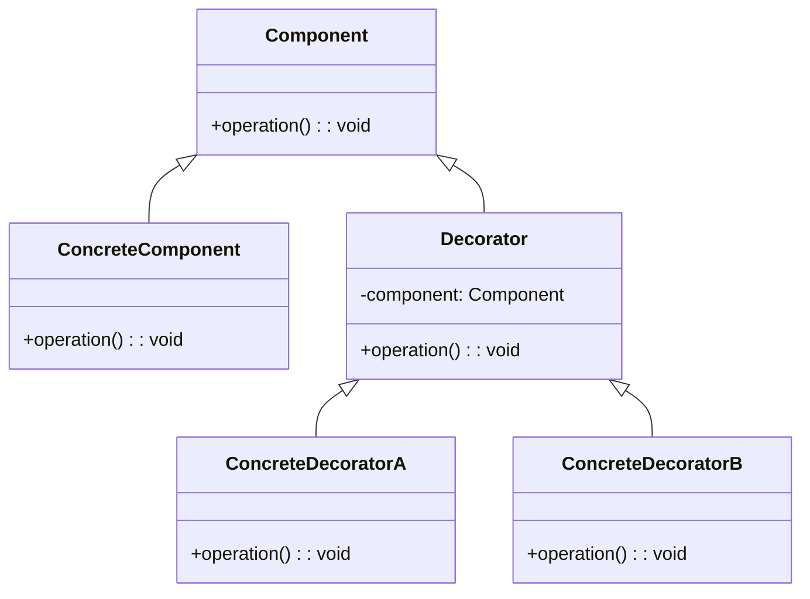

# Decorator Design Pattern
> Version: dp_20231231_234226

- [Builder Design Pattern](#builder-design-pattern)
   * [Summary](#summary)
      + [Essence](#essence)
      + [Real examples](#real-examples)
   * [Implementation](#implementation)
      + [How to use it?](#how-to-use-it)
      + [Python code examples:](#python-code-examples)
   * [Analysis](#analysis)
      + [Cleaner Code?](#cleaner-code)
      + [Readable Code?](#readable-code)
      + [Replaceable code?](#replaceable-code)
      + [Testable code?](#testable-code)
      + [Advantages?](#advantages)
      + [Disadvantages?](#disadvantages)
   * [Remarks](#remarks)
      + [Concerns and Tips?](#concerns-and-tips)
      + [Execrises](#execrises)

## Summary

### Essence

- The Decorator pattern is a design strategy that allows you to add new features to an object dynamically, without altering its structure.
- It promotes code modularity and reusability by using composition over inheritance.
- Decorators wrap the original object, providing additional behavior while maintaining the object's interface.
- This pattern promotes loose coupling, as decorators can be added or removed independently.

### Real examples

- Adding features to a text editor like spell checking or auto-completion without modifying the core editor functionality.
- Applying filters or effects to images in an image editing application without altering the original image.
- Extending the functionality of a web server by adding decorators for authentication, logging, or caching.
- Enhancing a user interface by adding decorators for tooltips, animations, or themes.
- When you want to add new functionality to an object dynamically without changing its structure.
- When you have a class hierarchy that is difficult to extend using inheritance.
- When you want to add multiple optional behaviors to an object independently.
- When you want to avoid subclass explosion by having a large number of subclasses for different combinations of behaviors.




## Implementation
### How to use it?
To use the Decorator design pattern, follow these steps:
1. Create an interface or abstract class for the component and define the basic operations.
2. Implement the component class that provides the basic functionality.
3. Create an abstract decorator class that implements the component interface and has a reference to the component object.
4. Create concrete decorator classes that extend the abstract decorator class and add additional behavior.
5. Use the decorators to wrap the component object and add the desired functionality.

### Python code examples:
```python

# Example 1: Adding additional functionality to a text editor

class TextEditor:
    def __init__(self):
        self.text = ''

    def write(self, text):
        self.text += text

    def read(self):
        return self.text


class SpellChecker:
    def __init__(self, editor):
        self.editor = editor

    def write(self, text):
        self.editor.write(text)
        self.check_spelling()

    def read(self):
        return self.editor.read()

    def check_spelling(self):
        # Spell checking logic
        pass


text_editor = TextEditor()
spell_checker = SpellChecker(text_editor)

spell_checker.write('Hello, world!')
print(spell_checker.read())  # Output: 'Hello, world!'
```
```python
# Example 2: Applying filters to images

class Image:
    def __init__(self, data):
        self.data = data

    def apply_filter(self, filter):
        filter.apply(self)


class Filter:
    def apply(self, image):
        # Filter logic
        pass


class GrayscaleFilter(Filter):
    def apply(self, image):
        # Grayscale filter logic
        pass


class SepiaFilter(Filter):
    def apply(self, image):
        # Sepia filter logic
        pass


image = Image('image.jpg')
grayscale_filter = GrayscaleFilter()
sepia_filter = SepiaFilter()

image.apply_filter(grayscale_filter)
image.apply_filter(sepia_filter)

```

- 1. Decorator pattern allows adding new functionality to an object dynamically.
- 2. Decorators wrap the object and provide additional behavior.
- 3. Composition is used instead of inheritance for code reuse and modularity.
- 4. Decorators and the object share a common interface or abstract class.
- 5. Decorators can be added or removed independently.   


## Analysis
### Maintainability: 
To what extent is your code characterized by cleanliness and readability?
#### Cleaner Code?

- The Decorator pattern keeps code clean by allowing you to add functionality to an object without modifying its code.
- It promotes the Single Responsibility Principle by separating core functionality from additional behaviors.

#### Readable Code?

- The Decorator pattern enhances code readability by separating additional behaviors from the object's core functionality.
- Using meaningful names for decorators and following a consistent naming convention makes the code self-explanatory.


### Testability: 
Can your code be methodically and comprehensively tested?


### Adaptability: 
How readily can your code be substituted or modified?
#### Replaceable code?

- The Decorator pattern promotes code replaceability by allowing decorators to be swapped or added without affecting existing code.
- A common interface or abstract class for the component and decorators makes the code more modular and flexible.


### Scalability:
Are your architectural components characterized by loose coupling?


### Tradeoffs:
#### Advantages?

- The Decorator pattern allows for dynamic addition of new functionality to an object without changing its structure.
- It promotes code reuse and modularity by using composition instead of inheritance.
- Provides a flexible alternative to subclassing for extending the behavior of objects.
- Allows for the addition of multiple optional behaviors to an object independently.
- Promotes loose coupling between the component and decorators.
- Solves the problem of adding new functionality to an object dynamically without changing its structure or modifying its existing code.

#### Disadvantages?

- Can result in a large number of small classes if there are many combinations of behaviors.
- May introduce complexity and overhead due to the use of multiple layers of decorators.
- Can make it harder to understand the flow of execution and debug the code.
- Avoids the need to modify the existing code of an object to add new functionality.
- Avoids the use of multiple inheritance for extending the behavior of objects.
- Avoids the creation of a large number of subclasses for different combinations of behaviors.


## Remarks
### Concerns and Tips?

- Concerns:
- The Decorator pattern can introduce complexity and overhead due to the use of multiple layers of decorators.
- It may be challenging to understand the flow of execution and debug the code when there are many decorators involved.
- Care must be taken to ensure that the decorators and component share a common interface or abstract class.
- Programming Tips:
- Use meaningful names for the decorators to make the code more readable and self-explanatory.
- Follow a consistent naming convention for the decorators to maintain code consistency.
- Keep the number of decorators to a minimum to avoid excessive nesting and code complexity.
- Use composition instead of inheritance to promote code reuse and modularity.
- Test the decorators and the component independently to ensure the correct behavior of each.
- Trickys:
- Understanding the order of wrapping when multiple decorators are used.
- Avoiding excessive nesting of decorators to prevent code complexity.
- Ensuring that the decorators and component share a common interface or abstract class.
- Studies:
- The Decorator pattern is commonly used in GUI frameworks to add additional behaviors to user interface components.
- The Java I/O classes in the java.io package use the Decorator pattern to provide functionality such as buffering, compression, and encryption.
- The Python logging module uses the Decorator pattern to add additional functionality to loggers and handlers.


### Execrises

- Q: What is the purpose of the Decorator design pattern?

  - A: The purpose of the Decorator design pattern is to dynamically add new functionality to an object without changing its structure.
- Q: How does the Decorator pattern promote code reuse?

  - A: The Decorator pattern promotes code reuse by using composition instead of inheritance. Decorators can be added or removed independently, allowing for the creation of different combinations of behaviors.
- Q: How does the Decorator pattern promote loose coupling?

  - A: The Decorator pattern promotes loose coupling by using composition instead of inheritance. The component does not need to be aware of the specific decorators, and decorators can be easily replaced or added without affecting the existing code.
- Q: What are some advantages of using the Decorator pattern?

  - A: Some advantages of using the Decorator pattern include dynamic addition of new functionality, code reuse and modularity, flexible extension of object behavior, addition of multiple optional behaviors independently, and loose coupling between the component and decorators.
- Q: What are some disadvantages of using the Decorator pattern?

  - A: Some disadvantages of using the Decorator pattern include the potential for a large number of small classes, complexity and overhead due to multiple layers of decorators, and potential difficulty in understanding the flow of execution and debugging the code.

