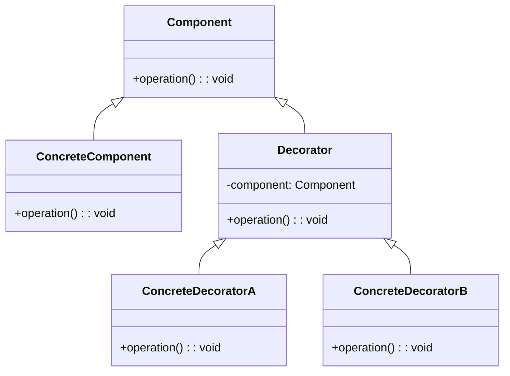

# Decorator Design Pattern
> Version: dp_20231231_202019

- [Builder Design Pattern](#builder-design-pattern)
   * [Summary](#summary)
      + [Essence](#essence)
      + [Real examples](#real-examples)
   * [Implementation](#implementation)
      + [How to use it?](#how-to-use-it)
      + [Python code examples:](#python-code-examples)
   * [Analysis](#analysis)
      + [Cleaner Code?](#cleaner-code)
      + [Readable Code?](#readable-code)
      + [Replaceable code?](#replaceable-code)
      + [Testable code?](#testable-code)
      + [Advantages?](#advantages)
      + [Disadvantages?](#disadvantages)
   * [Remarks](#remarks)
      + [Concerns and Tips?](#concerns-and-tips)
      + [Execrises](#execrises)

## Summary

### Essence
The Decorator design pattern allows the addition of new functionality to an object without changing its structure. Decorators wrap the core object and provide additional behavior. Decorators can be combined to create complex behavior. The core object can be used independently or wrapped with decorators as needed. The Decorator design pattern promotes loose coupling and modularity.

### Real examples

- Adding additional features to a text editor, such as spell checking, auto-correct, and formatting options.
- Extending the functionality of a web browser with plugins for ad-blocking, password management, and language translation.
- Enhancing a game character with new abilities, such as increased speed, improved defense, and special attacks.
- When you want to add new functionality to an object dynamically without changing its structure.
- When you have a class hierarchy that is difficult to extend using inheritance.
- When you want to add or remove responsibilities from an object at runtime.




## Implementation
### How to use it?
To use the Decorator design pattern, follow these steps:
1. Create an interface or abstract class for the component and define the base behavior.
2. Implement the component class that provides the base behavior.
3. Create an abstract decorator class that implements the component interface and has a reference to the component object.
4. Create concrete decorator classes that extend the abstract decorator class and add additional behavior.
5. Use the decorators to wrap the component object and add the desired functionality.

### Python code examples:
```python
from abc import ABC, abstractmethod

class Component(ABC):
    @abstractmethod
    def operation(self) -> None:
        pass


class ConcreteComponent(Component):
    def operation(self) -> None:
        print('ConcreteComponent operation')


class Decorator(Component):
    def __init__(self, component: Component) -> None:
        self._component = component

    def operation(self) -> None:
        self._component.operation()


class ConcreteDecoratorA(Decorator):
    def operation(self) -> None:
        super().operation()
        print('ConcreteDecoratorA operation')


class ConcreteDecoratorB(Decorator):
    def operation(self) -> None:
        super().operation()
        print('ConcreteDecoratorB operation')


component = ConcreteComponent()
decorator_a = ConcreteDecoratorA(component)
decorator_b = ConcreteDecoratorB(decorator_a)
decorator_b.operation()
```
The example demonstrates the use of the Decorator design pattern in Python. The ConcreteComponent class represents the core object, while the Decorator classes add additional behavior. The decorators can be combined to create complex behavior, and the core object can be used independently or wrapped with decorators as needed.   


## Analysis
### Cleaner Code?
The Decorator design pattern helps in making clean code by allowing the addition of new functionality to an object without changing its structure. This avoids the need for creating multiple subclasses with different combinations of behavior, resulting in a more modular and maintainable codebase.

### Readable Code?
The Decorator design pattern improves code readability by separating the core functionality of an object from the additional features provided by decorators. Each decorator class focuses on a specific aspect of behavior, making it easier to understand and modify individual components.

### Replaceable code?
The Decorator design pattern promotes loose coupling by allowing objects to be composed dynamically at runtime. Decorators can be added or removed without affecting the core object, making it easier to modify and extend the behavior of an object without impacting other parts of the system.

### Testable code?
The Decorator design pattern makes code easier to test by allowing the use of mock decorators that simulate different behaviors. This enables isolated testing of the core object and its decorators, ensuring that each component functions correctly and can be tested independently.

### Advantages?

- Allows the addition of new functionality to an object without changing its structure.
- Provides a flexible alternative to subclassing for extending behavior.
- Allows the combination of multiple decorators to create complex behavior.
- Promotes loose coupling and modularity.
- Enhances code reusability and maintainability.
- Solves the problem of adding new functionality to an object dynamically without changing its structure.

### Disadvantages?

- Can result in a large number of small classes if not used judiciously.
- May introduce complexity and overhead if decorators are not properly designed and managed.
- Can make code harder to debug and understand if decorators are applied excessively or inappropriately.
- Potential concerns include the possibility of introducing complexity and overhead if not used judiciously, and making the code harder to debug and understand if decorators are applied excessively or inappropriately.


## Remarks
### Concerns and Tips?

- Be careful not to overuse decorators, as it can lead to a large number of small classes and increased complexity.
- Ensure that decorators are properly designed and managed to avoid introducing unnecessary overhead.
- Use mock decorators for testing to isolate the core object and its decorators.
- Some potential concerns when using the Decorator design pattern include the possibility of introducing complexity and overhead if decorators are not properly designed and managed, and the potential for making the code harder to debug and understand if decorators are applied excessively or inappropriately.


### Execrises

- Q: What is the purpose of the Decorator design pattern?

  - A: The purpose of the Decorator design pattern is to dynamically add new functionality to an object without changing its structure.
- Q: How does the Decorator design pattern promote loose coupling?

  - A: The Decorator design pattern promotes loose coupling by allowing objects to be composed dynamically at runtime. Decorators can be added or removed without affecting the core object, making it easier to modify and extend the behavior of an object without impacting other parts of the system.
- Q: What are the advantages of using the Decorator design pattern?

  - A: Some advantages of using the Decorator design pattern include the ability to add new functionality without changing the object's structure, a flexible alternative to subclassing, the ability to combine multiple decorators, and improved code reusability and maintainability.
- Q: What are some potential concerns when using the Decorator design pattern?

  - A: Some potential concerns when using the Decorator design pattern include the possibility of introducing complexity and overhead if decorators are not properly designed and managed, and the potential for making the code harder to debug and understand if decorators are applied excessively or inappropriately.

