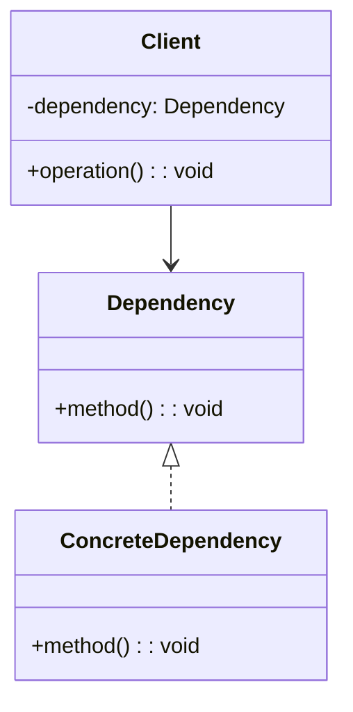

# Dependency Injection
> Version: dp_20231231_202019

- [Builder Design Pattern](#builder-design-pattern)
   * [Summary](#summary)
      + [Essence](#essence)
      + [Real examples](#real-examples)
   * [Implementation](#implementation)
      + [How to use it?](#how-to-use-it)
      + [Python code examples:](#python-code-examples)
   * [Analysis](#analysis)
      + [Cleaner Code?](#cleaner-code)
      + [Readable Code?](#readable-code)
      + [Replaceable code?](#replaceable-code)
      + [Testable code?](#testable-code)
      + [Advantages?](#advantages)
      + [Disadvantages?](#disadvantages)
   * [Remarks](#remarks)
      + [Concerns and Tips?](#concerns-and-tips)
      + [Execrises](#execrises)

## Summary

### Essence
The essence of Dependency Injection is to decouple the dependent code from the concrete implementation of its dependencies, allowing for easier testing, maintainability, and flexibility. It achieves this by inverting the control of creating and managing dependencies, providing them externally rather than creating them internally.

### Real examples

- In a web application, the controller classes can be injected with service classes to handle business logic.
- In a unit testing framework, the test cases can be injected with mock objects to simulate different scenarios.
- In a modular application, the modules can be injected with shared resources or services.
- In a plugin system, the plugins can be injected with the necessary interfaces to extend the functionality of the application.
- When there are multiple implementations of a dependency and the choice needs to be made at runtime.
- When the dependencies need to be easily replaced or mocked for testing purposes.
- When the dependencies are complex to create or manage internally.
- When the dependencies are shared across multiple components or modules.

## Implementation
### How to use it?
To use Dependency Injection, follow these steps:
1. Identify the dependencies of a class or component.
2. Create interfaces or abstract classes to represent the dependencies.
3. Implement the dependencies as concrete classes.
4. Modify the dependent class to accept the dependencies through constructor, setter, or method injection.
5. Create an injector or container to manage the creation and injection of dependencies.
6. Configure the injector with the appropriate bindings between interfaces and concrete classes.
7. Use the injector to create instances of the dependent class with the injected dependencies.

## Analysis
### Cleaner Code?

- Dependency Injection helps in separating the creation and management of dependencies from the dependent code, resulting in cleaner and more focused classes.
- It promotes the Single Responsibility Principle by allowing each class to focus on its own functionality without worrying about creating or managing dependencies.
- It reduces the amount of boilerplate code for creating and managing dependencies, resulting in cleaner and more concise code.
- It makes the code more modular and reusable by decoupling the dependent code from the concrete implementation of its dependencies.

### Readable Code?

- Dependency Injection makes the code more readable by clearly defining the dependencies of a class or component.
- It improves the understandability of the code by making the dependencies explicit and visible in the constructor or method signature.
- It makes the code easier to follow and reason about by separating the creation and management of dependencies from the dependent code.

### Replaceable code?

- Dependency Injection promotes loose coupling between components by removing the direct dependency on concrete implementations.
- It allows for easy replacement of dependencies with different implementations without modifying the dependent code.
- It enables the dependent code to work with any implementation that satisfies the required interface or contract.
- It reduces the coupling between components, making the code more flexible and maintainable.

### Testable code?

- Dependency Injection makes the code easier to test by allowing the dependencies to be easily replaced with mock objects or test doubles.
- It enables unit testing of individual components without the need for complex setup or external dependencies.
- It promotes testability by decoupling the dependent code from the concrete implementation of its dependencies.
- It allows for easier testing of different scenarios by injecting different dependencies or configurations.

### Advantages?

- Increased flexibility and maintainability due to loose coupling.
- Improved testability and easier unit testing.
- Better code organization and separation of concerns.
- Enhanced code readability and understandability.
- Facilitates the use of dependency inversion and other design principles.
- Tight coupling between components and dependencies.
- Difficulty in testing components in isolation.
- Lack of flexibility and maintainability when changing dependencies.
- Code duplication and boilerplate code for creating and managing dependencies.

### Disadvantages?

- Increased complexity and learning curve for understanding and implementing Dependency Injection.
- Requires additional setup and configuration for managing dependencies.
- Can lead to overuse or misuse of Dependency Injection frameworks, resulting in unnecessary complexity.
- May introduce performance overhead due to the need for dependency resolution and injection at runtime.
- Performance overhead due to the need for dependency resolution and injection at runtime.
- Increased complexity and learning curve for understanding and implementing Dependency Injection.
- Potential misuse or overuse of Dependency Injection frameworks, resulting in unnecessary complexity.
- Difficulty in managing the lifecycle of dependencies and ensuring they are created and destroyed correctly.

## Remarks
### Concerns and Tips?

- Performance overhead due to the need for dependency resolution and injection at runtime.
- Increased complexity and learning curve for understanding and implementing Dependency Injection.
- Potential misuse or overuse of Dependency Injection frameworks, resulting in unnecessary complexity.
- Difficulty in managing the lifecycle of dependencies and ensuring they are created and destroyed correctly.
- Start with small, focused classes and identify their dependencies.
- Use interfaces or abstract classes to represent the dependencies, allowing for easier replacement or mocking.
- Use constructor injection as the default choice, as it ensures that all dependencies are provided when creating an instance.
- Avoid using Dependency Injection frameworks or containers if they are not necessary or if they introduce unnecessary complexity.
- Test the code with different scenarios and configurations to ensure that the dependencies are correctly injected and managed.
- Understanding the different types of injection (constructor, setter, method) and choosing the appropriate one for each scenario.
- Managing the lifecycle of dependencies and ensuring they are created and destroyed correctly.
- Avoiding overuse or misuse of Dependency Injection frameworks, which can lead to unnecessary complexity.
- Handling circular dependencies, where two or more components depend on each other.

### Execrises

- Q: What is Dependency Injection?

  - A: Dependency Injection is a design pattern that decouples the dependent code from the concrete implementation of its dependencies, allowing for easier testing, maintainability, and flexibility.
- Q: What are the benefits of using Dependency Injection?

  - A: Dependency Injection promotes loose coupling, testability, maintainability, and flexibility. It separates the creation and management of dependencies from the dependent code, making the code more modular, reusable, and readable.
- Q: How does Dependency Injection help in making the code testable?

  - A: Dependency Injection makes the code easier to test by allowing the dependencies to be easily replaced with mock objects or test doubles. It enables unit testing of individual components without the need for complex setup or external dependencies.
- Q: What are the different types of injection in Dependency Injection?

  - A: Dependency Injection can be implemented using constructor injection, setter injection, or method injection. Constructor injection is the most common and recommended approach, as it ensures that all dependencies are provided when creating an instance.
- Q: How can circular dependencies be handled in Dependency Injection?

  - A: Circular dependencies can be handled by using lazy initialization or by introducing an intermediate interface or abstraction to break the circular reference.
- Q: What are some common pitfalls or challenges in using Dependency Injection?

  - A: Some common pitfalls include overuse or misuse of Dependency Injection frameworks, managing the lifecycle of dependencies, handling circular dependencies, and potential performance overhead.
- Q: When should Dependency Injection be used?

  - A: Dependency Injection should be used when there are multiple implementations of a dependency and the choice needs to be made at runtime, when the dependencies need to be easily replaced or mocked for testing purposes, when the dependencies are complex to create or manage internally, or when the dependencies are shared across multiple components or modules.

