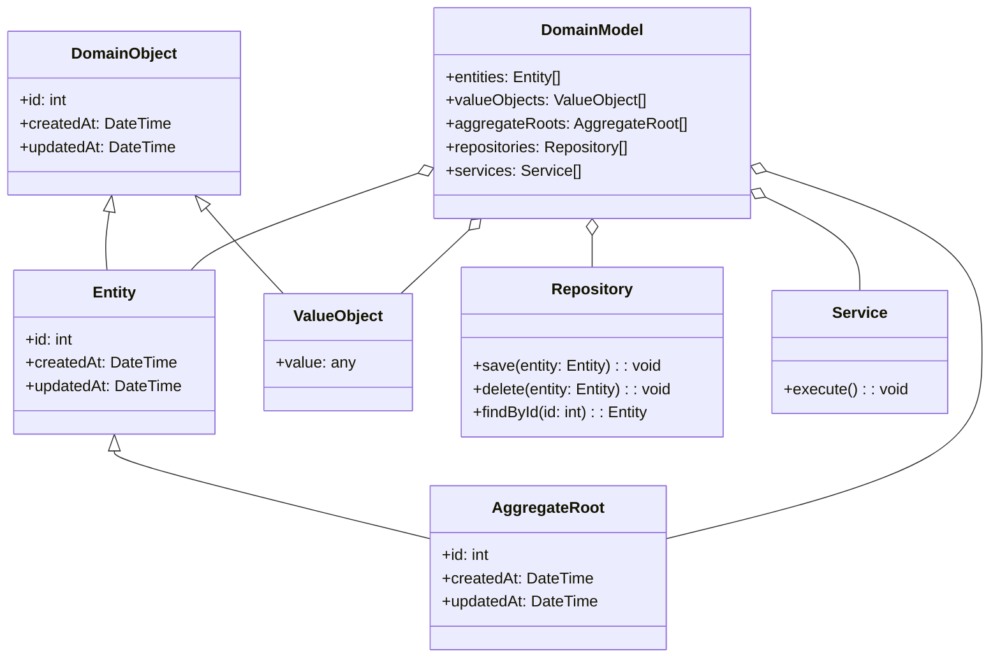

# Domain Model
> Version: dp_20231231_202019

- [Builder Design Pattern](#builder-design-pattern)
   * [Summary](#summary)
      + [Essence](#essence)
      + [Real examples](#real-examples)
   * [Implementation](#implementation)
      + [How to use it?](#how-to-use-it)
      + [Python code examples:](#python-code-examples)
   * [Analysis](#analysis)
      + [Cleaner Code?](#cleaner-code)
      + [Readable Code?](#readable-code)
      + [Replaceable code?](#replaceable-code)
      + [Testable code?](#testable-code)
      + [Advantages?](#advantages)
      + [Disadvantages?](#disadvantages)
   * [Remarks](#remarks)
      + [Concerns and Tips?](#concerns-and-tips)
      + [Execrises](#execrises)

## Summary

### Essence

- The Domain Model design pattern is a representation of real-world entities and their relationships in a software system. It's a conceptual model that aids in understanding, analyzing, and solving complex business problems.
- The pattern encapsulates the business logic and behavior within the domain objects, separating it from the technical implementation details.
- It uses domain-specific language and concepts, making the code more expressive and self-explanatory.
- The pattern supports the implementation of business rules and constraints in a centralized and reusable manner, improving code consistency and maintainability.
- It facilitates the testing, scalability, and evolution of the system over time.

### Real examples

- In an e-commerce system, the Domain Model can represent entities like Product, Order, Customer, and their relationships.
- In a banking system, the Domain Model can represent entities like Account, Transaction, Customer, and their relationships.
- The pattern is useful for modeling complex business domains with rich behavior and relationships.
- It's beneficial for implementing business rules and constraints in a flexible and maintainable way.
- It's useful for enforcing data integrity and consistency across the system.




## Implementation
### How to use it?
To use the Domain Model design pattern, follow these steps:
1. Identify the entities, value objects, aggregate roots, repositories, and services in the problem domain.
2. Create classes for each of these domain concepts, encapsulating their attributes and behavior.
3. Define the relationships between the domain objects using associations, aggregations, or compositions.
4. Implement the business logic and behavior of the system within the domain objects.
5. Use repositories to persist and retrieve domain objects from the data storage.
6. Use services to orchestrate the interactions between domain objects and perform complex operations.

### Python code examples:
```python
class Order:
    def __init__(self, id: int, customer: Customer, items: List[Product]):
        self.id = id
        self.customer = customer
        self.items = items

    def calculate_total_price(self) -> float:
        total_price = 0
        for item in self.items:
            total_price += item.price
        return total_price


class Customer:
    def __init__(self, id: int, name: str):
        self.id = id
        self.name = name


class Product:
    def __init__(self, id: int, name: str, price: float):
        self.id = id
        self.name = name
        self.price = price
```

- The above Python code demonstrates the implementation of the Domain Model design pattern for an e-commerce system. It defines classes for the Order, Customer, and Product entities, encapsulating their attributes and behavior. The Order class calculates the total price of the items in the order, while the Customer and Product classes represent the customer and product entities, respectively.   


## Analysis
### Cleaner Code?

- The pattern encapsulates business logic within domain objects, improving modularity and maintainability.
- It uses domain-specific language, making the code more expressive.
- It centralizes the implementation of business rules, reducing code duplication and improving consistency.
- It enables the use of object-oriented design principles, contributing to clean and modular code.

### Readable Code?

- The pattern uses domain-specific language and concepts, making the code more understandable.
- It provides a clear representation of the problem domain, making it easier to reason about the system's behavior.
- It promotes the use of meaningful names for domain objects, enhancing code readability.
- It encourages the separation of concerns and the organization of code into cohesive and loosely coupled modules.

### Replaceable code?

- The pattern encapsulates business logic within domain objects, reducing dependencies between different parts of the system.
- It allows for the separation of concerns and the modularization of code into independent modules.
- It enables the use of dependency injection and inversion of control, facilitating the replacement of implementations.
- It supports the use of interfaces and contracts for interacting with domain objects, making it easier to replace implementations.

### Testable code?

- The pattern allows for unit testing of individual domain objects in isolation.
- It promotes the use of dependency injection and inversion of control, facilitating the mocking of dependencies during testing.
- It enables the creation of testable interfaces and contracts for domain objects.
- It encourages the use of test-driven development (TDD) and behavior-driven development (BDD) practices.

### Advantages?

- The pattern separates business logic from technical implementation details, improving maintainability.
- It allows for easy modification and customization of the system's behavior.
- It promotes the use of unit testing and test-driven development practices, enhancing testability.
- It facilitates communication and collaboration between domain experts and developers.
- It supports the evolution and scalability of the system over time.

### Disadvantages?

- The pattern can introduce additional complexity, especially in large and complex systems.
- The encapsulation of business logic within domain objects can introduce a performance overhead.
- The pattern requires developers to learn and understand domain-specific language and concepts.
- The pattern can lead to over-engineering if not applied judiciously.
- The use of dependency injection and inversion of control can introduce additional complexity in managing dependencies.


## Remarks
### Concerns and Tips?

- One concern with the pattern is the potential performance overhead introduced by encapsulating business logic within domain objects.
- Another concern is the increased complexity of the codebase, especially in large and complex systems.
- The learning curve associated with the pattern can be a concern.
- Dependency management can be a concern in systems that use the pattern.
- Understand the problem domain thoroughly before applying the pattern.
- Keep the design focused on the specific requirements of the problem domain and avoid over-engineering.
- Continuously refine and evolve the Domain Model as the understanding of the problem domain improves and new requirements emerge.


### Execrises

- 1. Q: What is the purpose of the Domain Model design pattern?
   
  - A: The purpose of the Domain Model design pattern is to represent the real-world entities and their relationships in a software system. It helps in creating a conceptual model of the problem domain, which can be used to understand, analyze, and solve complex business problems.
- 2. Q: How does the Domain Model design pattern help in making code clean?
   
  - A: The Domain Model design pattern helps in making clean code by encapsulating the business logic and behavior within the domain objects. This separation of concerns improves the modularity and maintainability of the codebase. It also promotes the use of domain-specific language and concepts, making the code more expressive and self-explanatory.
- 3. Q: What are the advantages of using the Domain Model design pattern?
   
  - A: Some advantages of using the Domain Model design pattern include improved maintainability, increased flexibility, enhanced testability, better collaboration between domain experts and developers, and support for the evolution and scalability of the system over time.
- 4. Q: What are some concerns with the Domain Model design pattern?
   
  - A: Some concerns with the Domain Model design pattern include potential performance overhead, increased complexity of the codebase, learning curve associated with domain-specific language and concepts, and challenges in managing dependencies and configurations.
- 5. Q: How does the Domain Model design pattern promote loose coupling?
   
  - A: The Domain Model design pattern promotes loose coupling by encapsulating the business logic and behavior within the domain objects. This reduces the dependencies between different parts of the system. It also supports the use of dependency injection and inversion of control, which further decouples the domain objects from their dependencies and facilitates the replacement of implementations.

