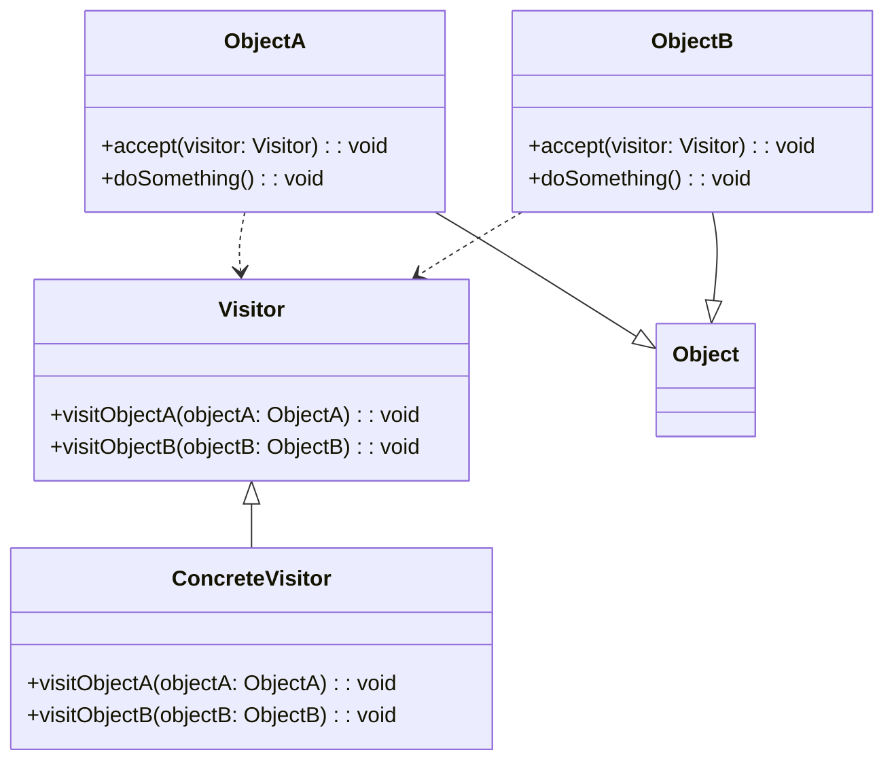

# Double Dispatch
> Version: dp_20231231_202019

- [Builder Design Pattern](#builder-design-pattern)
   * [Summary](#summary)
      + [Essence](#essence)
      + [Real examples](#real-examples)
   * [Implementation](#implementation)
      + [How to use it?](#how-to-use-it)
      + [Python code examples:](#python-code-examples)
   * [Analysis](#analysis)
      + [Cleaner Code?](#cleaner-code)
      + [Readable Code?](#readable-code)
      + [Replaceable code?](#replaceable-code)
      + [Testable code?](#testable-code)
      + [Advantages?](#advantages)
      + [Disadvantages?](#disadvantages)
   * [Remarks](#remarks)
      + [Concerns and Tips?](#concerns-and-tips)
      + [Execrises](#execrises)

## Summary

### Essence
The Double Dispatch design pattern enables dynamic method dispatch based on the runtime types of two objects. It separates the logic for handling different types of objects into separate visit methods, improving code organization and readability. It allows for the addition of new types of objects and visitors without modifying existing code. The pattern makes code easier to test by allowing for the creation of mock visitors and unit testing of visit methods in isolation. It helps in making components loosely coupled.

### Real examples

- Collision handling in a game engine
- Event handling in a graphical user interface framework

## Implementation
### How to use it?
To use the Double Dispatch design pattern, follow these steps:
1. Define the base classes for the objects that will be visited.
2. Define the visitor interface with visit methods for each type of object.
3. Implement the visitor interface with concrete visitor classes.
4. Implement the accept method in each object class to call the appropriate visit method on the visitor.

## Analysis
### Cleaner Code?

- Separates the logic for handling different types of objects into separate visit methods, improving code organization and readability.
- Allows for the addition of new types of objects and visitors without modifying existing code, making the code more maintainable and extensible.

### Readable Code?

- Improves code readability by clearly separating the logic for handling different types of objects into separate visit methods.
- Makes the code more self-documenting, as the visit methods provide a clear indication of how each type of object is handled.

### Replaceable code?

- Decouples the logic for handling different types of objects from the objects themselves.
- Allows for the addition of new types of objects and visitors without modifying existing code, as long as the new objects implement the accept method and the new visitors implement the visit methods.

### Testable code?

- Makes code easier to test by allowing for the creation of mock visitors that can be used to verify that the correct visit methods are called.
- Enables unit testing of the visit methods in isolation, as they can be called directly with mock objects.

### Advantages?

- Enables dynamic method dispatch based on the runtime types of two objects.
- Allows for flexible and extensible code.
- Improves code organization, readability, and maintainability.
- Makes code easier to test by allowing for the creation of mock visitors and unit testing of visit methods in isolation.
- Helps in making components loosely coupled.

### Disadvantages?

- Requires the implementation of accept methods in each object class and visit methods in each visitor class, which can increase code complexity.
- May introduce performance overhead due to the multiple levels of method dispatch.
- Can be difficult to understand and implement correctly, especially for complex object hierarchies.

## Remarks
### Concerns and Tips?

- One concern is the potential performance overhead due to the multiple levels of method dispatch. This can be mitigated by carefully designing the object hierarchy and minimizing the number of visit methods.
- Another concern is the increased code complexity due to the implementation of accept methods in each object class and visit methods in each visitor class.
- Carefully design the object hierarchy and visitor interface to ensure that all possible combinations of object types and visitor types are handled.
- Use meaningful names for the visit methods to clearly indicate their purpose and the types of objects they handle.
- Consider using a factory method or abstract factory pattern to create objects and visitors, to further decouple the code.
- Use unit tests to verify the correct behavior of the visit methods and the interaction between objects and visitors.
- One tricky aspect of the Double Dispatch pattern is ensuring that the accept method in each object class calls the appropriate visit method on the visitor. This requires careful design and implementation to handle all possible combinations of object types and visitor types.

### Execrises

- Q: What is the purpose of the Double Dispatch design pattern?
- 
  - A: The purpose of the Double Dispatch design pattern is to enable dynamic method dispatch based on the runtime types of two objects, allowing for more flexible and extensible code.
- Q: How does the Double Dispatch pattern help in making code clean?
- 
  - A: The Double Dispatch pattern helps in making clean code by separating the logic for handling different types of objects into separate visit methods, improving code organization and readability.
- Q: What are the advantages of using the Double Dispatch pattern?
- 
  - A: Some advantages of using the Double Dispatch pattern include enabling dynamic method dispatch, allowing for flexible and extensible code, improving code maintainability and testability, and helping in making components loosely coupled.
- Q: What are some concerns with the Double Dispatch pattern?
- 
  - A: Some concerns with the Double Dispatch pattern include potential performance overhead, increased code complexity, and the need for careful design and implementation to handle all possible combinations of object types and visitor types.

