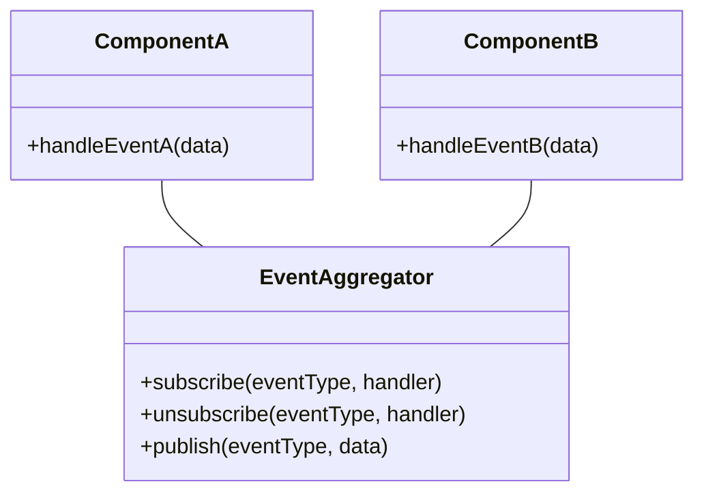

# Event Aggregator
> Version: dp_20231231_202019

- [Builder Design Pattern](#builder-design-pattern)
   * [Summary](#summary)
      + [Essence](#essence)
      + [Real examples](#real-examples)
   * [Implementation](#implementation)
      + [How to use it?](#how-to-use-it)
      + [Python code examples:](#python-code-examples)
   * [Analysis](#analysis)
      + [Cleaner Code?](#cleaner-code)
      + [Readable Code?](#readable-code)
      + [Replaceable code?](#replaceable-code)
      + [Testable code?](#testable-code)
      + [Advantages?](#advantages)
      + [Disadvantages?](#disadvantages)
   * [Remarks](#remarks)
      + [Concerns and Tips?](#concerns-and-tips)
      + [Execrises](#execrises)

## Summary

### Essence
The Event Aggregator pattern provides a centralized communication mechanism between components through events. It acts as a central hub for event handling and dispatching. It promotes loose coupling, code modularity, and testability.

### Real examples

- Coordinating communication between multiple components in a complex application.
- Handling user interactions and updating UI components.
- Routing and delivering messages in a messaging system.
- Handling game events in a game engine.
- Inter-component communication in a distributed system.




## Implementation
### How to use it?
To use the Event Aggregator pattern, follow these steps:
1. Create an Event Aggregator class.
2. Create components or objects that will publish events and subscribe to events.
3. Register event handlers with the Event Aggregator.
4. Publish events from the components.
5. Handle events in the subscribed event handlers.

### Python code examples:
```python
from typing import Any, Callable

class EventAggregator:
    def __init__(self):
        self.handlers = {}

    def subscribe(self, event_type: str, handler: Callable[[Any], None]) -> None:
        if event_type not in self.handlers:
            self.handlers[event_type] = []
        self.handlers[event_type].append(handler)

    def unsubscribe(self, event_type: str, handler: Callable[[Any], None]) -> None:
        if event_type in self.handlers:
            self.handlers[event_type].remove(handler)

    def publish(self, event_type: str, data: Any) -> None:
        if event_type in self.handlers:
            for handler in self.handlers[event_type]:
                handler(data)


# Usage

def handle_event_a(data: Any) -> None:
    print(f'Event A handled with data: {data}')

def handle_event_b(data: Any) -> None:
    print(f'Event B handled with data: {data}')

aggregator = EventAggregator()
aggregator.subscribe('event_a', handle_event_a)
aggregator.subscribe('event_b', handle_event_b)

aggregator.publish('event_a', 'Hello, World!')
aggregator.publish('event_b', 123)
from typing import Any, Callable

class EventAggregator:
    def __init__(self):
        self.handlers = {}

    def subscribe(self, event_type: str, handler: Callable[[Any], None]) -> None:
        if event_type not in self.handlers:
            self.handlers[event_type] = []
        self.handlers[event_type].append(handler)

    def unsubscribe(self, event_type: str, handler: Callable[[Any], None]) -> None:
        if event_type in self.handlers:
            self.handlers[event_type].remove(handler)

    def publish(self, event_type: str, data: Any) -> None:
        if event_type in self.handlers:
            for handler in self.handlers[event_type]:
                handler(data)


# Usage

def handle_event_a(data: Any) -> None:
    print(f'Event A handled with data: {data}')

def handle_event_b(data: Any) -> None:
    print(f'Event B handled with data: {data}')

aggregator = EventAggregator()
aggregator.subscribe('event_a', handle_event_a)
aggregator.subscribe('event_b', handle_event_b)

aggregator.publish('event_a', 'Hello, World!')
aggregator.publish('event_b', 123)
```

- The Event Aggregator pattern in Python provides a centralized communication mechanism between components through events. Components can subscribe to events and handle them accordingly. It promotes loose coupling, code modularity, and testability.
- The Event Aggregator pattern in Python enables components to communicate indirectly through events. It decouples components, promotes code modularity, and simplifies event-driven behavior and testing.
- The Event Aggregator pattern in Python allows components to publish events to a central hub, which then distributes them to interested subscribers. It promotes loose coupling, code modularity, and testability.
- The Event Aggregator pattern in Python provides a way for components to communicate through events. It promotes loose coupling, code modularity, and simplifies event-driven behavior and testing.
- The Event Aggregator pattern in Python facilitates communication between components through events. It promotes loose coupling, code modularity, and simplifies event-driven behavior and testing.   


## Analysis
### Cleaner Code?

- Promotes loose coupling between components by decoupling the sender and receiver of events.
- Separates concerns by providing a centralized mechanism for event handling.
- Improves code organization by providing a clear separation between event publishers and subscribers.

### Readable Code?

- Improves code readability by providing a clear and consistent way of handling events.
- Promotes a modular and reusable code structure by allowing components to subscribe to specific events of interest.
- Enhances code maintainability by providing a single point of entry for event handling.

### Replaceable code?

- Enables components to communicate indirectly through events, reducing direct dependencies.
- Allows for selective communication and reduces the impact of changes in other components.

### Testable code?

- Facilitates unit testing by enabling components to be tested in isolation.
- Simplifies the testing of event-driven behavior by providing a centralized mechanism for event simulation and verification.
- Promotes testability by decoupling components through events.

### Advantages?

- Decouples components by providing a centralized communication mechanism.
- Promotes code modularity and reusability.
- Enhances code organization and maintainability.
- Simplifies event-driven behavior and testing.
- Supports selective communication between components.
- Facilitates inter-component communication in distributed systems.

### Disadvantages?

- Increased complexity due to the introduction of an additional layer of indirection.
- Potential performance impact when handling a large number of events or subscribers.
- Requires careful design and management of event types and subscriptions.
- May introduce overhead in terms of memory usage and processing time.
- May require proper error handling and exception management.


## Remarks
### Concerns and Tips?

- Considerations for performance impact when handling a large number of events or subscribers.
- Proper management of event types and subscriptions to avoid conflicts or confusion.
- Error handling and exception management in event handling logic.
- Scalability and efficiency in distributed systems.
- Use meaningful and descriptive event names to improve code readability.
- Follow a consistent naming convention for event handlers and event-related methods.
- Consider using a library or framework that provides built-in support for event aggregation.
- Document the event types, their purpose, and the expected data format to facilitate understanding and usage.
- Careful management of event types and subscriptions is required to avoid conflicts or confusion.
- Performance considerations should be taken into account when handling a large number of events or subscribers.
- Proper error handling and exception management should be implemented to handle unexpected scenarios or failures.
- Scalability and efficiency in distributed systems.


### Execrises

- Q: What is the purpose of the Event Aggregator pattern?

  - A: The purpose of the Event Aggregator pattern is to provide a centralized communication mechanism between multiple components or objects in a system.
- Q: How does the Event Aggregator pattern promote loose coupling?

  - A: The Event Aggregator pattern decouples components by enabling them to communicate indirectly through events. Components only need to know about the Event Aggregator and the events they are interested in, rather than directly referencing each other.
- Q: How does the Event Aggregator pattern help in making code readable?

  - A: The Event Aggregator pattern improves code readability by providing a clear and consistent way of handling events. Event handlers can be registered and managed in a centralized manner, making it easier to understand the flow of events in the system.
- Q: How does the Event Aggregator pattern help in making code easy to be tested?

  - A: The Event Aggregator pattern facilitates unit testing by enabling components to be tested in isolation. Components can be easily replaced or mocked during testing, allowing for more focused and targeted testing scenarios.
- Q: What are some advantages of using the Event Aggregator pattern?

  - A: Some advantages of using the Event Aggregator pattern include decoupling of components, code modularity, enhanced code organization and maintainability, simplified event-driven behavior and testing, selective communication between components, and support for inter-component communication in distributed systems.

