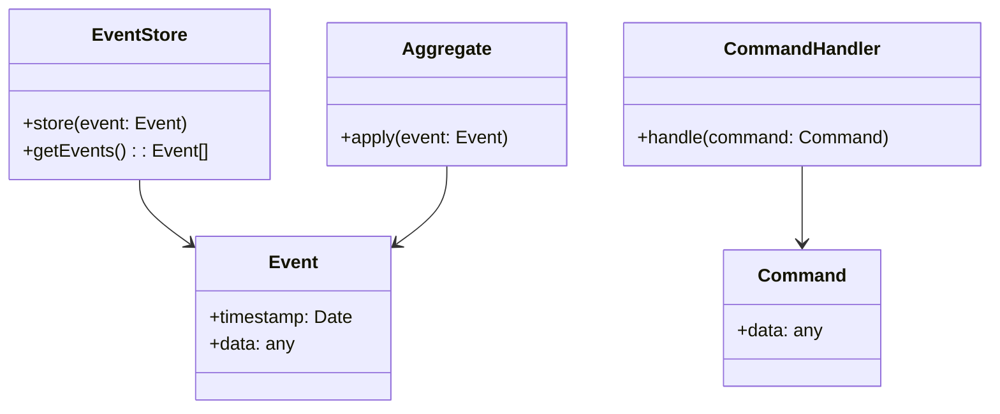

# Event Sourcing
> Version: dp_20231231_202019

- [Builder Design Pattern](#builder-design-pattern)
   * [Summary](#summary)
      + [Essence](#essence)
      + [Real examples](#real-examples)
   * [Implementation](#implementation)
      + [How to use it?](#how-to-use-it)
      + [Python code examples:](#python-code-examples)
   * [Analysis](#analysis)
      + [Cleaner Code?](#cleaner-code)
      + [Readable Code?](#readable-code)
      + [Replaceable code?](#replaceable-code)
      + [Testable code?](#testable-code)
      + [Advantages?](#advantages)
      + [Disadvantages?](#disadvantages)
   * [Remarks](#remarks)
      + [Concerns and Tips?](#concerns-and-tips)
      + [Execrises](#execrises)

## Summary

### Essence

- Event Sourcing captures all changes to an application's state as a sequence of events, which can be used to reconstruct the state at any point in time.
- The state of the application is derived from the events, which act as the source of truth.
- Event Sourcing requires implementing an Event Store to store and retrieve events.
- Event Sourcing fits well with event-driven architectures, where events are the primary means of communication between components.

### Real examples

- Financial systems: Event Sourcing can be used to track all financial transactions and easily generate reports or audit trails.
- E-commerce platforms: Event Sourcing can be used to track all changes to product inventory, orders, and payments.
- Collaboration tools: Event Sourcing can be used to track all changes to documents, comments, and user actions.
- IoT systems: Event Sourcing can be used to track all sensor readings and generate analytics or alerts.
- Auditing: Event Sourcing allows for easy auditing of all changes to an application's state.
- Debugging: Event Sourcing allows for easy debugging by replaying events and observing the state at different points in time.
- Replayability: Event Sourcing allows for replaying events to recreate the state of the application at any point in time.
- Scalability: Event Sourcing allows for distributing the processing of events across multiple nodes, enabling scalability.




## Implementation
### How to use it?
To use Event Sourcing, you need to implement an Event Store to store the events, Aggregates to apply the events and update their state, and Command Handlers to handle incoming commands and generate events.

### Python code examples:
```python
from datetime import datetime


class Event:
    def __init__(self, timestamp: datetime, data: any):
        self.timestamp = timestamp
        self.data = data


class EventStore:
    def __init__(self):
        self.events = []

    def store(self, event: Event):
        self.events.append(event)

    def getEvents(self):
        return self.events


class Aggregate:
    def apply(self, event: Event):
        # Apply the event to update the state of the aggregate
        pass


class CommandHandler:
    def handle(self, command: Command):
        # Handle the command and generate events
        pass


class Command:
    def __init__(self, data: any):
        self.data = data
```

- The Python code example demonstrates the basic structure of an Event Sourcing implementation, including an Event Store, Aggregates, Command Handlers, and Commands.
- Events are stored in the Event Store, Aggregates apply events to update their state, Command Handlers handle commands and generate events, and Commands encapsulate data for commands.
- This code provides a starting point for implementing Event Sourcing in Python, but additional logic and functionality would need to be added for a complete implementation.   


## Analysis
### Cleaner Code?

- Event Sourcing promotes modularity and maintainability by separating the storage of events from the processing of events.
- It ensures data integrity by making events immutable and preventing accidental modifications.
- It promotes an event-driven architecture, which helps in decoupling components and making the code more modular.

### Readable Code?

- Events in Event Sourcing are self-describing, making the code more readable and understandable.
- It promotes an event-driven architecture, which helps in making the code more readable by focusing on the flow of events.

### Replaceable code?

- Event Sourcing promotes an event-driven architecture, which helps in making components loosely coupled.
- It separates the storage of events from the processing of events, making the components more modular and loosely coupled.
- Event Sourcing often uses an event bus to publish and subscribe to events, further decoupling the components.

### Testable code?

- Event Sourcing ensures that the state of the application can be recreated by replaying events, making it easier to write deterministic tests.
- In tests, events can be easily mocked or replayed to simulate different scenarios and test the behavior of the application.
- Event Sourcing allows for testing individual components in isolation by replaying a subset of events.

### Advantages?

- Auditability: Event Sourcing provides a complete audit trail of all changes to an application's state.
- Replayability: Event Sourcing allows for replaying events to recreate the state of the application at any point in time.
- Scalability: Event Sourcing enables distributing the processing of events across multiple nodes, enabling scalability.
- Debugging: Event Sourcing allows for easy debugging by replaying events and observing the state at different points in time.
- Event-driven architecture: Event Sourcing fits well with event-driven architectures, where events are the primary means of communication between components.
- Tracking changes: Event Sourcing solves the problem of tracking all changes to an application's state.

### Disadvantages?

- Increased complexity: Event Sourcing adds complexity to the system, as it requires implementing an Event Store and handling event processing.
- Storage requirements: Event Sourcing requires storing all events, which can result in increased storage requirements compared to traditional state storage.
- Eventual consistency: Event Sourcing relies on eventual consistency, as events need to be processed and applied to update the state of the application.
- Learning curve: Event Sourcing introduces new concepts and patterns, which may require a learning curve for developers unfamiliar with the approach.
- Data loss: Event Sourcing avoids data loss by storing all events, providing a complete audit trail of changes to the application's state.
- Inconsistent state: Event Sourcing avoids inconsistent state by deriving the state from the events, ensuring data integrity.
- Tight coupling: Event Sourcing avoids tight coupling by promoting an event-driven architecture, where components communicate through events.


## Remarks
### Concerns and Tips?

- Concerns: Storage requirements, performance, and the learning curve for developers unfamiliar with Event Sourcing are some concerns to consider.
- Programming Tips: Start small, use event versioning, consider event sourcing frameworks, and document events to ensure clarity and understanding for future development and maintenance.
- Trickys: Handling changes to event schemas and ensuring backward compatibility can be tricky in Event Sourcing. Replaying events to recreate the state of the application can be time-consuming for large event streams.
- Studies: Martin Fowler's blog post on Event Sourcing, Greg Young's talk on CQRS and Event Sourcing, and Vaughn Vernon's book 'Implementing Domain-Driven Design' are good resources to learn more about Event Sourcing.


### Execrises

- Q: What is the purpose of Event Sourcing?

  - A: The purpose of Event Sourcing is to capture all changes to an application's state as a sequence of events, which can be used to reconstruct the state at any point in time.
- Q: How does Event Sourcing help in making code clean?

  - A: Event Sourcing promotes separation of concerns, single source of truth, immutable events, and an event-driven architecture, all of which contribute to cleaner code.
- Q: What are the advantages of Event Sourcing?

  - A: Event Sourcing provides auditability, replayability, scalability, debugging capabilities, and fits well with event-driven architectures.
- Q: What are the disadvantages of Event Sourcing?

  - A: Event Sourcing adds complexity, requires increased storage, relies on eventual consistency, and may have a learning curve for developers unfamiliar with the approach.
- Q: How can Event Sourcing help in making code readable?

  - A: Event Sourcing provides self-describing events, clear separation of concerns, and promotes an event-driven architecture, all of which contribute to readable code.
- Q: How can Event Sourcing help in making code easy to be tested?

  - A: Event Sourcing ensures deterministic state, allows for mocking events, enables isolated testing, and promotes an event-driven testing approach.
- Q: How does Event Sourcing help in making components loose coupled?

  - A: Event Sourcing promotes an event-driven architecture, separates the storage of events from the processing of events, and often uses an event bus, all of which contribute to loose coupling.
- Q: What are some real product usage examples of Event Sourcing?

  - A: Event Sourcing can be used in financial systems, e-commerce platforms, collaboration tools, and IoT systems to track changes, provide auditing, and enable replayability.
- Q: What are some use cases of Event Sourcing?

  - A: Event Sourcing can be used for auditing, debugging, replayability, scalability, and in event-driven architectures.
- Q: What are some concerns with Event Sourcing?

  - A: Storage requirements, performance, and the learning curve for developers unfamiliar with Event Sourcing are some concerns to consider.
- Q: How can Event Sourcing be implemented in Python?

  - A: The provided Python code example demonstrates the basic structure of an Event Sourcing implementation, including an Event Store, Aggregates, Command Handlers, and Commands.

