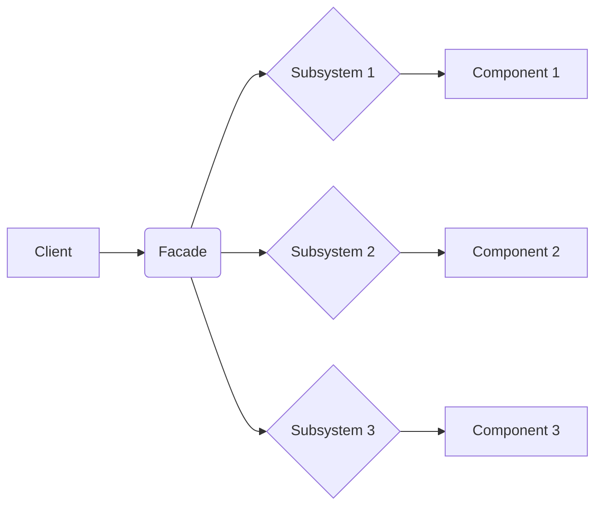

# Facade Design Pattern
> Version: dp_20231231_202019

- [Builder Design Pattern](#builder-design-pattern)
   * [Summary](#summary)
      + [Essence](#essence)
      + [Real examples](#real-examples)
   * [Implementation](#implementation)
      + [How to use it?](#how-to-use-it)
      + [Python code examples:](#python-code-examples)
   * [Analysis](#analysis)
      + [Cleaner Code?](#cleaner-code)
      + [Readable Code?](#readable-code)
      + [Replaceable code?](#replaceable-code)
      + [Testable code?](#testable-code)
      + [Advantages?](#advantages)
      + [Disadvantages?](#disadvantages)
   * [Remarks](#remarks)
      + [Concerns and Tips?](#concerns-and-tips)
      + [Execrises](#execrises)

## Summary

### Essence
The Facade design pattern provides a simplified interface to a complex system or set of subsystems. It encapsulates the complex interactions and dependencies of the system behind a simple interface, promoting loose coupling between the client and the subsystems. The facade class acts as a high-level abstraction that hides the details of the underlying subsystems. This pattern improves code readability, maintainability, and testability, and facilitates modularization and separation of concerns. It is suitable for systems with complex interactions and dependencies.

### Real examples

- Simplifying the interface to a complex system or set of subsystems.
- Providing a single entry point for the client to interact with the system.
- Promoting loose coupling between the client and the subsystems.
- Abstracting away the complexities of the underlying system.
- Making the system easier to understand, use, and maintain.




## Implementation
### How to use it?
To use the Facade design pattern, create a facade class that provides a simplified interface to the subsystems. The facade class should delegate the client's requests to the appropriate subsystems and coordinate their interactions. The client interacts only with the facade class, unaware of the underlying subsystems.

### Python code examples:
```python
from abc import ABC, abstractmethod

class Subsystem1:
    def operation1(self):
        pass


class Subsystem2:
    def operation2(self):
        pass


class Subsystem3:
    def operation3(self):
        pass


class Facade:
    def __init__(self):
        self.subsystem1 = Subsystem1()
        self.subsystem2 = Subsystem2()
        self.subsystem3 = Subsystem3()

    def operation(self):
        self.subsystem1.operation1()
        self.subsystem2.operation2()
        self.subsystem3.operation3()


# Client code
facade = Facade()
facade.operation()
```
The above Python code demonstrates the implementation of the Facade design pattern. The Facade class provides a simplified interface to the subsystems (Subsystem1, Subsystem2, Subsystem3) and coordinates their interactions. The client interacts with the Facade class, unaware of the complexities of the subsystems.   


## Analysis
### Cleaner Code?
Encapsulates complex interactions and dependencies behind a simple interface, promoting modularization and improving code readability and maintainability.

### Readable Code?
Provides a simplified interface that reduces cognitive load on the client, making the code easier to understand and navigate.

### Replaceable code?
Promotes loose coupling between the client and the subsystems, allowing them to evolve independently without affecting the client. This makes the system more flexible and easier to maintain.

### Testable code?
Provides a single entry point for the client to interact with the system, allowing for easy isolation and testing of the client's interactions with the system.

### Advantages?

- Simplifies the interface to a complex system or set of subsystems.
- Provides a single entry point for the client to interact with the system.
- Promotes loose coupling between the client and the subsystems.
- Abstracts away the complexities of the underlying system.
- Improves code readability and maintainability.
- Enhances testability and enables effective testing of the system.
- Facilitates modularization and separation of concerns.
- Allows for easier evolution and maintenance of the system.

### Disadvantages?

- May introduce an additional layer of abstraction.
- Can lead to a proliferation of facade classes if not properly designed.
- May hide important details and make troubleshooting more difficult.
- Requires careful design to ensure the facade class does not become a God object.
- May not be suitable for systems with frequently changing requirements or complex interactions.


## Remarks
### Concerns and Tips?

- The Facade design pattern may introduce an additional layer of abstraction, which can make the code more complex.
- It may hide important details and make troubleshooting more difficult.
- The facade class needs to be carefully designed to ensure it does not become a God object.
- The Facade design pattern may not be suitable for systems with frequently changing requirements or complex interactions.
- Identify the complex interactions and dependencies within your system that can be encapsulated behind a simplified interface.
- Design the facade class to provide a clear and intuitive interface for the client.
- Use meaningful and descriptive names for the methods and classes in the facade.
- Test the facade class thoroughly to ensure it correctly delegates the client's requests to the subsystems.
- Regularly review and refactor the facade class to maintain its simplicity and effectiveness.
- Be careful not to create a facade class that becomes a God object, responsible for too many things.
- Avoid exposing the underlying subsystems directly to the client, as it would violate the principle of encapsulation.
- Consider the trade-off between simplicity and flexibility when designing the facade class.


### Execrises

- Q: What is the purpose of the Facade design pattern?

  - A: The purpose of the Facade design pattern is to provide a simplified interface to a complex system or set of subsystems.
- Q: How does the Facade design pattern promote loose coupling?

  - A: The Facade design pattern promotes loose coupling by encapsulating the interactions with the subsystems behind a facade class. The client only interacts with the facade class, unaware of the details of the subsystems.
- Q: What are the advantages of using the Facade design pattern?

  - A: The advantages of using the Facade design pattern include simplifying the interface to a complex system, providing a single entry point for the client, promoting loose coupling, abstracting away complexities, improving code readability and maintainability, enhancing testability, facilitating modularization, and enabling easier evolution and maintenance of the system.
- Q: What are the disadvantages of using the Facade design pattern?

  - A: The disadvantages of using the Facade design pattern include the potential introduction of an additional layer of abstraction, the possibility of a proliferation of facade classes, the potential hiding of important details, the need for careful design to prevent the facade class from becoming a God object, and the potential unsuitability for systems with frequently changing requirements or complex interactions.

