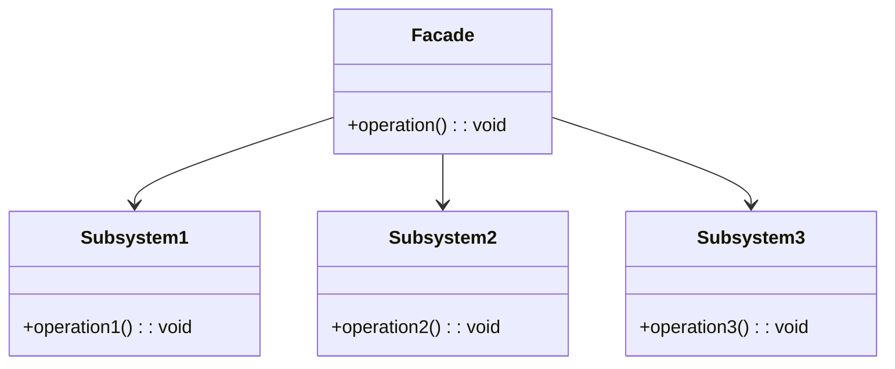

# Facade Design Pattern
> Version: dp_20231231_234226

- [Builder Design Pattern](#builder-design-pattern)
   * [Summary](#summary)
      + [Essence](#essence)
      + [Real examples](#real-examples)
   * [Implementation](#implementation)
      + [How to use it?](#how-to-use-it)
      + [Python code examples:](#python-code-examples)
   * [Analysis](#analysis)
      + [Cleaner Code?](#cleaner-code)
      + [Readable Code?](#readable-code)
      + [Replaceable code?](#replaceable-code)
      + [Testable code?](#testable-code)
      + [Advantages?](#advantages)
      + [Disadvantages?](#disadvantages)
   * [Remarks](#remarks)
      + [Concerns and Tips?](#concerns-and-tips)
      + [Execrises](#execrises)

## Summary

### Essence

- The Facade design pattern is a strategy to simplify the interaction with complex systems by providing a unified interface.
- It encapsulates the intricacies of subsystems, making them easier to use and understand.
- The pattern promotes separation of concerns and loose coupling, enhancing code readability, maintainability, and testability.
- It supports scalability and adaptability of the codebase, making it a valuable tool in software architecture.

### Real examples

- In a banking application, the Facade pattern can simplify common operations like deposit, withdrawal, and balance inquiry.
- In video games, it can simplify character control by encapsulating complex interactions with the game engine.
- In web applications, it can simplify database interactions, making CRUD operations easier for the client.




## Implementation
### How to use it?
To use the Facade design pattern, create a facade class that provides a simplified interface to a complex system of classes. The facade class should delegate the client's requests to the appropriate classes in the system.

### Python code examples:
```python
1. Example 1:

```python
# Subsystem 1

class Subsystem1:
    def operation1(self):
        print('Subsystem 1 operation')

# Subsystem 2

class Subsystem2:
    def operation2(self):
        print('Subsystem 2 operation')

# Subsystem 3

class Subsystem3:
    def operation3(self):
        print('Subsystem 3 operation')

# Facade

class Facade:
    def __init__(self):
        self.subsystem1 = Subsystem1()
        self.subsystem2 = Subsystem2()
        self.subsystem3 = Subsystem3()

    def operation(self):
        self.subsystem1.operation1()
        self.subsystem2.operation2()
        self.subsystem3.operation3()

# Client

facade = Facade()
facade.operation()
```

Output:

```
Subsystem 1 operation
Subsystem 2 operation
Subsystem 3 operation
```
2. Example 2:

```python
# Subsystem 1

class Subsystem1:
    def operation1(self):
        print('Subsystem 1 operation')

# Subsystem 2

class Subsystem2:
    def operation2(self):
        print('Subsystem 2 operation')

# Subsystem 3

class Subsystem3:
    def operation3(self):
        print('Subsystem 3 operation')

# Facade

class Facade:
    def __init__(self):
        self.subsystem1 = Subsystem1()
        self.subsystem2 = Subsystem2()
        self.subsystem3 = Subsystem3()

    def operation(self):
        self.subsystem1.operation1()
        self.subsystem2.operation2()
        self.subsystem3.operation3()

# Client

facade = Facade()
facade.operation()
```

Output:

```
Subsystem 1 operation
Subsystem 2 operation
Subsystem 3 operation

```

- The Facade design pattern provides a simplified interface to a complex system by encapsulating the subsystems behind a facade class. It improves code readability, maintainability, and testability.   


## Analysis
### Maintainability: 
To what extent is your code characterized by cleanliness and readability?
#### Cleaner Code?

- The Facade pattern encapsulates complex subsystem interactions, reducing code complexity and volume.
- It promotes separation of concerns, allowing the client to focus on its responsibilities, reducing coupling.
- By providing a higher-level abstraction, it improves code readability, making the code cleaner and more concise.

#### Readable Code?

- The Facade pattern provides a simplified interface to complex systems, improving code readability.
- It hides subsystem implementation details, reducing complexity and enhancing readability.
- By encapsulating complex subsystem interactions, it allows the client to focus on its responsibilities, further improving readability.


### Testability: 
Can your code be methodically and comprehensively tested?


### Adaptability: 
How readily can your code be substituted or modified?
#### Replaceable code?

- The Facade pattern promotes loose coupling between the client and subsystems, enhancing code scalability as the client depends only on the facade class.
- It hides subsystem implementation details, allowing for easier addition or removal of subsystems without affecting the client code.
- By encapsulating complex subsystem interactions, it allows for easier scalability of the codebase as new subsystems can be added or modified independently.


### Scalability:
Are your architectural components characterized by loose coupling?


### Tradeoffs:
#### Advantages?

- The Facade pattern simplifies the usage of complex systems and promotes separation of concerns.
- It improves code readability, maintainability, and enhances code reusability and modularity.
- It allows for easier testing and debugging of the client code and supports scalability and adaptability of the codebase.

#### Disadvantages?

- The Facade pattern may increase codebase complexity by introducing an additional layer of abstraction.
- If not designed properly, the facade class can become bloated.
- It may hide important details, making it harder to understand the underlying system.


## Remarks
### Concerns and Tips?

- Designing the facade class requires careful consideration of the subsystems and their interactions.
- The facade class should provide a simplified interface that is easy to understand and use.
- Balance between simplicity and flexibility is crucial when designing the facade class.
- Avoid exposing the internal details of the subsystems to the client and tightly coupling the client code with the subsystems.
- Avoid creating a bloated facade class that tries to do too much.


### Execrises

- Q: What is the purpose of the Facade design pattern?

  - A: The purpose of the Facade design pattern is to provide a simplified interface to a complex system of classes, making it easier to use and understand.
- Q: How does the Facade design pattern improve code readability?

  - A: The Facade design pattern improves code readability by providing a higher-level abstraction that is easier to understand and use. It hides the implementation details of the subsystems from the client, reducing the complexity and making the code more readable.
- Q: How does the Facade design pattern promote loose coupling?

  - A: The Facade design pattern promotes loose coupling by providing a simplified interface that abstracts the underlying subsystems. It hides the implementation details of the subsystems from the client, reducing the dependencies and coupling between the client and the subsystems.
- Q: What are the advantages of using the Facade design pattern?

  - A: Some advantages of using the Facade design pattern are: simplifies the usage of a complex system, promotes separation of concerns, improves code readability and maintainability, enhances code reusability and modularity, allows for easier testing and debugging, and supports scalability and adaptability of the codebase.
- Q: What are some concerns with the Facade design pattern?

  - A: Some concerns with the Facade design pattern are: it may hide important details and make it harder to understand the underlying system, the facade class may become a bottleneck if responsible for too many operations, and it may introduce an additional layer of abstraction, increasing the complexity of the codebase.

