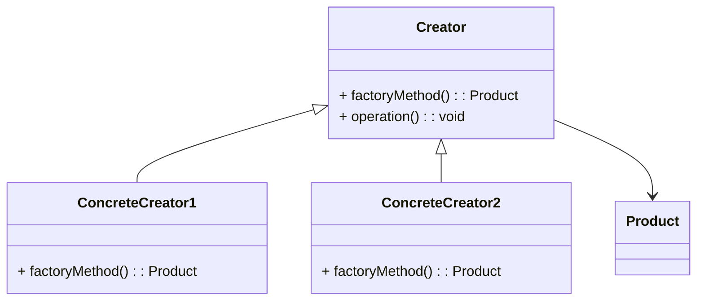

# Factory Method
> Version: dp_20231231_234226

- [Builder Design Pattern](#builder-design-pattern)
   * [Summary](#summary)
      + [Essence](#essence)
      + [Real examples](#real-examples)
   * [Implementation](#implementation)
      + [How to use it?](#how-to-use-it)
      + [Python code examples:](#python-code-examples)
   * [Analysis](#analysis)
      + [Cleaner Code?](#cleaner-code)
      + [Readable Code?](#readable-code)
      + [Replaceable code?](#replaceable-code)
      + [Testable code?](#testable-code)
      + [Advantages?](#advantages)
      + [Disadvantages?](#disadvantages)
   * [Remarks](#remarks)
      + [Concerns and Tips?](#concerns-and-tips)
      + [Execrises](#execrises)

## Summary

### Essence
The Factory Method design pattern encapsulates the object creation logic in a separate method or class, allowing the client code to be decoupled from the specific classes being instantiated. It provides an interface for creating objects, but lets subclasses decide which class to instantiate. This promotes loose coupling, code reusability, adaptability, maintainability, and testability.

### Real examples

- When a class cannot anticipate the type of objects it needs to create.
- When a class wants to delegate the responsibility of object creation to its subclasses.
- When a class wants to decouple the client code from the specific classes being instantiated.




## Implementation
### How to use it?
To use the Factory Method design pattern, follow these steps:
1. Define an abstract Creator class with a factoryMethod() that returns a Product object.
2. Create concrete subclasses of the Creator class, each implementing the factoryMethod() to return a specific type of Product.
3. Use the factoryMethod() to create Product objects, without knowing the specific class being instantiated.

### Python code examples:
```python
Here is an example of the Factory Method design pattern implemented in Python:

```python
from abc import ABC, abstractmethod

class Product(ABC):
    @abstractmethod
    def operation(self):
        pass


class ConcreteProduct1(Product):
    def operation(self):
        print('ConcreteProduct1 operation')


class ConcreteProduct2(Product):
    def operation(self):
        print('ConcreteProduct2 operation')


class Creator(ABC):
    @abstractmethod
    def factory_method(self) -> Product:
        pass

    def operation(self):
        product = self.factory_method()
        product.operation()


class ConcreteCreator1(Creator):
    def factory_method(self) -> Product:
        return ConcreteProduct1()


class ConcreteCreator2(Creator):
    def factory_method(self) -> Product:
        return ConcreteProduct2()


def main():
    creator1 = ConcreteCreator1()
    creator1.operation()

    creator2 = ConcreteCreator2()
    creator2.operation()


if __name__ == '__main__':
    main()
```

Output:
```
ConcreteProduct1 operation
ConcreteProduct2 operation

```

- The Python code example demonstrates the Factory Method design pattern. It defines an abstract Product class and concrete subclasses. The Creator class has a factory method that returns a specific type of Product. The client code uses the factory method to create and operate on the products.   


## Analysis
### Maintainability: 
To what extent is your code characterized by cleanliness and readability?
#### Cleaner Code?

- Encapsulates the object creation logic in a separate method or class, separating the responsibility of object creation from the client code.
- Promotes the Open-Closed Principle by allowing for easy introduction of new product types without modifying the existing client code.

#### Readable Code?

- Provides a clear and consistent way to create objects, making the code more readable.
- Acts as a single entry point for object creation, making it easier to understand and follow the code flow.


### Testability: 
Can your code be methodically and comprehensively tested?


### Adaptability: 
How readily can your code be substituted or modified?
#### Replaceable code?

- Decouples the client code from the specific classes being instantiated, allowing for easy substitution of different product implementations.


### Scalability:
Are your architectural components characterized by loose coupling?


### Tradeoffs:
#### Advantages?

- Provides a flexible way to create objects without tightly coupling the client code to the specific classes being instantiated.
- Promotes code reusability by encapsulating the object creation logic in a separate method or class.
- Supports the Open-Closed Principle by allowing for easy introduction of new product types without modifying the existing client code.
- Enables easy substitution of different product implementations, making the code more adaptable and maintainable.
- Facilitates unit testing by allowing for easy creation of mock objects.

#### Disadvantages?

- Increases the complexity of the codebase by introducing additional classes and abstractions.
- May lead to an excessive number of subclasses if there are many different product types.
- Avoids tightly coupling the client code to the specific classes being instantiated.
- Avoids the need for the client code to know the specific class names or implementation details of the products.


## Remarks
### Concerns and Tips?

- Careful design and planning are required to ensure a maintainable and scalable codebase.
- Use meaningful names for the creator and product classes to improve code readability.
- Consider using a naming convention for the factory methods, such as 'createProduct()', to clearly indicate their purpose.
- Follow the Single Responsibility Principle by keeping the creator classes focused on object creation and the product classes focused on their specific functionality.
- Use dependency injection to further decouple the client code from the specific product implementations.
- One tricky aspect of the Factory Method design pattern is designing the proper hierarchy of creator and product classes.
- The Factory Method design pattern avoids tightly coupling the client code to the specific classes being instantiated.
- The Factory Method design pattern avoids the need for the client code to know the specific class names or implementation details of the products.
- The Factory Method design pattern solves the problem of creating objects without tightly coupling the client code to the specific classes being instantiated.
- The Factory Method design pattern promotes loose coupling by decoupling the client code from the specific classes being instantiated.
- The Factory Method design pattern makes the code more readable by providing a clear and consistent way to create objects.
- The Factory Method design pattern helps in making the code replaceable by decoupling the client code from the specific classes being instantiated.
- The Factory Method design pattern helps in making the code testable by allowing for easy creation of mock objects.
- The Factory Method design pattern helps in making the code scalable by providing a flexible way to introduce new product types.
- The Factory Method design pattern helps in making the code clean by encapsulating the object creation logic in a separate method or class.


### Execrises

- Q: What is the purpose of the Factory Method design pattern?

  - A: The purpose of the Factory Method design pattern is to provide an interface for creating objects, but let subclasses decide which class to instantiate.

Q: How does the Factory Method design pattern promote code reusability?

  - A: The Factory Method design pattern encapsulates the object creation logic in a separate method or class, allowing it to be reused across different parts of the codebase.

Q: How does the Factory Method design pattern support the Open-Closed Principle?

  - A: The Factory Method design pattern allows for easy introduction of new product types without modifying the existing client code, promoting the principle of open for extension, closed for modification.

