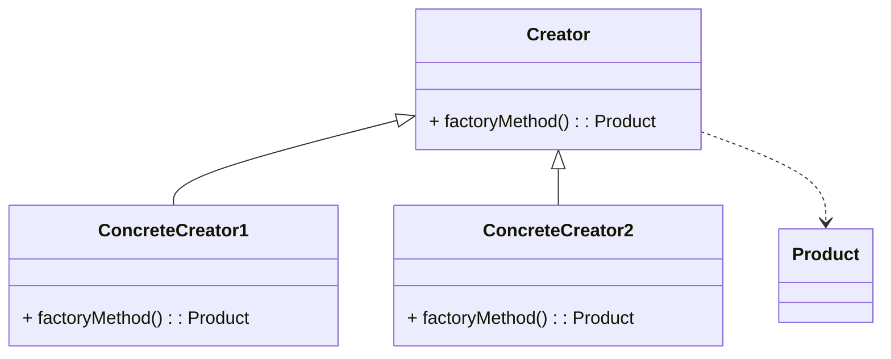

# Factory Method
> Version: dp_20231231_202019

- [Builder Design Pattern](#builder-design-pattern)
   * [Summary](#summary)
      + [Essence](#essence)
      + [Real examples](#real-examples)
   * [Implementation](#implementation)
      + [How to use it?](#how-to-use-it)
      + [Python code examples:](#python-code-examples)
   * [Analysis](#analysis)
      + [Cleaner Code?](#cleaner-code)
      + [Readable Code?](#readable-code)
      + [Replaceable code?](#replaceable-code)
      + [Testable code?](#testable-code)
      + [Advantages?](#advantages)
      + [Disadvantages?](#disadvantages)
   * [Remarks](#remarks)
      + [Concerns and Tips?](#concerns-and-tips)
      + [Execrises](#execrises)

## Summary

### Essence
The Factory Method design pattern defines an interface for creating objects, but lets subclasses decide which class to instantiate. It promotes loose coupling and enhances code readability and maintainability.

### Real examples

- Creating different types of game objects, UI elements, or loggers based on a common interface.




## Implementation
### How to use it?
To use the Factory Method design pattern, follow these steps:
1. Create an abstract Creator class with a factoryMethod() method.
2. Create concrete Creator classes that extend the abstract Creator class and implement the factoryMethod() method.
3. Create an abstract Product class.
4. Create concrete Product classes that extend the abstract Product class.
5. In the concrete Creator classes, implement the factoryMethod() method to return an instance of the appropriate concrete Product class.

### Python code examples:
```python
from abc import ABC, abstractmethod

class Product(ABC):
    @abstractmethod
    def operation(self):
        pass


class ConcreteProduct1(Product):
    def operation(self):
        return 'ConcreteProduct1 operation'


class ConcreteProduct2(Product):
    def operation(self):
        return 'ConcreteProduct2 operation'


class Creator(ABC):
    @abstractmethod
    def factory_method(self) -> Product:
        pass

    def some_operation(self) -> str:
        product = self.factory_method()
        result = product.operation()
        return f'Creator: {result}'


class ConcreteCreator1(Creator):
    def factory_method(self) -> Product:
        return ConcreteProduct1()


class ConcreteCreator2(Creator):
    def factory_method(self) -> Product:
        return ConcreteProduct2()


def client_code(creator: Creator) -> None:
    print(creator.some_operation())


if __name__ == '__main__':
    client_code(ConcreteCreator1())
```
The code defines an abstract Product class and concrete Product classes. It also defines an abstract Creator class with a factoryMethod() method. Concrete Creator classes implement the factoryMethod() method to create specific Product instances. The client code uses the Creator class to create and use Product instances.   


## Analysis
### Cleaner Code?
Promotes the Single Responsibility Principle by separating the responsibility of object creation from the client code.

### Readable Code?
Provides a clear and consistent way to create objects, abstracting the object creation process and making the code easier to understand and maintain.

### Replaceable code?
Promotes loose coupling between the creator and the concrete classes, allowing for flexibility and extensibility.

### Testable code?
Enables the use of mock objects or test doubles during testing, improving testability.

### Advantages?

- Provides a flexible way to create objects, allowing for easy extensibility.
- Promotes loose coupling between the creator and the concrete classes.
- Enhances code readability and maintainability by abstracting the object creation process.
- Enables the use of mock objects or test doubles during testing, improving testability.

### Disadvantages?

- Increases code complexity by introducing additional classes and abstractions.
- May lead to a larger codebase.
- Potential performance overhead due to dynamic object creation process.


## Remarks
### Concerns and Tips?

- Concerns: Potential performance overhead due to dynamic object creation process.
- Programming tips: Use meaningful names for classes, consider using a naming convention for the factory method, use dependency injection for flexibility.
- Tricky point: Large number of concrete classes if there are many different types of products to be created.
- Further studies: 'Design Patterns: Elements of Reusable Object-Oriented Software' by Erich Gamma, Richard Helm, Ralph Johnson, and John Vlissides; 'Head First Design Patterns' by Eric Freeman and Elisabeth Robson; 'Refactoring: Improving the Design of Existing Code' by Martin Fowler.


### Execrises

- Q: What is the purpose of the Factory Method design pattern?

  - A: The purpose of the Factory Method design pattern is to provide an interface for creating objects, but let subclasses decide which class to instantiate.
- Q: How does the Factory Method design pattern promote loose coupling?

  - A: The Factory Method design pattern promotes loose coupling by allowing the creator to depend on an abstract interface (the factory method) to create objects, rather than directly depending on concrete classes.
- Q: What are the advantages of using the Factory Method design pattern?

  - A: Some advantages of using the Factory Method design pattern include easy extensibility, loose coupling, enhanced code readability, and improved testability.
- Q: What are some potential disadvantages of using the Factory Method design pattern?

  - A: Some potential disadvantages of using the Factory Method design pattern include increased code complexity, a larger codebase, and potential performance overhead.
- Q: How can the Factory Method design pattern be used in game development?

  - A: In game development, the Factory Method design pattern can be used to create different types of game objects, such as enemies or power-ups, based on a common interface.

