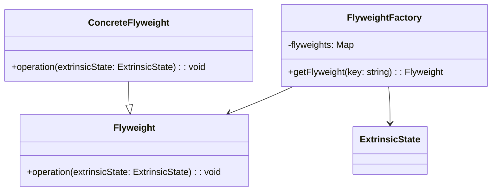

# Flyweight Design Pattern
> Version: dp_20231231_202019

- [Builder Design Pattern](#builder-design-pattern)
   * [Summary](#summary)
      + [Essence](#essence)
      + [Real examples](#real-examples)
   * [Implementation](#implementation)
      + [How to use it?](#how-to-use-it)
      + [Python code examples:](#python-code-examples)
   * [Analysis](#analysis)
      + [Cleaner Code?](#cleaner-code)
      + [Readable Code?](#readable-code)
      + [Replaceable code?](#replaceable-code)
      + [Testable code?](#testable-code)
      + [Advantages?](#advantages)
      + [Disadvantages?](#disadvantages)
   * [Remarks](#remarks)
      + [Concerns and Tips?](#concerns-and-tips)
      + [Execrises](#execrises)

## Summary

### Essence
The Flyweight design pattern aims to minimize memory usage by sharing as much data as possible between multiple objects. It separates the intrinsic and extrinsic state of objects, where the intrinsic state is shared among objects and the extrinsic state is unique to each object. This pattern improves code organization, reduces complexity, and promotes code reusability.

### Real examples

- Text editors representing characters in a document
- Web browsers caching images and fonts
- Database connection pools reusing connections
- Game engines representing game objects with a large number of instances




## Implementation
### How to use it?
To use the Flyweight design pattern, follow these steps:
1. Identify the objects that have a large number of instances and consume significant memory.
2. Separate the intrinsic and extrinsic state of these objects.
3. Create a flyweight interface or base class that defines the shared operations.
4. Implement concrete flyweight classes that represent the intrinsic state and implement the shared operations.
5. Create a flyweight factory class that manages the flyweight objects and provides a way to retrieve them.
6. Use the flyweight objects by passing the extrinsic state as a parameter to the shared operations.

### Python code examples:
```python

class Flyweight:
    def operation(self, extrinsic_state):
        pass


class ConcreteFlyweight(Flyweight):
    def operation(self, extrinsic_state):
        # Perform operation using intrinsic state and extrinsic state
        pass


class FlyweightFactory:
    def __init__(self):
        self.flyweights = {}

    def getFlyweight(self, key):
        if key not in self.flyweights:
            self.flyweights[key] = ConcreteFlyweight()
        return self.flyweights[key]


# Usage
factory = FlyweightFactory()
flyweight = factory.getFlyweight('key')
flyweight.operation('extrinsic state')

```

- The Python code example demonstrates the implementation of the Flyweight pattern. It defines a flyweight interface, concrete flyweight class, and flyweight factory class. The flyweight objects are created and retrieved using the factory class, and the shared operations are performed using the extrinsic state.   


## Analysis
### Cleaner Code?

- Separates the intrinsic and extrinsic state of objects, improving code organization and reducing complexity.
- Reuses flyweight objects instead of creating new ones, making the code more efficient and avoiding unnecessary memory allocation.
- Centralizes the creation and management of flyweight objects in a flyweight factory class, making the code easier to maintain and understand.

### Readable Code?

- Improves code readability by separating shared operations from the unique state of each object.
- Uses descriptive names for flyweight objects and their operations, making the code self-explanatory and easier to understand.
- Provides a clear and consistent way to retrieve flyweight objects through the flyweight factory class, enhancing code readability.

### Replaceable code?

- Promotes loose coupling by separating the intrinsic and extrinsic state of objects.
- Reduces dependencies on specific implementations by having flyweight objects depend only on shared operations.
- The flyweight factory class acts as a mediator between client code and flyweight objects, further decoupling the two.

### Testable code?

- Makes code easier to test by decoupling shared operations from the extrinsic state.
- Passes the extrinsic state as a parameter to shared operations, allowing for different input values in test cases.
- Enables better isolation of code under test by using flyweight objects, as shared operations can be tested independently from the extrinsic state.

### Advantages?

- Reduces memory usage by sharing common data among objects
- Improves performance by reusing flyweight objects
- Simplifies code and makes it easier to understand and maintain
- Allows for the creation of a large number of objects without excessive memory consumption

### Disadvantages?

- Introduces additional complexity, especially in managing shared state and ensuring thread safety
- Limited applicability to objects with a large number of instances and significant memory consumption
- May introduce overhead due to state management and object sharing


## Remarks
### Concerns and Tips?

- Thread safety and avoiding data corruption when multiple threads access shared flyweight objects
- Potential impact on object identity as multiple objects may share the same intrinsic state
- Performance trade-offs between memory usage reduction and overhead from state management and object sharing
- Tips for using the Flyweight pattern effectively and judiciously


### Execrises

- Q: What is the purpose of the Flyweight design pattern?

  - A: The purpose of the Flyweight design pattern is to minimize memory usage by sharing as much data as possible between multiple objects.
- Q: How does the Flyweight pattern help in making code clean?

  - A: The Flyweight pattern helps in making clean code by separating the intrinsic and extrinsic state of objects, improving code organization and reducing complexity.
- Q: What are the advantages of using the Flyweight pattern?

  - A: The advantages of using the Flyweight pattern include reduced memory usage, improved performance, simplified code, and scalability.
- Q: What are the disadvantages of using the Flyweight pattern?

  - A: The disadvantages of using the Flyweight pattern include increased complexity, limited applicability, and potential impact on performance.
- Q: How does the Flyweight pattern promote loose coupling?

  - A: The Flyweight pattern promotes loose coupling by separating the intrinsic and extrinsic state of objects and reducing dependencies on specific implementations.
- Q: How can the Flyweight pattern be tested?

  - A: The Flyweight pattern can be tested by creating test cases with different input values for the extrinsic state and verifying the behavior of the shared operations.
- Q: What are some concerns when using the Flyweight pattern?

  - A: Some concerns when using the Flyweight pattern include thread safety, object identity, and performance trade-offs.
- Q: Can you give an example of a real product that uses the Flyweight pattern?

  - A: One example is a text editor that uses the Flyweight pattern to represent characters in a document, sharing character objects among multiple positions to reduce memory usage.

