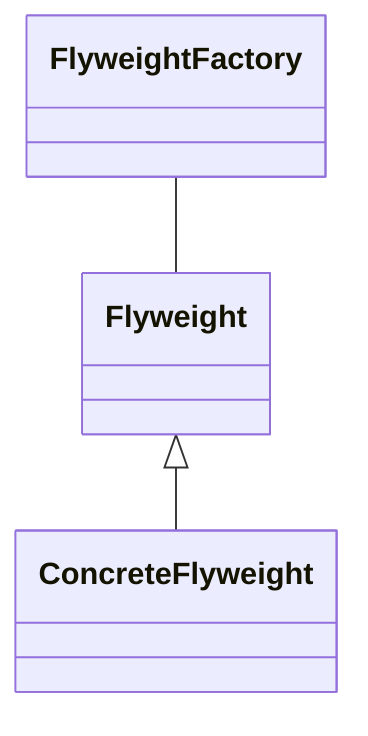

# Flyweight Design Pattern Summary
> Version: dp_20231231_234226

- [Builder Design Pattern](#builder-design-pattern)
   * [Summary](#summary)
      + [Essence](#essence)
      + [Real examples](#real-examples)
   * [Implementation](#implementation)
      + [How to use it?](#how-to-use-it)
      + [Python code examples:](#python-code-examples)
   * [Analysis](#analysis)
      + [Cleaner Code?](#cleaner-code)
      + [Readable Code?](#readable-code)
      + [Replaceable code?](#replaceable-code)
      + [Testable code?](#testable-code)
      + [Advantages?](#advantages)
      + [Disadvantages?](#disadvantages)
   * [Remarks](#remarks)
      + [Concerns and Tips?](#concerns-and-tips)
      + [Execrises](#execrises)

## Summary

### Essence
The essence of the Flyweight pattern is to use sharing to support large numbers of fine-grained objects efficiently. It helps minimize memory use by sharing as much data as possible with similar objects.

### Real examples

- Text editing software where each character is a flyweight object
- Game programming where game objects like trees and monsters can be flyweights




## Implementation
### How to use it?
To use the Flyweight pattern, you need to divide the target class into intrinsic and extrinsic states. Intrinsic state is stored in the Flyweight class, while extrinsic state is stored or computed by client objects.

### Python code examples:
```python
class TreeType:
    def __init__(self, name, color):
        self.name = name
        self.color = color

class TreeFactory:
    treeTypes = {}
    @classmethod
    def getTreeType(cls, name, color):
        if name not in cls.treeTypes:
            cls.treeTypes[name] = TreeType(name, color)
        return cls.treeTypes[name]
```
The code defines a TreeType class (Flyweight) and a TreeFactory class (Flyweight Factory). The TreeFactory creates a new TreeType only if it doesn't exist, otherwise it returns the existing one.   


## Analysis
### Maintainability: 
To what extent is your code characterized by cleanliness and readability?
#### Cleaner Code?
The Flyweight pattern helps in making clean code by reducing the clutter of a large number of objects. It promotes data sharing instead of storing separate objects for each data.

#### Readable Code?
The Flyweight pattern makes code more readable by separating intrinsic and extrinsic states, making it clear what data is shared and what data is client-specific.


### Testability: 
Can your code be methodically and comprehensively tested?


### Adaptability: 
How readily can your code be substituted or modified?
#### Replaceable code?
The Flyweight pattern makes code more replaceable by decoupling the state (intrinsic and extrinsic) from the object structure. This allows you to change the state without affecting the Flyweight object.


### Scalability:
Are your architectural components characterized by loose coupling?


### Tradeoffs:
#### Advantages?

- Reduces the number of objects, saving memory
- Improves performance by sharing data
- Solves the problem of handling large numbers of objects that share a lot of common state

#### Disadvantages?

- Increases complexity by introducing more classes
- Extrinsic state might be hard to manage
- Not beneficial if the overhead of sharing is high compared to the memory saved


## Remarks
### Concerns and Tips?

- The Flyweight pattern increases complexity by introducing more classes.
- Be careful when managing the extrinsic state as it's not shared and needs to be provided by the client whenever an operation is performed.
- Use the Flyweight pattern when there are many similar objects and memory is a concern.
- Study the usage of Flyweight pattern in Java's String Pool and how browsers use it for rendering optimizations.


### Execrises

- Q: What is the Flyweight pattern used for? 
  - A: It's used to minimize memory use by sharing as much data as possible with similar objects.
- Q: What is the difference between intrinsic and extrinsic state in the Flyweight pattern? 
  - A: Intrinsic state is shared, extrinsic state is client-specific.

