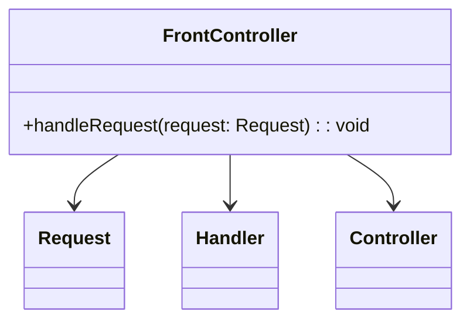

# Front Controller
> Version: dp_20231231_202019

- [Builder Design Pattern](#builder-design-pattern)
   * [Summary](#summary)
      + [Essence](#essence)
      + [Real examples](#real-examples)
   * [Implementation](#implementation)
      + [How to use it?](#how-to-use-it)
      + [Python code examples:](#python-code-examples)
   * [Analysis](#analysis)
      + [Cleaner Code?](#cleaner-code)
      + [Readable Code?](#readable-code)
      + [Replaceable code?](#replaceable-code)
      + [Testable code?](#testable-code)
      + [Advantages?](#advantages)
      + [Disadvantages?](#disadvantages)
   * [Remarks](#remarks)
      + [Concerns and Tips?](#concerns-and-tips)
      + [Execrises](#execrises)

## Summary

### Essence
The Front Controller design pattern provides a centralized entry point for handling requests in a web application. It separates the concerns of request handling from the business logic and delegates the processing to the appropriate handlers or controllers based on the type of request.

### Real examples

- Handling different types of requests in a web application
- Routing requests in a microservices architecture
- Handling user actions and events in a desktop application




## Implementation
### How to use it?
To use the Front Controller design pattern, you need to implement a FrontController class that handles incoming requests. The FrontController class should have a method called handleRequest that takes a Request object as a parameter. Inside the handleRequest method, you can determine the type of request and delegate the processing to the appropriate handlers or controllers.

### Python code examples:
```python
class FrontController:
    def handleRequest(self, request):
        if request.type == 'GET':
            # Handle GET request
        elif request.type == 'POST':
            # Handle POST request
        elif request.type == 'PUT':
            # Handle PUT request
        elif request.type == 'DELETE':
            # Handle DELETE request
class UserController:
    def handleRequest(self, request):
        # Handle user-related requests

class ProductController:
    def handleRequest(self, request):
        # Handle product-related requests
```
The FrontController class handles incoming requests and delegates the processing to the appropriate handlers or controllers based on the type of request.   


## Analysis
### Cleaner Code?
The Front Controller design pattern helps in making clean code by organizing the request handling logic separately from the business logic. It provides a centralized entry point for request processing, making the code more organized and easier to maintain.

### Readable Code?
The Front Controller design pattern makes the code more readable by providing a single point of control for request processing. Developers can easily understand the flow of request handling and the logic for delegating the processing to the appropriate handlers or controllers.

### Replaceable code?
The Front Controller design pattern helps in making code replaceable by separating the concerns of request handling from the business logic. The handlers or controllers can be developed independently and easily replaced or modified without affecting other parts of the application.

### Testable code?
The Front Controller design pattern makes the code easy to be tested by decoupling the request handling logic from the business logic. Developers can write unit tests for the handlers or controllers without the need to simulate the entire request handling process.

### Advantages?

- Centralized request handling
- Separation of concerns
- Code reusability
- Easy extension

### Disadvantages?

- Increased complexity
- Single point of failure
- Performance overhead


## Remarks
### Concerns and Tips?

- Performance: The Front Controller design pattern may introduce some performance overhead due to the need to determine the type of request and delegate the processing to the appropriate handlers or controllers.
- Scalability: The Front Controller design pattern may become a bottleneck in highly scalable systems where the number of requests is very high. Additional measures may be needed to handle the increased load.
- Security: The FrontController class should have mechanisms to handle security-related concerns such as authentication and authorization.
- Use a framework: Many web frameworks provide built-in support for the Front Controller design pattern. Using a framework can simplify the implementation and provide additional features such as routing and error handling.
- Follow the Single Responsibility Principle: Each handler or controller should have a single responsibility and should be focused on handling a specific type of request or action.
- Use dependency injection: Dependency injection can help in decoupling the FrontController class from the handlers or controllers, making the code more modular and testable.
- Handling different types of requests: The FrontController class should be able to handle different types of requests such as GET, POST, PUT, and DELETE. It should have logic to determine the type of request and delegate the processing to the appropriate handlers or controllers.
- Routing requests: In a microservices architecture, the FrontController class may need to route requests to different microservices based on the request type or URL. It should have a mechanism to determine the destination microservice and forward the request.
- Error handling: The FrontController class should handle errors and exceptions that may occur during the request handling process. It should have a mechanism to handle and report errors to the client.


### Execrises

- Q: What is the purpose of the Front Controller design pattern?

  - A: The purpose of the Front Controller design pattern is to provide a centralized entry point for handling requests in a web application.
- Q: How does the Front Controller design pattern help in making the code clean?

  - A: The Front Controller design pattern separates the concerns of request handling from the business logic, making the code more organized and easier to maintain.
- Q: How does the Front Controller design pattern make the code readable?

  - A: The Front Controller design pattern provides a single point of control for request processing, making it easier to understand the flow of request handling and the logic for delegating the processing to the appropriate handlers or controllers.
- Q: How does the Front Controller design pattern help in making the code easy to be tested?

  - A: The Front Controller design pattern decouples the request handling logic from the business logic, allowing developers to write unit tests for the handlers or controllers without the need to simulate the entire request handling process.
- Q: How does the Front Controller design pattern make components loose coupled?

  - A: The Front Controller design pattern separates the concerns of request handling from the business logic, making the handlers or controllers independent and easily replaceable or modifiable.
- Q: What are the advantages of the Front Controller design pattern?

  - A: The advantages of the Front Controller design pattern include centralized request handling, separation of concerns, code reusability, and easy extension.
- Q: What are the disadvantages of the Front Controller design pattern?

  - A: The disadvantages of the Front Controller design pattern include increased complexity, single point of failure, and performance overhead.
- Q: How can you handle different types of requests in the Front Controller design pattern?

  - A: The FrontController class can have logic to determine the type of request and delegate the processing to the appropriate handlers or controllers.
- Q: How can you handle routing in the Front Controller design pattern?

  - A: In a microservices architecture, the FrontController class can have a mechanism to determine the destination microservice and forward the request.
- Q: How can you handle errors in the Front Controller design pattern?

  - A: The FrontController class should have a mechanism to handle and report errors that may occur during the request handling process.

