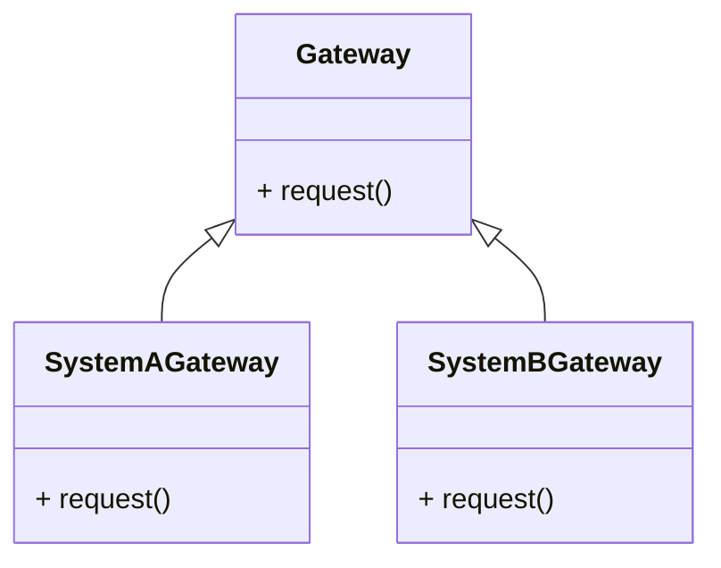

# Gateway Design Pattern
> Version: dp_20231231_202019

- [Builder Design Pattern](#builder-design-pattern)
   * [Summary](#summary)
      + [Essence](#essence)
      + [Real examples](#real-examples)
   * [Implementation](#implementation)
      + [How to use it?](#how-to-use-it)
      + [Python code examples:](#python-code-examples)
   * [Analysis](#analysis)
      + [Cleaner Code?](#cleaner-code)
      + [Readable Code?](#readable-code)
      + [Replaceable code?](#replaceable-code)
      + [Testable code?](#testable-code)
      + [Advantages?](#advantages)
      + [Disadvantages?](#disadvantages)
   * [Remarks](#remarks)
      + [Concerns and Tips?](#concerns-and-tips)
      + [Execrises](#execrises)

## Summary

### Essence
The Gateway design pattern provides a unified interface for accessing multiple external systems or resources. It encapsulates the communication and interaction with external systems behind a single interface, separating it from the core application logic. This pattern helps in making the code clean, readable, testable, and loosely coupled with the external systems.

### Real examples

- Integrating with multiple payment processors
- Sending emails using different email service providers
- Storing and retrieving files from different file storage systems




## Implementation
### How to use it?
To use the Gateway design pattern, follow these steps:
1. Identify the external systems or resources that need to be accessed.
2. Create a Gateway interface that defines the common methods for interacting with the external systems.
3. Implement concrete Gateway classes for each external system, implementing the methods defined in the Gateway interface.
4. Use the Gateway interface in the application code to interact with the external systems.

### Python code examples:
```python

# Example of a Gateway interface

from abc import ABC, abstractmethod

class Gateway(ABC):
    @abstractmethod
    def request(self):
        pass


# Example of a concrete Gateway class

class SystemAGateway(Gateway):
    def request(self):
        # Implementation for System A
        pass


class SystemBGateway(Gateway):
    def request(self):
        # Implementation for System B
        pass

```

- The Gateway design pattern provides a unified interface for accessing multiple external systems. It separates the code responsible for interacting with external systems from the core application logic, making the code clean and maintainable. It also helps in making the code readable, testable, and loosely coupled with the external systems.   


## Analysis
### Cleaner Code?

- Separation of concerns: The Gateway design pattern separates the code responsible for interacting with external systems from the core application logic, resulting in cleaner and more maintainable code.
- Single responsibility principle: Each Gateway class has a single responsibility, making the code easier to understand and modify.
- Code reuse: The Gateway design pattern promotes code reuse by providing a common interface for interacting with multiple external systems.

### Readable Code?

- Abstraction of complexity: The Gateway design pattern abstracts away the complexities of interacting with different external systems, making the code more readable and easier to understand.
- Consistent interface: By providing a common interface for interacting with external systems, the Gateway design pattern ensures a consistent and familiar set of methods and protocols, making the code more readable.
- Clear separation of concerns: The Gateway design pattern separates the code responsible for interacting with external systems from the core application logic, making the code more readable and easier to follow.

### Replaceable code?

- Decoupling from external systems: The Gateway design pattern decouples the application code from the specific details and dependencies of the external systems, allowing for easier replacement or addition of new external systems without affecting the application code.
- Dependency inversion: By depending on the Gateway interface instead of concrete implementations, the application code becomes loosely coupled with the external systems, improving flexibility and maintainability.
- Easy integration with new systems: The Gateway design pattern makes it easier to integrate new external systems into the application by providing a common interface, reducing the coupling between the application and the external systems.

### Testable code?

- Mocking and stubbing: The Gateway design pattern allows for easy unit testing by using mock or stub implementations of the Gateway interface, enabling isolated testing of the application logic without actual external system interactions.
- Testability of individual components: By encapsulating the communication with external systems behind a Gateway interface, the individual components of the application can be tested independently, making it easier to identify and fix issues.
- Test data isolation: The Gateway design pattern provides a consistent interface for interacting with external systems, allowing for easy isolation of test data and enabling more reliable and repeatable testing.

### Advantages?

- Flexibility: The Gateway design pattern allows the application to switch between different external systems without changing the application code.
- Maintainability: The Gateway design pattern makes it easier to accommodate changes to external systems, improving code maintainability.
- Testability: The Gateway design pattern enables easier testing through the use of mock or stub implementations of the Gateway interface.
- Reusability: The Gateway design pattern promotes code reuse by providing a common interface for interacting with multiple external systems.

### Disadvantages?

- Increased complexity: The Gateway design pattern introduces an additional layer of abstraction and complexity to the codebase, which may make it harder to understand and maintain.
- Performance overhead: The Gateway design pattern may introduce some performance overhead due to the additional abstraction layer and the need to translate between the Gateway interface and the specific protocols of the external systems.
- Dependency management: The Gateway design pattern requires careful management of dependencies between the application code and the external systems, especially when adding or replacing external systems.
- Potential performance overhead: The Gateway design pattern may introduce some performance overhead due to the additional abstraction layer and translation between the Gateway interface and specific protocols of external systems.


## Remarks
### Concerns and Tips?

- Concerns: One concern with the Gateway design pattern is the potential performance overhead introduced by the additional abstraction layer and the need to translate between the Gateway interface and the specific protocols of the external systems.
- Programming tips: 1. Use meaningful and descriptive names for the Gateway interface and classes. 2. Follow the single responsibility principle when implementing Gateway classes. 3. Consider using dependency injection to manage dependencies between the application code and Gateway classes. 4. Be mindful of potential performance overhead and carefully manage dependencies when adding or replacing external systems.
- Tricky aspects: Managing dependencies between the application code and external systems can be tricky. Careful consideration should be given to how dependencies are managed, especially when adding or replacing external systems.
- Additional studies: 1. "Design Patterns: Elements of Reusable Object-Oriented Software" by Erich Gamma, Richard Helm, Ralph Johnson, and John Vlissides. 2. "Clean Architecture: A Craftsman's Guide to Software Structure and Design" by Robert C. Martin.


### Execrises

- Q: What is the purpose of the Gateway design pattern?

  - A: The purpose of the Gateway design pattern is to provide a unified interface for accessing multiple external systems or resources.
- Q: How does the Gateway design pattern help in making the code clean?

  - A: The Gateway design pattern helps in making the code clean by separating the code responsible for interacting with external systems from the core application logic.
- Q: What are some advantages of using the Gateway design pattern?

  - A: Some advantages of using the Gateway design pattern include flexibility, maintainability, testability, and reusability.
- Q: What are some real usage examples of the Gateway design pattern?

  - A: Some real usage examples of the Gateway design pattern include payment gateways, email gateways, and file storage gateways.
- Q: What are some concerns with using the Gateway design pattern?

  - A: One concern with the Gateway design pattern is the potential performance overhead introduced by the additional abstraction layer and the need to translate between the Gateway interface and the specific protocols of the external systems.

