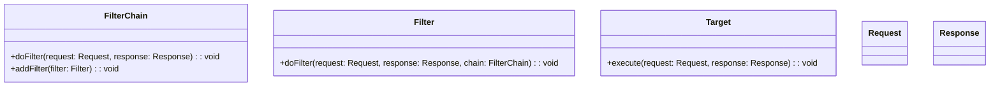

# Intercepting Filter
> Version: dp_20231231_202019

- [Builder Design Pattern](#builder-design-pattern)
   * [Summary](#summary)
      + [Essence](#essence)
      + [Real examples](#real-examples)
   * [Implementation](#implementation)
      + [How to use it?](#how-to-use-it)
      + [Python code examples:](#python-code-examples)
   * [Analysis](#analysis)
      + [Cleaner Code?](#cleaner-code)
      + [Readable Code?](#readable-code)
      + [Replaceable code?](#replaceable-code)
      + [Testable code?](#testable-code)
      + [Advantages?](#advantages)
      + [Disadvantages?](#disadvantages)
   * [Remarks](#remarks)
      + [Concerns and Tips?](#concerns-and-tips)
      + [Execrises](#execrises)

## Summary

### Essence

- The Intercepting Filter design pattern is a centralized mechanism for handling requests and responses in a web application.
- It allows for the implementation of cross-cutting concerns such as authentication, logging, and input validation.
- The pattern promotes separation of concerns, reusability, testability, and loose coupling.
- The FilterChain maintains a list of filters and executes them in order, allowing for the implementation of cross-cutting concerns.

### Real examples

- Authentication: Intercepting and validating user credentials before allowing access to certain pages or resources.
- Logging: Intercepting requests and responses to log information such as request details, response time, and errors.
- Input validation: Intercepting and validating user input to prevent malicious or incorrect data from being processed.
- Caching: Intercepting requests and responses to implement caching mechanisms for improved performance.
- Compression: Intercepting responses to compress data before sending it to the client for reduced bandwidth usage.




## Implementation
### How to use it?
To use the Intercepting Filter pattern, follow these steps:
1. Create a Filter interface with a doFilter method.
2. Implement the Filter interface with concrete filter classes.
3. Create a FilterChain class that maintains a list of filters and executes them in order.
4. Create a Target class that represents the main functionality of the web application.
5. In the Target class, create a method that accepts a request and response object.
6. In the method, create a FilterChain object and add the desired filters.
7. Call the doFilter method of the FilterChain object, passing in the request and response objects.

### Python code examples:
```python

# Example filter for authentication

class AuthenticationFilter(Filter):
    def doFilter(request, response, chain):
        if not request.isAuthenticated():
            response.setStatus(401)
            response.setMessage('Unauthorized')
        else:
            chain.doFilter(request, response)
```
```python
# Example filter for logging

class LoggingFilter(Filter):
    def doFilter(request, response, chain):
        log.info('Request: ' + request.toString())
        chain.doFilter(request, response)
        log.info('Response: ' + response.toString())

```

- The first example shows an AuthenticationFilter that checks if the request is authenticated and returns an unauthorized response if not.
- The second example shows a LoggingFilter that logs the request and response information before and after the execution of the filter chain.   


## Analysis
### Cleaner Code?

- The pattern separates cross-cutting concerns from the main functionality, resulting in cleaner and more modular code.
- Filters can be reused across different parts of the application, reducing code duplication.
- Each filter is responsible for a specific concern, adhering to the single responsibility principle.
- The pattern encapsulates the logic for intercepting and processing requests and responses, making the code more organized.

### Readable Code?

- The pattern separates the main functionality from cross-cutting concerns, making the code easier to read.
- By using meaningful filter names and organizing them in a FilterChain, the code becomes self-explanatory.
- Each filter focuses on a specific concern, making it easier to locate and modify the relevant code.
- The pattern promotes a consistent coding style by providing a standardized way to implement and apply filters.

### Replaceable code?

- Filters can be added or removed without affecting the core features of the web application, promoting loose coupling.
- New filters can be easily added to the FilterChain without modifying existing code, allowing for flexible architecture.
- Filters can be injected into the FilterChain, enabling loose coupling and facilitating the use of different implementations or configurations.

### Testable code?

- Filters can be tested in isolation by providing mock request and response objects, allowing for easier testing of individual concerns.
- The FilterChain can be tested to ensure that filters are executed in the correct order and produce the expected results.
- By separating cross-cutting concerns from the main functionality, it becomes easier to test the core features of the web application without the need to mock or simulate the behavior of filters.

### Advantages?

- The pattern separates cross-cutting concerns from the main functionality, resulting in cleaner and more maintainable code.
- Filters can be reused across different parts of the application, reducing code duplication.
- New filters can be easily added or removed without modifying existing code, allowing for flexible and extensible architecture.
- The pattern enables easier testing of individual concerns and the main functionality of the web application.
- The FilterChain can be extended to support additional filters, making it scalable to handle different requirements or scenarios.
- The pattern solves the problem of implementing cross-cutting concerns in a web application in a modular and reusable way.

### Disadvantages?

- The pattern introduces additional processing overhead due to the execution of multiple filters for each request.
- Managing the order and configuration of filters in the FilterChain can become complex, especially in large-scale applications.
- If not properly designed and implemented, the pattern can lead to code duplication or unnecessary complexity.
- The use of filters may introduce dependencies between different parts of the application, requiring careful management and versioning.
- The pattern avoids code duplication by providing a centralized mechanism for implementing cross-cutting concerns.
- By using the FilterChain and decoupling filters from the main functionality, the pattern avoids tight coupling between different parts of the application.
- The pattern provides a standardized way to implement and apply filters, avoiding inconsistencies in the implementation of cross-cutting concerns.


## Remarks
### Concerns and Tips?

- Performance: The pattern may introduce additional processing overhead due to the execution of multiple filters for each request.
- Complexity: Managing the order and configuration of filters in the FilterChain can become complex, especially in large-scale applications.
- Dependency management: The use of filters may introduce dependencies between different parts of the application, requiring careful management and versioning.
- Use meaningful filter names to make the code more readable and self-explanatory.
- Each filter should focus on a specific concern, adhering to the single responsibility principle.
- Unit test each filter separately to ensure that it behaves as expected and handles different scenarios correctly.
- Provide clear documentation or comments to explain the purpose and behavior of each filter.
- The order in which filters are added to the FilterChain determines the order of execution.
- Filters may have dependencies on other filters or components in the application.
- Some filters may require configuration parameters or settings.
- Refer to "Design Patterns: Elements of Reusable Object-Oriented Software" by Erich Gamma et al., "Clean Architecture: A Craftsman's Guide to Software Structure and Design" by Robert C. Martin, and "Web Development with Django: Learn to build modern web applications using Django, the Python framework for perfectionists" by Jeff Forcier et al. for further studies.


### Execrises

- 1. Q: What is the purpose of the Intercepting Filter pattern?
   
  - A: The Intercepting Filter pattern is used to intercept and manipulate requests and responses in a web application, allowing for the implementation of cross-cutting concerns.
- 2. Q: How does the Intercepting Filter pattern help in making code clean?
   
  - A: The Intercepting Filter pattern promotes separation of concerns, reusability, and encapsulation, resulting in cleaner and more modular code.
- 3. Q: What are some advantages of using the Intercepting Filter pattern?
   
  - A: Some advantages include separation of concerns, reusability, flexibility, testability, and scalability.
- 4. Q: What are some disadvantages of using the Intercepting Filter pattern?
   
  - A: Some disadvantages include performance overhead, complexity, potential for misuse, and dependency management.
- 5. Q: How does the Intercepting Filter pattern help in making code readable?
   
  - A: The Intercepting Filter pattern provides a clear separation of concerns, self-documenting code, and a modular code structure, making it easier to read and understand.
- 6. Q: How does the Intercepting Filter pattern help in making code easy to be tested?
   
  - A: The Intercepting Filter pattern enables easier testing of individual concerns and the main functionality of the web application through unit testing and integration testing.
- 7. Q: How does the Intercepting Filter pattern help in making components loose couple?
   
  - A: The Intercepting Filter pattern allows for the addition or removal of filters without affecting the main functionality of the application, promoting loose coupling and a plug-and-play architecture.

