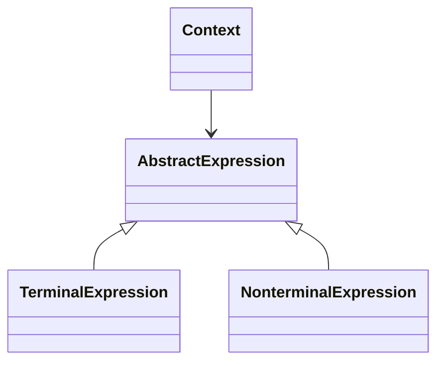

# Interpreter Design Pattern
> Version: dp_20231231_202019

- [Builder Design Pattern](#builder-design-pattern)
   * [Summary](#summary)
      + [Essence](#essence)
      + [Real examples](#real-examples)
   * [Implementation](#implementation)
      + [How to use it?](#how-to-use-it)
      + [Python code examples:](#python-code-examples)
   * [Analysis](#analysis)
      + [Cleaner Code?](#cleaner-code)
      + [Readable Code?](#readable-code)
      + [Replaceable code?](#replaceable-code)
      + [Testable code?](#testable-code)
      + [Advantages?](#advantages)
      + [Disadvantages?](#disadvantages)
   * [Remarks](#remarks)
      + [Concerns and Tips?](#concerns-and-tips)
      + [Execrises](#execrises)

## Summary

### Essence
The Interpreter design pattern defines a language or grammar and provides an interpreter to interpret and execute the expressions in the language. It helps in making clean code by separating the grammar or expressions from the interpretation logic, making the code more maintainable and modifiable. The pattern supports the implementation of domain-specific languages (DSLs) and query languages. It also makes the code easy to test and components loosely coupled. However, it can lead to a large number of classes if the grammar or expressions are complex, requires a deep understanding of the language or grammar being interpreted, and may introduce performance overhead.

### Real examples

- Parsing and executing mathematical expressions.
- Implementing domain-specific languages (DSLs).
- Creating query languages for databases.
- Implementing rule-based systems.
- Building interpreters for scripting languages.




## Implementation
### How to use it?
To use the Interpreter design pattern:
1. Define a language grammar using classes that represent the different expressions in the grammar.
2. Implement an interpreter that can interpret and execute the expressions in the grammar.
3. Create instances of the expressions and compose them to form complex expressions.
4. Pass a context object to the interpreter and call the interpret method to execute the expressions.

### Python code examples:
```python
from abc import ABC, abstractmethod

class AbstractExpression(ABC):
    @abstractmethod
    def interpret(self, context):
        pass

class TerminalExpression(AbstractExpression):
    def interpret(self, context):
        # Interpret terminal expression
        pass

class NonterminalExpression(AbstractExpression):
    def interpret(self, context):
        # Interpret nonterminal expression
        pass

class Context:
    def __init__(self):
        self.variables = {}

    def get_variable(self, name):
        return self.variables.get(name)

    def set_variable(self, name, value):
        self.variables[name] = value

    def remove_variable(self, name):
        del self.variables[name]

# Usage
context = Context()
expression = NonterminalExpression(TerminalExpression())
expression.interpret(context)
```
The code defines abstract expression classes, terminal and nonterminal expression classes, and a context class. The expressions interpret the context based on the given grammar.   


## Analysis
### Cleaner Code?
Separates the grammar or expressions from the interpretation logic, making the code more maintainable and modifiable.

### Readable Code?
Provides a clear and structured way to define and interpret expressions, making the code more readable.

### Replaceable code?
Decouples the interpretation logic from the expressions, allowing for flexibility in adding or modifying expressions.

### Testable code?
Provides a clear separation between the interpretation logic and the expressions, making the code easy to test.

### Advantages?

- Provides a flexible and extensible way to define and interpret expressions.
- Allows for the separation of concerns between the grammar or expressions and the interpretation logic.
- Supports the implementation of domain-specific languages (DSLs) and query languages.
- Facilitates the testing of the interpretation logic and the expressions independently.

### Disadvantages?

- Can lead to a complex and large number of classes if the grammar or expressions are complex.
- May require a deep understanding of the language or grammar being interpreted.
- May introduce performance overhead due to the interpretation process.


## Remarks
### Concerns and Tips?

- The complexity of the grammar or expressions can lead to a large number of classes and increased maintenance effort.
- The interpretation process may introduce performance overhead compared to other approaches.
- Deep understanding of the language or grammar being interpreted is required for effective implementation.
- Start with a simple grammar and gradually add complexity as needed.
- Use the Composite pattern to represent complex expressions as a tree structure.
- Consider using the Flyweight pattern to optimize memory usage when dealing with large numbers of similar expressions.
- Understanding the grammar or language being interpreted is crucial for implementing the Interpreter pattern effectively.
- Care should be taken to balance the number of expression classes to avoid excessive complexity.
- Performance considerations should be taken into account when using the Interpreter pattern, as the interpretation process can introduce overhead.


### Execrises

- Q: What is the purpose of the Interpreter design pattern?

  - A: The purpose of the Interpreter design pattern is to define a representation for a language and provide an interpreter to interpret and execute the language's grammar or expressions.
- Q: How does the Interpreter design pattern help in making code clean?

  - A: The Interpreter design pattern helps in making code clean by separating the grammar or expressions from the interpretation logic, allowing for easier maintenance and modification of the grammar or expressions.
- Q: What are some advantages of using the Interpreter design pattern?

  - A: Some advantages of using the Interpreter design pattern are flexibility, separation of concerns, support for domain-specific languages (DSLs) and query languages, and easier testing of the interpretation logic and expressions.
- Q: What are some disadvantages of using the Interpreter design pattern?

  - A: Some disadvantages of using the Interpreter design pattern are increased complexity with complex grammars or expressions, the need for a deep understanding of the language or grammar being interpreted, and potential performance overhead.
- Q: How can the Interpreter design pattern be used to implement a domain-specific language (DSL)?

  - A: The Interpreter design pattern can be used to implement a DSL by defining a grammar for the language and providing an interpreter to interpret and execute the expressions in the grammar.
- Q: What are some concerns when using the Interpreter design pattern?

  - A: Some concerns when using the Interpreter design pattern are the complexity of the grammar or expressions, potential performance overhead, and the need for a deep understanding of the language or grammar being interpreted.

