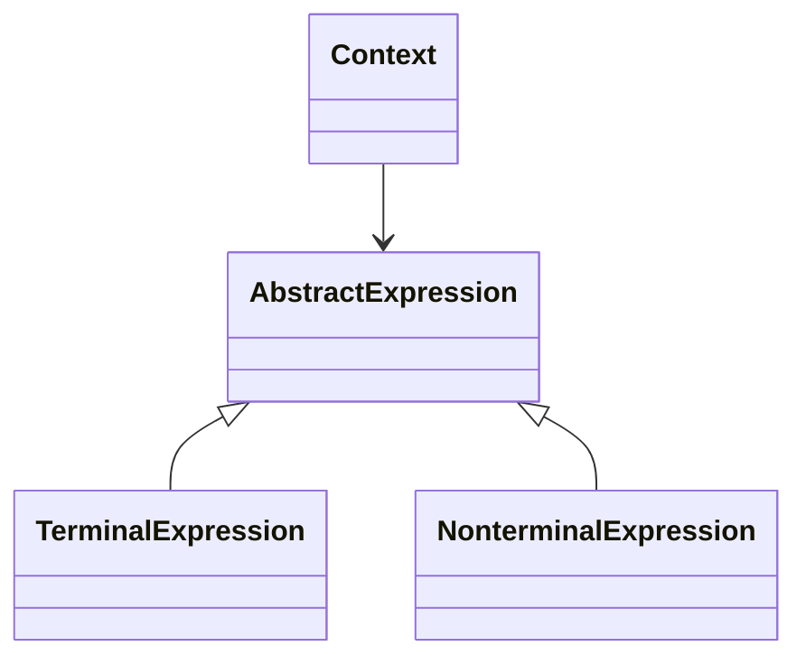

# Interpreter Design Pattern
> Version: dp_20240101_000050

- [Interpreter Design Pattern](#interpreter-design-pattern)
  * [Summary](#summary)
    + [Essence](#essence)
    + [Real examples](#real-examples)
  * [Implementation](#implementation)
    + [How to use it?](#how-to-use-it)
    + [Python code examples:](#python-code-examples)
  * [Analysis](#analysis)
    + [Maintainability:](#maintainability)
      - [Cleaner Code?](#cleaner-code)
      - [Readable Code?](#readable-code)
    + [Testability:](#testability)
    + [Adaptability:](#adaptability)
      - [Replaceable code?](#replaceable-code)
    + [Scalability:](#scalability)
    + [Tradeoffs:](#tradeoffs)
      - [Advantages?](#advantages)
      - [Disadvantages?](#disadvantages)
  * [Remarks](#remarks)
    + [Concerns and Tips?](#concerns-and-tips)
    + [Execrises](#execrises)

## Summary

### Essence
The Interpreter design pattern allows the interpretation and execution of expressions in a defined language. It separates the grammar or language rules from the interpretation logic, making the code clean and modular.

### Real examples

- 1. SQL query parsers use the Interpreter pattern to parse and interpret SQL queries.
- 2. Regular expression engines use the Interpreter pattern to interpret and match regular expressions.
- 3. Programming languages often use the Interpreter pattern to interpret and execute code written in the language.
- 4. Parsing and interpreting mathematical expressions.
- 5. Parsing and interpreting configuration files.
- 6. Parsing and interpreting domain-specific languages.




## Implementation
### How to use it?
To use the Interpreter design pattern:
1. Define the grammar or language for which you want to create an interpreter.
2. Create a hierarchy of expression classes that represent the grammar rules or language constructs.
3. Implement the interpret() method in each expression class to interpret and execute the expression.
4. Create a context object that holds the state and variables for the interpreter.
5. Use the interpreter to interpret and execute expressions in the defined language.

### Python code examples:
```python
1. Example 1:

class Context:
    def __init__(self):
        self.variables = {}

    def set_variable(self, name, value):
        self.variables[name] = value

    def get_variable(self, name):
        return self.variables.get(name)


class AbstractExpression:
    def interpret(self, context):
        pass


class TerminalExpression(AbstractExpression):
    def __init__(self, name):
        self.name = name

    def interpret(self, context):
        return context.get_variable(self.name)


class NonterminalExpression(AbstractExpression):
    def __init__(self, expression1, expression2):
        self.expression1 = expression1
        self.expression2 = expression2

    def interpret(self, context):
        value1 = self.expression1.interpret(context)
        value2 = self.expression2.interpret(context)
        return value1 + value2


context = Context()
context.set_variable('x', 10)
context.set_variable('y', 5)

expression = NonterminalExpression(TerminalExpression('x'), TerminalExpression('y'))
result = expression.interpret(context)
print(result)  # Output: 15
2. Example 2:

class Context:
    def __init__(self):
        self.variables = {}

    def set_variable(self, name, value):
        self.variables[name] = value

    def get_variable(self, name):
        return self.variables.get(name)


class AbstractExpression:
    def interpret(self, context):
        pass


class TerminalExpression(AbstractExpression):
    def __init__(self, name):
        self.name = name

    def interpret(self, context):
        return context.get_variable(self.name)


class NonterminalExpression(AbstractExpression):
    def __init__(self, expression1, expression2):
        self.expression1 = expression1
        self.expression2 = expression2

    def interpret(self, context):
        value1 = self.expression1.interpret(context)
        value2 = self.expression2.interpret(context)
        return value1 * value2


context = Context()
context.set_variable('x', 10)
context.set_variable('y', 5)

expression = NonterminalExpression(TerminalExpression('x'), TerminalExpression('y'))
result = expression.interpret(context)
print(result)  # Output: 50
```

- The Interpreter design pattern allows the interpretation and execution of expressions in a defined language. It separates the grammar or language rules from the interpretation logic, making the code clean and modular.
- The Interpreter design pattern helps in making the code readable, clean, replacable, testable, and loose coupled. It provides a flexible and extensible way to interpret and execute expressions.
- Advantages of the Interpreter design pattern include flexibility, extensibility, loose coupling, modularity, and the creation of domain-specific languages.
- Disadvantages of the Interpreter design pattern include a potentially large number of classes, the need for a deep understanding of the grammar or language, and potentially lower efficiency compared to other approaches.
- Real usage examples of the Interpreter design pattern include SQL query parsers, regular expression engines, and programming language interpreters.   


## Analysis
### Maintainability: 
To what extent is your code characterized by cleanliness and readability?
#### Cleaner Code?
The Interpreter design pattern helps in making the code clean by separating the grammar or language rules from the interpretation logic. Each expression class is responsible for interpreting and executing a specific grammar rule or language construct, making the code modular and easy to understand.

#### Readable Code?
The Interpreter design pattern makes the code readable by providing a clear and structured way to interpret and execute expressions. Each expression class represents a specific grammar rule or language construct, making it easy to follow the flow of execution.


### Testability: 
Can your code be methodically and comprehensively tested?


### Adaptability: 
How readily can your code be substituted or modified?
#### Replaceable code?
The Interpreter design pattern helps in making the code replaceable by allowing new expressions to be added or existing expressions to be modified without affecting the rest of the code. Each expression class can be easily extended or modified to support new grammar rules or language constructs.


### Scalability:
Are your architectural components characterized by loose coupling?


### Tradeoffs:
#### Advantages?

- 1. Provides a flexible and extensible way to interpret and execute expressions.
- 2. Allows the addition of new expressions without modifying the existing code.
- 3. Promotes loose coupling between the interpretation logic and the rest of the code.
- 4. Makes the code modular and easy to understand.
- 5. Enables the creation of domain-specific languages.

#### Disadvantages?

- 1. Can lead to a large number of classes if the grammar or language is complex.
- 2. May require a deep understanding of the grammar or language to implement the interpreter correctly.
- 3. Can be less efficient than other approaches for interpreting and executing expressions.
- 4. Avoid tightly coupling the interpretation logic with the rest of the code.
- 5. Avoid modifying the existing code when adding new expressions.
- 6. Avoid implementing the interpreter without a clear understanding of the grammar or language rules.


## Remarks
### Concerns and Tips?

- 1. Concerns:
-    - The Interpreter design pattern can lead to a large number of classes if the grammar or language is complex.
-    - Implementing the interpreter correctly requires a deep understanding of the grammar or language rules.
-    - The interpreter may be less efficient than other approaches for interpreting and executing expressions.
- 2. Programming Tips:
-    - Start by defining the grammar or language for which you want to create an interpreter.
-    - Create a hierarchy of expression classes that represent the grammar rules or language constructs.
-    - Implement the interpret() method in each expression class to interpret and execute the expression.
-    - Use a context object to hold the state and variables for the interpreter.
-    - Test each expression class independently to ensure correct interpretation and execution.
- 3. Tricky Points:
-    - Understanding the grammar or language rules is crucial for implementing the interpreter correctly.
-    - Care should be taken to ensure that the interpreter is efficient, especially for complex languages or grammars.
-    - Adding new expressions may require modifying multiple classes, which can be challenging to maintain.
- 4. Real Usage Examples:
-    - The Interpreter design pattern was used to implement a regular expression engine. The interpreter parsed and interpreted regular expressions, allowing for pattern matching in text.
-    - The Interpreter design pattern was used to implement a programming language interpreter. The interpreter parsed and interpreted code written in the programming language, allowing for its execution.


### Execrises

- 1. Q: What is the purpose of the Interpreter design pattern?
   
  - A: The purpose of the Interpreter design pattern is to define a representation for a language and provide an interpreter to interpret and execute the language grammar or expressions.
- 2. Q: How does the Interpreter design pattern help in making the code clean?
   
  - A: The Interpreter design pattern helps in making the code clean by separating the grammar or language rules from the interpretation logic. Each expression class is responsible for interpreting and executing a specific grammar rule or language construct, making the code modular and easy to understand.
- 3. Q: What are some real usage examples of the Interpreter design pattern?
   
  - A: Some real usage examples of the Interpreter design pattern include SQL query parsers, regular expression engines, and programming language interpreters.
- 4. Q: What are the advantages of the Interpreter design pattern?
   
  - A: The advantages of the Interpreter design pattern include flexibility, extensibility, loose coupling, modularity, and the creation of domain-specific languages.
- 5. Q: What are some concerns or disadvantages of the Interpreter design pattern?
   
  - A: Some concerns or disadvantages of the Interpreter design pattern include a potentially large number of classes, the need for a deep understanding of the grammar or language, and potentially lower efficiency compared to other approaches.

