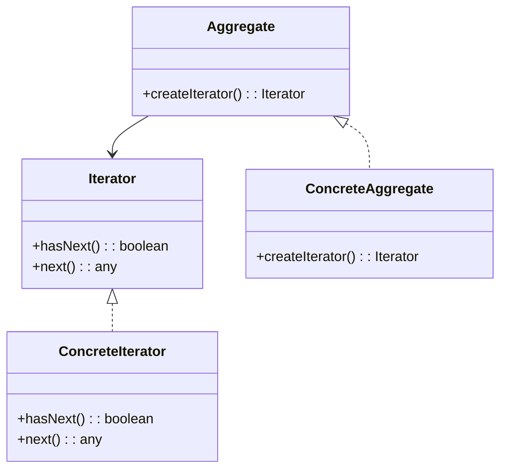

# Iterator Design Pattern
> Version: dp_20231231_202019

- [Builder Design Pattern](#builder-design-pattern)
   * [Summary](#summary)
      + [Essence](#essence)
      + [Real examples](#real-examples)
   * [Implementation](#implementation)
      + [How to use it?](#how-to-use-it)
      + [Python code examples:](#python-code-examples)
   * [Analysis](#analysis)
      + [Cleaner Code?](#cleaner-code)
      + [Readable Code?](#readable-code)
      + [Replaceable code?](#replaceable-code)
      + [Testable code?](#testable-code)
      + [Advantages?](#advantages)
      + [Disadvantages?](#disadvantages)
   * [Remarks](#remarks)
      + [Concerns and Tips?](#concerns-and-tips)
      + [Execrises](#execrises)

## Summary

### Essence
The Iterator design pattern provides a way to access the elements of a collection sequentially without exposing its internal structure. It separates the traversal logic from the collection, promoting clean code and modularity. The pattern enhances code readability by abstracting away the details of collection traversal and makes code easier to test by decoupling the traversal logic from the collection. It helps in making components loosely coupled by allowing the collection to change its internal structure without affecting the code that uses it.

### Real examples

- When you want to iterate over the elements of a collection without exposing its internal structure.
- When you want to provide a uniform way of iterating over different types of collections.
- When you want to decouple the traversal algorithm from the collection, allowing them to vary independently.




## Implementation
### How to use it?
To use the Iterator design pattern, you need to define an Iterator interface that provides methods for traversing the elements of a collection. Then, implement the Iterator interface in concrete iterator classes that are specific to each collection. Finally, define an Aggregate interface that provides a method for creating an iterator, and implement the Aggregate interface in concrete aggregate classes that represent different collections.

### Python code examples:
```python
class MyCollection:
    def __init__(self):
        self.data = [1, 2, 3, 4, 5]

    def __iter__(self):
        return MyIterator(self.data)


class MyIterator:
    def __init__(self, data):
        self.data = data
        self.index = 0

    def __next__(self):
        if self.index >= len(self.data):
            raise StopIteration
        value = self.data[self.index]
        self.index += 1
        return value


# Usage
my_collection = MyCollection()
for item in my_collection:
    print(item)
Output:
1
2
3
4
5
```

- The above Python code demonstrates the implementation of the Iterator design pattern. The MyCollection class represents a collection of data, and the MyIterator class provides the iteration logic. By implementing the __iter__() and __next__() methods, the collection can be iterated using a for loop.   


## Analysis
### Cleaner Code?

- Separates the traversal logic from the collection, making the code more modular and easier to understand.
- Encapsulates the iteration logic in a separate class, promoting single responsibility principle.
- Provides a consistent interface for iterating over different types of collections, making the code more reusable and maintainable.

### Readable Code?

- Improves code readability by providing a clear and standardized way of iterating over collections.
- Abstracts away the details of collection traversal, making the code more focused on the business logic.
- Makes the code more self-explanatory and easier to understand, especially when used with descriptive method names.

### Replaceable code?

- Helps in making components loosely coupled by separating the traversal logic from the collection.
- Allows the collection to change its internal structure without affecting the code that uses it, as long as the iterator interface remains the same.
- Promotes flexibility and modularity, as different collections can be used interchangeably as long as they provide the same iterator interface.

### Testable code?

- Makes code easier to test by decoupling the traversal logic from the collection.
- Enables the creation of mock iterators for testing purposes, allowing testing of the code that uses the iterator without relying on the actual collection.
- Promotes testability by providing a clear separation between the iteration logic and the business logic, making it easier to write unit tests for both.

### Advantages?

- Provides a uniform way of iterating over different types of collections.
- Allows the collection to change its internal structure without affecting the code that uses it.
- Promotes clean code by separating the traversal logic from the collection.
- Enhances code readability by abstracting away the details of collection traversal.
- Makes code easier to test by decoupling the traversal logic from the collection.
- Enables the creation of mock iterators for testing purposes.
- Promotes loose coupling between components.
- Increases code reusability and maintainability.

### Disadvantages?

- Adds an additional layer of abstraction, which may increase complexity in some cases.
- Requires the implementation of multiple classes/interfaces, which can be time-consuming.
- May not be suitable for simple collections with a fixed structure and known traversal logic.
- Avoids exposing the internal structure of a collection, helping maintain encapsulation and data integrity.
- Avoids the need for client code to have knowledge of the specific collection implementation, allowing for more flexibility and modularity.


## Remarks
### Concerns and Tips?

- One concern with the Iterator design pattern is the potential performance impact of iterating over large collections.
- Depending on the implementation, iterating over a collection using an iterator may introduce additional overhead compared to direct access to the elements.
- This is especially true for collections that require expensive operations to retrieve the next element, such as database queries.
- Programming tips: Consider the specific requirements of your application and choose the appropriate iteration strategy.
- Use descriptive method names in your iterator implementation to make the code more self-explanatory.
- Consider using language-specific features or libraries that provide built-in support for the Iterator design pattern.
- Test your iterator implementation thoroughly, especially edge cases such as empty collections or collections with a single element.
- Pay attention to the correct handling of the end of the iteration.
- When using the Iterator design pattern, be mindful of the potential impact on performance, especially when iterating over large collections.
- Consider optimizing the iteration logic if necessary.
- Tricky aspect: Handling the end of the iteration. The iterator needs to keep track of its current position and determine when it has reached the end of the collection.
- This is typically done by checking if the current position is greater than or equal to the length of the collection.
- Study the implementation of iterators in programming languages and frameworks to gain a deeper understanding of the design pattern and its variations.
- Study algorithms and data structures that involve iteration, such as linked lists and binary trees, to enhance your understanding of the design pattern.


### Execrises

- Q: What is the purpose of the Iterator design pattern?

  - A: The purpose of the Iterator design pattern is to provide a way to access the elements of an aggregate object sequentially without exposing its underlying representation.
- Q: How does the Iterator design pattern help in making code clean?

  - A: The Iterator design pattern helps in making clean code by separating the traversal logic from the collection, promoting modularity and single responsibility principle.
- Q: How does the Iterator design pattern help in making code readable?

  - A: The Iterator design pattern improves code readability by providing a clear and standardized way of iterating over collections, abstracting away the details of collection traversal.
- Q: How does the Iterator design pattern help in making code easy to be tested?

  - A: The Iterator design pattern makes code easier to test by decoupling the traversal logic from the collection, allowing the creation of mock iterators for testing purposes.
- Q: How does the Iterator design pattern help in making components loose coupled?

  - A: The Iterator design pattern helps in making components loosely coupled by separating the traversal logic from the collection, allowing the collection to change its internal structure without affecting the code that uses it.
- Q: What are the advantages of using the Iterator design pattern?

  - A: Some advantages of using the Iterator design pattern include providing a uniform way of iterating over different types of collections, promoting clean code, enhancing code readability, and making code easier to test.
- Q: What are the disadvantages of using the Iterator design pattern?

  - A: Some disadvantages of using the Iterator design pattern include increased complexity in some cases, the need to implement multiple classes/interfaces, and potential unsuitability for simple collections with a fixed structure and known traversal logic.

