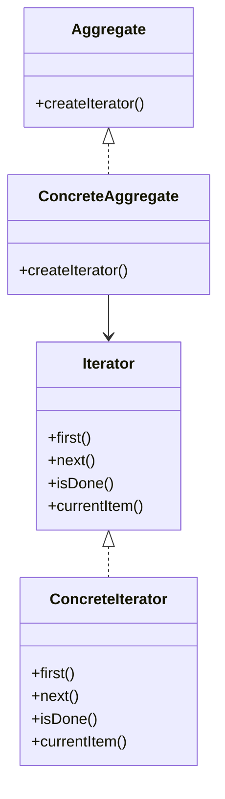

# Iterator
> Version: dp_20231231_234226

- [Builder Design Pattern](#builder-design-pattern)
   * [Summary](#summary)
      + [Essence](#essence)
      + [Real examples](#real-examples)
   * [Implementation](#implementation)
      + [How to use it?](#how-to-use-it)
      + [Python code examples:](#python-code-examples)
   * [Analysis](#analysis)
      + [Cleaner Code?](#cleaner-code)
      + [Readable Code?](#readable-code)
      + [Replaceable code?](#replaceable-code)
      + [Testable code?](#testable-code)
      + [Advantages?](#advantages)
      + [Disadvantages?](#disadvantages)
   * [Remarks](#remarks)
      + [Concerns and Tips?](#concerns-and-tips)
      + [Execrises](#execrises)

## Summary

### Essence
The Iterator design pattern provides a way to access the elements of an aggregate object sequentially without exposing its underlying representation.

### Real examples

- 1. Iterating over a collection of files in a directory.
- 2. Traversing the elements of a linked list.
- 3. Parsing a tree structure.




## Implementation
### How to use it?
To use the Iterator pattern, you need to define an Iterator interface with methods like `first()`, `next()`, `isDone()`, and `currentItem()`. Then, implement the Iterator interface in a ConcreteIterator class. Next, define an Aggregate interface with a method `createIterator()`. Finally, implement the Aggregate interface in a ConcreteAggregate class and return a ConcreteIterator object from the `createIterator()` method.

### Python code examples:
```python
1. Iterating over a list using an iterator:
```python
my_list = [1, 2, 3, 4, 5]
iterator = iter(my_list)
while True:
    try:
        item = next(iterator)
        print(item)
    except StopIteration:
        break
```
2. Implementing an iterator for a custom collection:
```python
class MyCollection:
    def __init__(self):
        self.data = [1, 2, 3, 4, 5]
    def __iter__(self):
        return MyIterator(self.data)
class MyIterator:
    def __init__(self, data):
        self.data = data
        self.index = 0
    def __iter__(self):
        return self
    def __next__(self):
        if self.index >= len(self.data):
            raise StopIteration
        item = self.data[self.index]
        self.index += 1
        return item
my_collection = MyCollection()
for item in my_collection:
    print(item)

```

- 1. Iterating over a list using an iterator.
- 2. Implementing an iterator for a custom collection.   


## Analysis
### Maintainability: 
To what extent is your code characterized by cleanliness and readability?
#### Cleaner Code?

- 1. Separates the traversal logic from the collection class, making the code cleaner and more focused on its specific responsibilities.
- 2. Promotes encapsulation and information hiding by allowing iteration without exposing the internal structure of the collection.
- 3. Provides a clear and consistent way to access the elements of a collection, enhancing code readability and maintainability.

#### Readable Code?

- 1. Provides a clear and consistent way to access the elements of a collection, making the code more readable and easier to understand.
- 2. Abstracts away the details of the collection's internal structure, allowing the code to focus on the logic of iterating over the elements.


### Testability: 
Can your code be methodically and comprehensively tested?


### Adaptability: 
How readily can your code be substituted or modified?
#### Replaceable code?

- 1. Decouples the traversal algorithm from the collection class, making it easier to replace or modify the algorithm without affecting the collection.
- 2. Allows switching between different traversal algorithms without changing the code that uses the iterator.


### Scalability:
Are your architectural components characterized by loose coupling?


### Tradeoffs:
#### Advantages?

- 1. Encapsulates the traversal logic and provides a uniform interface for accessing elements.
- 2. Promotes clean code by separating concerns and promoting loose coupling.
- 3. Enhances code readability and maintainability by abstracting away the details of the collection's internal structure.
- 4. Improves code testability by providing a standardized way to access elements and allowing for easy mocking in tests.
- 5. Enables code scalability by decoupling the traversal algorithm from the collection class.

#### Disadvantages?

- 1. Adds complexity to the code by introducing additional classes and interfaces.
- 2. Requires implementing multiple classes and interfaces, increasing development time.
- 3. May not be necessary for simple collections or cases with straightforward traversal logic.


## Remarks
### Concerns and Tips?

- One concern is the potential performance impact of iterating over large collections.
- Consider the trade-off between encapsulation and performance when using the Iterator pattern.
- Handling the end of the collection can be tricky, requiring the iterator to know when to stop iterating and raise a `StopIteration` exception.
- Additional studies on the Iterator pattern can be found at: [1. Python](https://realpython.com/iterator-pattern-python/), [2. Java](https://www.baeldung.com/java-iterator-pattern).


### Execrises

- Q: What is the purpose of the Iterator pattern?
- 
  - A: The purpose of the Iterator pattern is to provide a way to access the elements of a collection sequentially without exposing its internal structure.
- Q: How does the Iterator pattern promote clean code?
- 
  - A: The Iterator pattern separates the traversal logic from the collection class, making the code cleaner and more focused on its specific responsibilities.
- Q: How does the Iterator pattern help in making the code testable?
- 
  - A: The Iterator pattern provides a clear and standardized way to access the elements of a collection, making it easier to write tests for the code that uses the iterator.
- Q: What are the advantages of using the Iterator pattern?
- 
  - A: Some advantages of using the Iterator pattern include encapsulating the traversal logic, promoting clean code, enhancing code readability and maintainability, improving code testability, and enabling code scalability.
- Q: What are some real-world examples of using the Iterator pattern?
- 
  - A: Some real-world examples of using the Iterator pattern include iterating over a collection of files in a directory, traversing the elements of a linked list, and parsing a tree structure.

