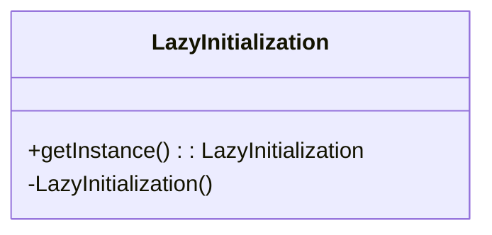

# Lazy Initialization
> Version: dp_20231231_202019

- [Builder Design Pattern](#builder-design-pattern)
   * [Summary](#summary)
      + [Essence](#essence)
      + [Real examples](#real-examples)
   * [Implementation](#implementation)
      + [How to use it?](#how-to-use-it)
      + [Python code examples:](#python-code-examples)
   * [Analysis](#analysis)
      + [Cleaner Code?](#cleaner-code)
      + [Readable Code?](#readable-code)
      + [Replaceable code?](#replaceable-code)
      + [Testable code?](#testable-code)
      + [Advantages?](#advantages)
      + [Disadvantages?](#disadvantages)
   * [Remarks](#remarks)
      + [Concerns and Tips?](#concerns-and-tips)
      + [Execrises](#execrises)

## Summary

### Essence
The Lazy Initialization design pattern defers the creation of an object or resource until it is accessed for the first time. This improves performance by avoiding unnecessary overhead and reduces memory usage. It separates object or resource creation from its usage, resulting in cleaner and more maintainable code.

### Real examples

- Database connection: The Lazy Initialization pattern can be used to delay the creation of a database connection until it is actually needed. This can improve performance by avoiding unnecessary overhead.
- Resource loading: Lazy Initialization can be used to load resources, such as images or configuration files, only when they are required. This can reduce memory usage and improve startup time.
- Singleton pattern: The Lazy Initialization pattern is commonly used in the implementation of the Singleton pattern, where the instance of the class is created lazily when it is first accessed.




## Implementation
### How to use it?
To use the Lazy Initialization design pattern, follow these steps:
1. Create a private constructor for the class.
2. Create a private static instance variable.
3. Create a public static method that returns the instance.
4. In the public static method, check if the instance is null. If it is, create a new instance and assign it to the instance variable.
5. Return the instance.

### Python code examples:
```python
class LazyInitialization:
    __instance = None

    @staticmethod
    def getInstance():
        if LazyInitialization.__instance is None:
            LazyInitialization()
        return LazyInitialization.__instance

    def __init__(self):
        if LazyInitialization.__instance is not None:
            raise Exception("This class is a singleton!")
        else:
            LazyInitialization.__instance = self
```
The Lazy Initialization design pattern in Python ensures that only one instance of a class is created and provides a global point of access to it.   


## Analysis
### Cleaner Code?
Lazy Initialization helps in making clean code by separating the creation of an object or resource from its usage. This improves code organization and makes it easier to understand and maintain.

### Readable Code?
Lazy Initialization improves code readability by clearly indicating that an object or resource is only created when it is needed. This makes the code more self-explanatory and easier to follow.

### Replaceable code?
Lazy Initialization helps in making code more replaceable and components loosely coupled by decoupling the creation of an object or resource from its usage. This allows for flexibility and interchangeability of components.

### Testable code?
Lazy Initialization makes code easier to test by allowing for the creation of mock objects or resources during testing. This enables isolated unit testing and improves testability.

### Advantages?

- Improved performance: Lazy Initialization can improve performance by avoiding unnecessary object or resource creation.
- Reduced memory usage: By deferring object or resource creation until it is needed, Lazy Initialization can reduce memory usage.
- Simplified code: Lazy Initialization separates object or resource creation from its usage, resulting in cleaner and more maintainable code.
- Flexibility: Lazy Initialization allows for on-demand creation of objects or resources, providing flexibility and adaptability.

### Disadvantages?

- Increased complexity: Lazy Initialization adds complexity to the code by introducing additional logic for object or resource creation.
- Potential for null references: If not implemented correctly, Lazy Initialization can lead to null reference errors if the object or resource is accessed before it is initialized.
- Thread safety: Lazy Initialization may require additional synchronization mechanisms to ensure thread safety in multi-threaded environments.


## Remarks
### Concerns and Tips?

- Potential performance impact: While Lazy Initialization can improve performance in certain scenarios, it may introduce additional overhead in others.
- Complexity: Lazy Initialization adds complexity to the code by introducing additional logic for object or resource creation.
- Thread safety: Lazy Initialization may require additional synchronization mechanisms to ensure thread safety in multi-threaded environments.
- Programming tips: Use Lazy Initialization when the creation of an object or resource is expensive and should be deferred until it is actually needed. Be mindful of potential null reference errors and ensure proper initialization before accessing the object or resource. Consider thread safety requirements and use appropriate synchronization mechanisms if necessary.
- Tricky points: Ensuring thread safety and avoiding null references are important considerations when implementing Lazy Initialization.


### Execrises

- Q: What is the purpose of the Lazy Initialization design pattern?

  - A: The purpose of the Lazy Initialization design pattern is to delay the initialization of an object or resource until it is actually needed.
- Q: How does Lazy Initialization help in making code clean?

  - A: Lazy Initialization separates the creation of an object or resource from its usage, improving code organization and maintainability.
- Q: What are the advantages of using Lazy Initialization?

  - A: Some advantages of Lazy Initialization include improved performance, reduced memory usage, simplified code, and flexibility.
- Q: What are the potential disadvantages of Lazy Initialization?

  - A: Potential disadvantages of Lazy Initialization include increased complexity, potential for null references, and thread safety concerns.
- Q: How can Lazy Initialization be used in practice?

  - A: Lazy Initialization can be used in scenarios such as database connections, resource loading, and implementing the Singleton pattern.

