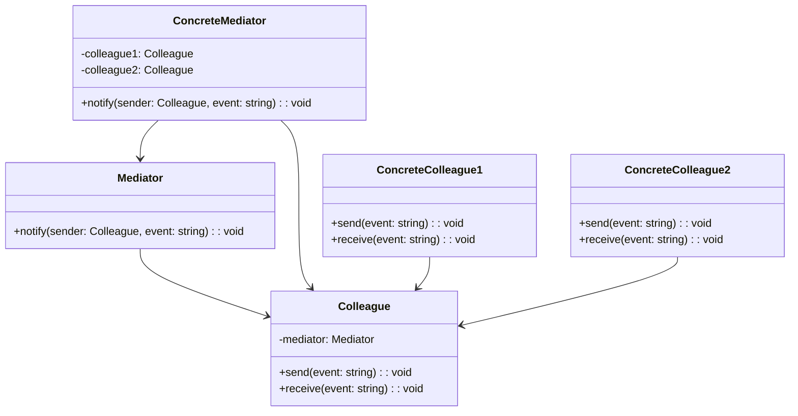

# Mediator Design Pattern Summary
> Version: dp_20231231_234226

- [Builder Design Pattern](#builder-design-pattern)
   * [Summary](#summary)
      + [Essence](#essence)
      + [Real examples](#real-examples)
   * [Implementation](#implementation)
      + [How to use it?](#how-to-use-it)
      + [Python code examples:](#python-code-examples)
   * [Analysis](#analysis)
      + [Cleaner Code?](#cleaner-code)
      + [Readable Code?](#readable-code)
      + [Replaceable code?](#replaceable-code)
      + [Testable code?](#testable-code)
      + [Advantages?](#advantages)
      + [Disadvantages?](#disadvantages)
   * [Remarks](#remarks)
      + [Concerns and Tips?](#concerns-and-tips)
      + [Execrises](#execrises)

## Summary

### Essence

- Defines an object that encapsulates how a set of objects interact
- Promotes loose coupling by keeping objects from referring to each other explicitly
- Centralizes communication logic
- Reduces complexity of individual objects
- Decouples objects and reduces dependencies

### Real examples

- Chat applications, where the mediator acts as a central hub for sending and receiving messages between users
- Air traffic control systems, where the mediator coordinates communication between aircraft and control towers
- Event-driven systems, where the mediator handles routing of events between components
- Online marketplaces, where the mediator facilitates communication between buyers and sellers
- Multiplayer games, where the mediator manages interactions between players




## Implementation
### How to use it?
To use the Mediator design pattern, follow these steps:
1. Create an interface or base class for the mediator.
2. Create concrete mediator classes that implement the mediator interface.
3. Create interface or base classes for the colleagues.
4. Create concrete colleague classes that implement the colleague interface or inherit from the colleague base class.
5. In the colleague classes, define methods to send and receive messages.
6. In the mediator classes, implement the logic to handle the communication between colleagues.
7. Use the mediator to coordinate the communication between colleagues.

### Python code examples:
```python

from abc import ABC, abstractmethod

class Mediator(ABC):
    @abstractmethod
    def notify(self, sender, event):
        pass

class Colleague(ABC):
    def __init__(self, mediator):
        self.mediator = mediator

    @abstractmethod
    def send(self, event):
        pass

    @abstractmethod
    def receive(self, event):
        pass

class ConcreteMediator(Mediator):
    def __init__(self):
        self.colleague1 = ConcreteColleague1(self)
        self.colleague2 = ConcreteColleague2(self)

    def notify(self, sender, event):
        if sender == self.colleague1:
            self.colleague2.receive(event)
        elif sender == self.colleague2:
            self.colleague1.receive(event)

class ConcreteColleague1(Colleague):
    def send(self, event):
        self.mediator.notify(self, event)

    def receive(self, event):
        print('ConcreteColleague1 received:', event)


class ConcreteColleague2(Colleague):
    def send(self, event):
        self.mediator.notify(self, event)

    def receive(self, event):
        print('ConcreteColleague2 received:', event)

mediator = ConcreteMediator()
mediator.colleague1.send('Hello from ConcreteColleague1')
mediator.colleague2.send('Hello from ConcreteColleague2')

```

- The Python code example demonstrates the Mediator design pattern by defining a mediator and two colleagues. The colleagues communicate with each other through the mediator, which decouples them and centralizes the communication logic.   


## Analysis
### Maintainability: 
To what extent is your code characterized by cleanliness and readability?
#### Cleaner Code?

- Encapsulates communication logic in a separate mediator object
- Reduces complexity of individual objects by removing the need for them to know about each other
- Centralizes communication logic in one place

#### Readable Code?

- Provides a clear and centralized way to handle communication between objects
- Makes it easier to understand the flow of communication and interactions
- Reduces the need for objects to have knowledge of each other, making the code more modular and easier to follow


### Testability: 
Can your code be methodically and comprehensively tested?


### Adaptability: 
How readily can your code be substituted or modified?
#### Replaceable code?

- Decouples objects from each other
- Allows for easier modification or replacement of individual objects without affecting the rest of the system
- Provides a flexible and extensible architecture


### Scalability:
Are your architectural components characterized by loose coupling?


### Tradeoffs:
#### Advantages?

- Decouples objects and reduces dependencies
- Centralizes communication logic
- Improves code readability and modularity
- Supports replaceability and extensibility
- Enhances code testability and scalability
- Solves the problem of complex communication logic and tight coupling

#### Disadvantages?

- Can introduce additional complexity and overhead
- Requires creation of additional mediator and colleague classes
- May not be suitable for simple systems with few objects and straightforward communication
- Avoids tightly coupling objects
- Avoids duplicating communication logic
- Avoids complex and tangled communication between objects


## Remarks
### Concerns and Tips?

- The Mediator design pattern can introduce additional complexity and overhead
- Requires creation of additional mediator and colleague classes
- May not be suitable for simple systems with few objects and straightforward communication
- Consider trade-offs between loose coupling and additional classes and complexity
- Ensure responsibilities of mediator and colleagues are well-defined and properly separated
- Recommended resources: 'Design Patterns: Elements of Reusable Object-Oriented Software' by Erich Gamma et al., 'Head First Design Patterns' by Eric Freeman and Elisabeth Robson, 'Design Patterns in Python' by Brandon Rhodes and Tres Seaver


### Execrises

- Q: What is the purpose of the Mediator design pattern?

  - A: The purpose of the Mediator design pattern is to define an object that encapsulates how a set of objects interact and promotes loose coupling by keeping objects from referring to each other explicitly.
- Q: How does the Mediator design pattern improve code maintainability?

  - A: The Mediator design pattern improves code maintainability by centralizing the communication logic in a separate mediator object, making it easier to understand, modify, and debug.
- Q: What are the advantages of using the Mediator design pattern?

  - A: The advantages of using the Mediator design pattern include decoupling objects and reducing dependencies, centralizing communication logic, improving code readability and modularity, supporting replaceability and extensibility, and enhancing code testability and scalability.
- Q: When should you use the Mediator design pattern?

  - A: You should use the Mediator design pattern when you have a system with complex communication logic, multiple objects, and the need for decoupling and centralization.
- Q: What are the potential drawbacks of using the Mediator design pattern?

  - A: The potential drawbacks of using the Mediator design pattern include additional complexity and overhead, the creation of additional mediator and colleague classes, and potential unsuitability for simple systems with few objects and straightforward communication.

