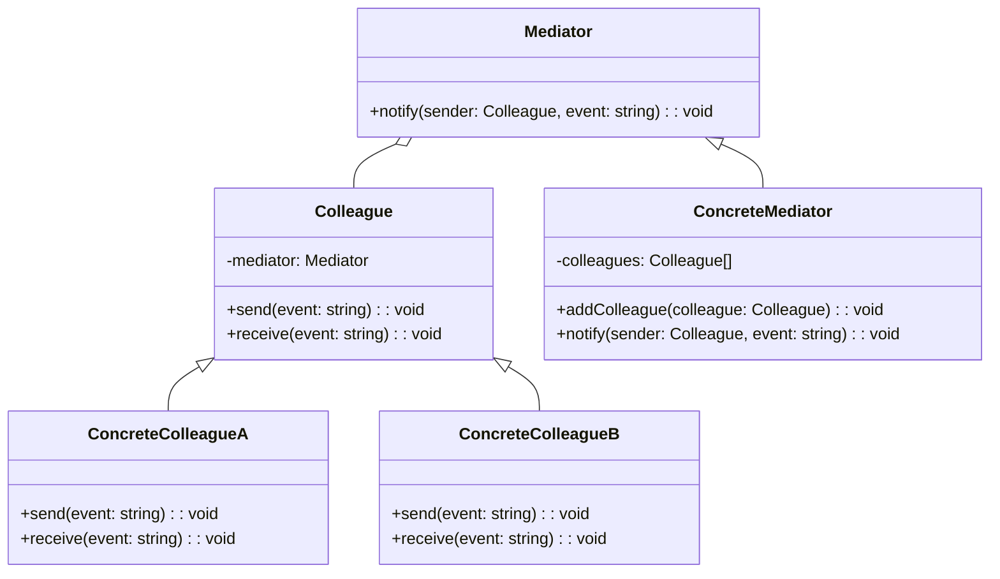

# Mediator Design Pattern
> Version: dp_20231231_202019

- [Builder Design Pattern](#builder-design-pattern)
   * [Summary](#summary)
      + [Essence](#essence)
      + [Real examples](#real-examples)
   * [Implementation](#implementation)
      + [How to use it?](#how-to-use-it)
      + [Python code examples:](#python-code-examples)
   * [Analysis](#analysis)
      + [Cleaner Code?](#cleaner-code)
      + [Readable Code?](#readable-code)
      + [Replaceable code?](#replaceable-code)
      + [Testable code?](#testable-code)
      + [Advantages?](#advantages)
      + [Disadvantages?](#disadvantages)
   * [Remarks](#remarks)
      + [Concerns and Tips?](#concerns-and-tips)
      + [Execrises](#execrises)

## Summary

### Essence
Defines a mediator object that controls communication between objects

### Real examples

- Chat applications
- Air traffic control systems
- Event-driven systems
- Shopping cart systems
- Multiplayer games
- Distributed systems




## Implementation
### How to use it?
To use the Mediator design pattern, follow these steps:
1. Define a Mediator interface or base class that declares the communication methods.
2. Implement the Mediator interface or base class to create a concrete mediator class.
3. Define a Colleague interface or base class that declares the communication methods used by the objects.
4. Implement the Colleague interface or base class to create concrete colleague classes.
5. In the client code, create the mediator object and the colleague objects.
6. Set the mediator object as the mediator for each colleague object.
7. Use the colleague objects to communicate with each other indirectly through the mediator.

### Python code examples:
```python
from abc import ABC, abstractmethod

class Mediator(ABC):
    @abstractmethod
    def notify(self, sender, event):
        pass

class Colleague(ABC):
    def __init__(self, mediator):
        self.mediator = mediator

    @abstractmethod
    def send(self, event):
        pass

    @abstractmethod
    def receive(self, event):
        pass

class ConcreteMediator(Mediator):
    def __init__(self):
        self.colleagues = []

    def add_colleague(self, colleague):
        self.colleagues.append(colleague)

    def notify(self, sender, event):
        for colleague in self.colleagues:
            if colleague != sender:
                colleague.receive(event)


class ConcreteColleagueA(Colleague):
    def send(self, event):
        self.mediator.notify(self, event)

    def receive(self, event):
        print('ConcreteColleagueA received:', event)


class ConcreteColleagueB(Colleague):
    def send(self, event):
        self.mediator.notify(self, event)

    def receive(self, event):
        print('ConcreteColleagueB received:', event)


mediator = ConcreteMediator()

colleague_a = ConcreteColleagueA(mediator)
colleague_b = ConcreteColleagueB(mediator)

mediator.add_colleague(colleague_a)
mediator.add_colleague(colleague_b)

colleague_a.send('Hello from Colleague A')
# Output: ConcreteColleagueB received: Hello from Colleague A

colleague_b.send('Hello from Colleague B')
# Output: ConcreteColleagueA received: Hello from Colleague B
```

- The Python code example demonstrates the Mediator design pattern by defining a mediator and two colleagues.
- The colleagues communicate with each other indirectly through the mediator, reducing direct dependencies.
- The mediator notifies the other colleagues when a colleague sends a message, promoting loose coupling.
- The code shows how the Mediator design pattern can be used to manage communication between objects.
- By using the mediator, the code becomes more modular, maintainable, and easier to test.   


## Analysis
### Cleaner Code?

- Reduces direct dependencies between objects
- Encapsulates communication logic in a separate mediator object
- Allows for easier extensibility and modification of communication behavior

### Readable Code?

- Centralizes communication logic in a mediator object
- Abstracts interactions between objects
- Reduces complexity of individual objects

### Replaceable code?

- Promotes loose coupling between objects
- Objects only need to know about the mediator interface

### Testable code?

- Promotes loose coupling between objects
- Objects can be tested in isolation
- Communication logic can be tested separately in the mediator

### Advantages?

- Promotes loose coupling
- Simplifies communication
- Improves code readability
- Facilitates unit testing

### Disadvantages?

- Adds complexity to system architecture
- Potential single point of failure
- Difficulty in defining a generic mediator interface


## Remarks
### Concerns and Tips?

- Concerns: Potential complexity of mediator object, Designing mediator interface
- Programming tips: Identify objects that need to communicate, Define clear interfaces, Test communication using mediator
- Trickys: Designing mediator interface, Avoiding performance bottlenecks
- Studies: 'Design Patterns: Elements of Reusable Object-Oriented Software', 'Head First Design Patterns', 'Design Patterns in Python'


### Execrises

- Q: What is the purpose of the Mediator design pattern?

  - A: The purpose of the Mediator design pattern is to define an object that encapsulates how a set of objects interact and promotes loose coupling between them.
- Q: How does the Mediator design pattern help in making code clean?

  - A: The Mediator design pattern promotes clean code by reducing direct dependencies between objects and encapsulating the communication logic in a separate mediator object.
- Q: What are some advantages of using the Mediator design pattern?

  - A: Some advantages of using the Mediator design pattern include promoting loose coupling, simplifying communication, improving code readability, and facilitating unit testing.
- Q: What are some real-world examples of the Mediator design pattern?

  - A: Some real-world examples include chat applications, air traffic control systems, and event-driven systems.
- Q: What are some concerns with the Mediator design pattern?

  - A: Some concerns with the Mediator design pattern include the potential for the mediator object to become too complex and the need to carefully design the mediator interface.

