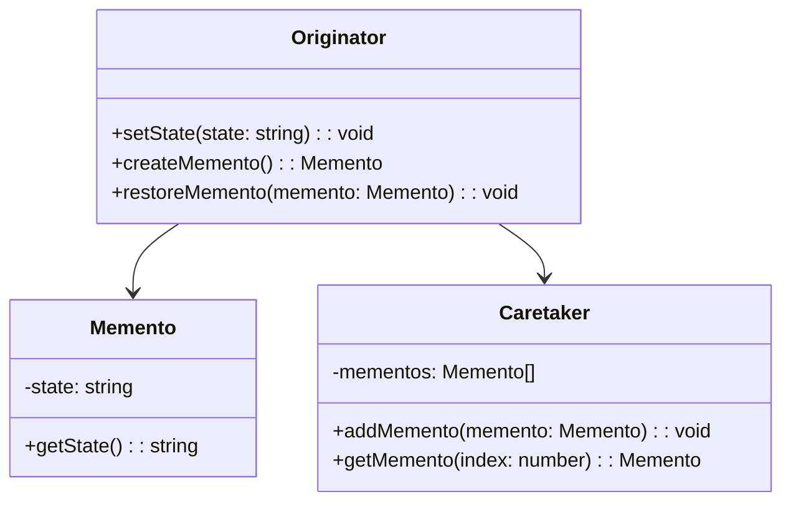

# Memento Design Pattern
> Version: dp_20240101_000050

- [Memento Design Pattern](#memento-design-pattern)
  * [Summary](#summary)
    + [Essence](#essence)
    + [Real examples](#real-examples)
  * [Implementation](#implementation)
    + [How to use it?](#how-to-use-it)
    + [Python code examples:](#python-code-examples)
  * [Analysis](#analysis)
    + [Maintainability:](#maintainability)
      - [Cleaner Code?](#cleaner-code)
      - [Readable Code?](#readable-code)
    + [Testability:](#testability)
    + [Adaptability:](#adaptability)
      - [Replaceable code?](#replaceable-code)
    + [Scalability:](#scalability)
    + [Tradeoffs:](#tradeoffs)
      - [Advantages?](#advantages)
      - [Disadvantages?](#disadvantages)
  * [Remarks](#remarks)
    + [Concerns and Tips?](#concerns-and-tips)
    + [Execrises](#execrises)

## Summary

### Essence
The Memento design pattern provides a way to save and restore the state of an object without violating encapsulation. It captures an object's internal state and externalizes it, allowing the object to be restored to this state later. The key points of the Memento design pattern are:

### Real examples

- Undo/Redo functionality in text editors or graphic design software.
- Checkpoint systems in video games.
- Browser history functionality in web browsers.
- Transaction rollback in databases.
- Saving and restoring the state of an object.




## Implementation
### How to use it?
To use the Memento design pattern, follow these steps:
1. Create the Originator class that has methods to set and get the state, as well as create and restore mementos.
2. Create the Memento class that stores the state of the Originator.
3. Create the Caretaker class that keeps track of the mementos.
4. Use the Originator and Caretaker classes to save and restore the state of the Originator object.

### Python code examples:
```python

# Originator class

class Originator:
    def __init__(self):
        self._state = ''

    def set_state(self, state):
        self._state = state

    def create_memento(self):
        return Memento(self._state)

    def restore_memento(self, memento):
        self._state = memento.get_state()


# Memento class

class Memento:
    def __init__(self, state):
        self._state = state

    def get_state(self):
        return self._state


# Caretaker class

class Caretaker:
    def __init__(self):
        self._mementos = []

    def add_memento(self, memento):
        self._mementos.append(memento)

    def get_memento(self, index):
        return self._mementos[index]

```

- The Python code example demonstrates the implementation of the Memento design pattern using the Originator, Memento, and Caretaker classes.
- The Originator class is responsible for setting and getting the state, as well as creating and restoring mementos.
- The Memento class stores the state of the Originator.
- The Caretaker class keeps track of the mementos.
- The code showcases how the Memento design pattern can be used to save and restore the state of an object.   


## Analysis
### Maintainability: 
To what extent is your code characterized by cleanliness and readability?
#### Cleaner Code?

- Encapsulates the state of an object and separates it from the object itself.
- Allows for the separation of concerns, as the object doesn't need to worry about saving and restoring its state.

#### Readable Code?

- Improves code readability by providing a clear and explicit way to save and restore the state of an object.
- Abstracts away the state management, making it easier for other developers to understand and work with the code.


### Testability: 
Can your code be methodically and comprehensively tested?


### Adaptability: 
How readily can your code be substituted or modified?
#### Replaceable code?

- Decouples the state management from the object itself.
- Allows for different implementations of the Memento class, which can be easily swapped without affecting the object's behavior.


### Scalability:
Are your architectural components characterized by loose coupling?


### Tradeoffs:
#### Advantages?

- Provides a way to save and restore the state of an object without violating encapsulation.
- Enables the implementation of undo/redo functionality, checkpoint systems, browser history management, and transaction rollback.
- Improves code cleanliness, readability, and maintainability.
- Enhances code testability and scalability.

#### Disadvantages?

- May increase memory usage if a large number of mementos need to be stored.
- May introduce additional complexity to the codebase.
- Requires careful management of mementos to avoid memory leaks or excessive memory usage.
- Avoids violating encapsulation by externalizing the object's internal state.
- Avoids tightly coupling the state management with the object.
- Avoids the need for the object to expose its internal details for state management.


## Remarks
### Concerns and Tips?

- Careful management of mementos is required to avoid memory leaks or excessive memory usage.
- The Memento design pattern may introduce additional complexity to the codebase.
- Ensure that the state stored in the mementos is complete and consistent to avoid unexpected behavior during restoration.
- Consider the trade-offs between memory usage and functionality when using the Memento design pattern.
- Document the usage of the Memento design pattern in the codebase to facilitate understanding and future maintenance.


### Execrises

- Q: What is the purpose of the Memento design pattern?

  - A: The purpose of the Memento design pattern is to capture and externalize an object's internal state so that the object can be restored to this state later without violating encapsulation.
- Q: How does the Memento design pattern help in making the code clean and maintainable?

  - A: The Memento design pattern helps in making the code clean by encapsulating the state of an object and separating it from the object itself. It allows for the separation of concerns, as the object doesn't need to worry about saving and restoring its state.
- Q: What are some real product usage examples of the Memento design pattern?

  - A: Some real product usage examples of the Memento design pattern include undo/redo functionality in text editors or graphic design software, checkpoint systems in video games, browser history functionality in web browsers, and transaction rollback in databases.
- Q: How does the Memento design pattern help in making the code testable?

  - A: The Memento design pattern improves code testability by providing a way to save and restore the state of an object during testing. It allows for easier creation of test cases that require specific object states, as the state can be easily set and restored.
- Q: What are some advantages of using the Memento design pattern?

  - A: Some advantages of using the Memento design pattern include providing a way to save and restore the state of an object without violating encapsulation, enabling the implementation of undo/redo functionality, simplifying the management of browser history, and enhancing code cleanliness, readability, maintainability, testability, and scalability.
- Q: What are some disadvantages of using the Memento design pattern?

  - A: Some disadvantages of using the Memento design pattern include increased memory usage if a large number of mementos need to be stored, potential introduction of additional complexity to the codebase, and the need for careful management of mementos to avoid memory leaks or excessive memory usage.

