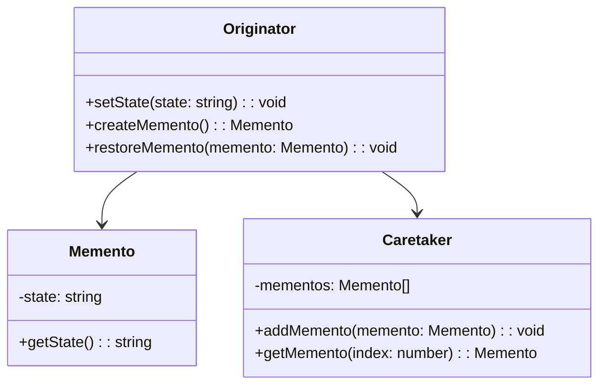

# Memento Design Pattern
> Version: dp_20231231_202019

- [Builder Design Pattern](#builder-design-pattern)
   * [Summary](#summary)
      + [Essence](#essence)
      + [Real examples](#real-examples)
   * [Implementation](#implementation)
      + [How to use it?](#how-to-use-it)
      + [Python code examples:](#python-code-examples)
   * [Analysis](#analysis)
      + [Cleaner Code?](#cleaner-code)
      + [Readable Code?](#readable-code)
      + [Replaceable code?](#replaceable-code)
      + [Testable code?](#testable-code)
      + [Advantages?](#advantages)
      + [Disadvantages?](#disadvantages)
   * [Remarks](#remarks)
      + [Concerns and Tips?](#concerns-and-tips)
      + [Execrises](#execrises)

## Summary

### Essence
The Memento design pattern allows an object to save its internal state and restore it later, without exposing its internal details. It captures and externalizes an object's internal state so that it can be restored without violating encapsulation.

### Real examples

- Undo/Redo functionality in a text editor
- Checkpoints in games
- Transaction management in databases




## Implementation
### How to use it?
To use the Memento design pattern, follow these steps:
1. Create the Originator class, which is the object whose state needs to be saved and restored.
2. Create the Memento class, which represents the saved state of the Originator.
3. Create the Caretaker class, which is responsible for storing and retrieving the Mementos.
4. In the Originator class, implement methods to set the state, create a Memento, and restore the state from a Memento.
5. In the Caretaker class, implement methods to add Mementos and retrieve Mementos by index.

### Python code examples:
```python
class Originator:
    def __init__(self):
        self._state = ''

    def set_state(self, state):
        self._state = state

    def create_memento(self):
        return Memento(self._state)

    def restore_memento(self, memento):
        self._state = memento.get_state()


class Memento:
    def __init__(self, state):
        self._state = state

    def get_state(self):
        return self._state


class Caretaker:
    def __init__(self):
        self._mementos = []

    def add_memento(self, memento):
        self._mementos.append(memento)

    def get_memento(self, index):
        return self._mementos[index]
```
The Python code above demonstrates the implementation of the Memento design pattern. The Originator class represents the object whose state needs to be saved and restored. The Memento class represents the saved state, and the Caretaker class is responsible for storing and retrieving the Mementos.   


## Analysis
### Cleaner Code?
Separates the responsibility of saving and restoring the state from the object itself, allowing the object to focus on its core functionality without being cluttered with state management code.

### Readable Code?
Encapsulates the state of an object in a separate Memento object, making it clear and explicit where the state is being saved and restored.

### Replaceable code?
Separates the responsibility of state management from the object itself, promoting loose coupling between components and making it easier to maintain and modify the code.

### Testable code?
Provides a way to save and restore the state of an object, making it easier to test different states and scenarios.

### Advantages?

- Allows an object to save and restore its internal state without exposing its internal details
- Enables the implementation of undo/redo functionality
- Facilitates the creation of checkpoints in applications
- Simplifies transaction management in databases
- Improves code cleanliness and readability
- Makes code easier to test
- Promotes loose coupling between components

### Disadvantages?

- May increase memory usage if a large number of Mementos need to be stored
- Can introduce additional complexity to the codebase
- Requires careful management of Mementos to avoid memory leaks


## Remarks
### Concerns and Tips?

- Managing Mementos can be tricky, care must be taken to ensure they are stored and retrieved correctly
- Deciding what state to save in the Memento requires consideration of relevant aspects of the object's state


### Execrises

- Q: What is the purpose of the Memento design pattern?

  - A: The purpose of the Memento design pattern is to capture and externalize an object's internal state so that the object can be restored to this state later without violating encapsulation.
- Q: How does the Memento design pattern help in making code clean?

  - A: The Memento design pattern helps in making code clean by separating the responsibility of saving and restoring the state from the object itself. This allows the object to focus on its core functionality without being cluttered with state management code.
- Q: What are some advantages of using the Memento design pattern?

  - A: Some advantages of using the Memento design pattern include providing a way to save and restore state, enabling undo/redo functionality, and improving code cleanliness and readability.
- Q: What are some disadvantages of using the Memento design pattern?

  - A: Some disadvantages of using the Memento design pattern include increased memory usage, potential complexity in the codebase, and the need for careful management of Mementos to avoid memory leaks.
- Q: How can the Memento design pattern be used in practice?

  - A: The Memento design pattern can be used in practice to implement functionality such as undo/redo, checkpoints in games, and transaction management in databases.

