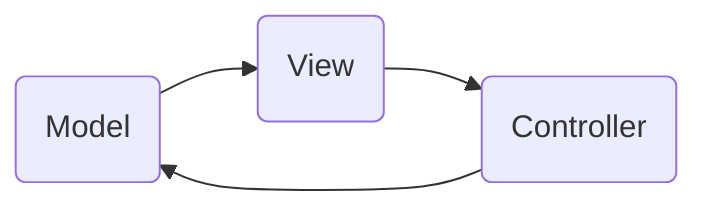

# Model-View-Controller (MVC)
> Version: dp_20231231_202019

- [Builder Design Pattern](#builder-design-pattern)
   * [Summary](#summary)
      + [Essence](#essence)
      + [Real examples](#real-examples)
   * [Implementation](#implementation)
      + [How to use it?](#how-to-use-it)
      + [Python code examples:](#python-code-examples)
   * [Analysis](#analysis)
      + [Cleaner Code?](#cleaner-code)
      + [Readable Code?](#readable-code)
      + [Replaceable code?](#replaceable-code)
      + [Testable code?](#testable-code)
      + [Advantages?](#advantages)
      + [Disadvantages?](#disadvantages)
   * [Remarks](#remarks)
      + [Concerns and Tips?](#concerns-and-tips)
      + [Execrises](#execrises)

## Summary

### Essence
The purpose of the Model-View-Controller (MVC) design pattern is to separate the concerns of data management, user interface, and user interaction in an application. MVC divides an application into three components: Model, View, and Controller. The Model represents the data and business logic, the View displays the user interface, and the Controller handles user input. MVC promotes the separation of concerns, making the codebase easier to understand and maintain. It helps in making the code clean, readable, and easy to test. MVC components are loosely coupled, allowing for independent development and easier maintenance.

### Real examples

- Building web applications with separate components for data management, user interface, and user interaction.
- Developing desktop applications with a clear separation between the data, UI, and user input handling.
- Creating mobile apps with a structured architecture that separates the data, UI, and user interaction logic.




## Implementation
### How to use it?
To use MVC, follow these steps:
1. Identify the data and business logic that make up the Model.
2. Design the user interface components in the View.
3. Implement the Controller to handle user input and update the Model and View accordingly.
4. Connect the Model, View, and Controller components together.

### Python code examples:
```python
1. Example of a Model class in Python:

```python
class User:
    def __init__(self, name, email):
        self.name = name
        self.email = email

    def get_name(self):
        return self.name

    def get_email(self):
        return self.email
```
2. Example of a View class in Python:

```python
class UserView:
    def display_user(self, user):
        print(f'Name: {user.get_name()}')
        print(f'Email: {user.get_email()}')
```
3. Example of a Controller class in Python:

```python
class UserController:
    def __init__(self, user, view):
        self.user = user
        self.view = view

    def update_user(self, name, email):
        self.user.name = name
        self.user.email = email
        self.view.display_user(self.user)

```
   


## Analysis
### Cleaner Code?

- MVC promotes the separation of concerns, making it easier to understand and maintain the codebase.
- By separating the data, UI, and user interaction logic, MVC allows for modular development and easier code reuse.
- The clear separation of responsibilities in MVC leads to cleaner code that is easier to test and debug.

### Readable Code?

- MVC's separation of concerns makes the codebase more readable by organizing the code into distinct components.
- The use of descriptive names for the Model, View, and Controller components improves code readability.
- MVC's modular development approach allows for better code organization and easier navigation.

### Replaceable code?

- MVC promotes loose coupling between the Model, View, and Controller components.
- The Model does not depend on the View or Controller, allowing for independent development and easier maintenance.
- Changes in one component do not affect the others, making it easier to modify or replace individual components.

### Testable code?

- The separation of concerns in MVC makes it easier to write unit tests for each component independently.
- The Model can be tested for data manipulation and business logic, the View can be tested for UI rendering, and the Controller can be tested for user input handling.
- Mocking and stubbing can be used to isolate and test each component in isolation, improving testability.

### Advantages?

- Separation of concerns: MVC separates the data, UI, and user interaction logic, making the codebase easier to understand and maintain.
- Modularity: MVC allows for modular development and code reuse, improving productivity and reducing duplication.
- Testability: The clear separation of responsibilities in MVC makes it easier to write unit tests for each component.
- Scalability: MVC's modular architecture allows for easy scaling and adding new features to the application.

### Disadvantages?

- Complexity: MVC can introduce additional complexity, especially for small applications with simple requirements.
- Learning curve: Developers new to MVC may require time to understand and adapt to the architectural pattern.
- Overhead: MVC can introduce additional overhead in terms of code and development time.
- Tight coupling: Improper implementation of MVC can lead to tight coupling between the components, making the codebase harder to maintain.


## Remarks
### Concerns and Tips?

- Ensuring proper communication and coordination between the Model, View, and Controller components.
- Managing the complexity introduced by the separation of concerns and maintaining a clear overall architecture.
- Avoiding tight coupling between the components to maintain flexibility and ease of maintenance.
- Follow the principles of abstraction and encapsulation to ensure loose coupling between the components.
- Use descriptive names for the Model, View, and Controller components to improve code readability.
- Keep the responsibilities of each component focused and avoid mixing concerns.
- Use design patterns and best practices to implement the MVC architecture effectively.
- Regularly review and refactor the codebase to maintain a clean and maintainable architecture.
- Understanding the responsibilities of each component and ensuring proper communication between them.
- Avoiding tight coupling between the components by following the principles of abstraction and encapsulation.
- Balancing the level of granularity in dividing the application into components to avoid excessive complexity or fragmentation.


### Execrises

- 1. Q: What is the purpose of the Model-View-Controller (MVC) design pattern?
   
  - A: The purpose of MVC is to separate the concerns of data management, user interface, and user interaction in an application.
- 2. Q: How does MVC help in making the code clean and readable?
   
  - A: MVC promotes the separation of concerns, modular development, and descriptive naming, which improve code cleanliness and readability.
- 3. Q: How does MVC facilitate code testing?
   
  - A: MVC's separation of concerns allows for independent testing of each component, making it easier to write unit tests and ensure code quality.
- 4. Q: What are the advantages of using MVC?
   
  - A: MVC offers advantages such as separation of concerns, modularity, testability, and scalability.
- 5. Q: What are the potential disadvantages of MVC?
   
  - A: MVC can introduce complexity, have a learning curve, add overhead, and lead to tight coupling if not implemented properly.
- 6. Q: How can you ensure loose coupling between the Model, View, and Controller components?
   
  - A: By following the principles of abstraction and encapsulation, and avoiding direct dependencies between the components.
- 7. Q: Can you give an example of a real product that uses MVC?
   
  - A: Apple's iTunes application uses MVC to separate the data management, UI rendering, and user interaction logic.
- 8. Q: What are some programming tips for implementing MVC?
   
  - A: Use descriptive names, follow design patterns, regularly review and refactor the codebase, and ensure proper communication between the components.

