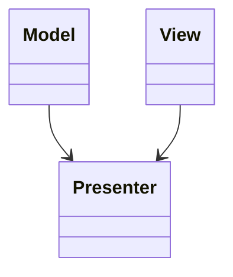

# Model-View-Presenter (MVP)
> Version: dp_20231231_202019

- [Builder Design Pattern](#builder-design-pattern)
   * [Summary](#summary)
      + [Essence](#essence)
      + [Real examples](#real-examples)
   * [Implementation](#implementation)
      + [How to use it?](#how-to-use-it)
      + [Python code examples:](#python-code-examples)
   * [Analysis](#analysis)
      + [Cleaner Code?](#cleaner-code)
      + [Readable Code?](#readable-code)
      + [Replaceable code?](#replaceable-code)
      + [Testable code?](#testable-code)
      + [Advantages?](#advantages)
      + [Disadvantages?](#disadvantages)
   * [Remarks](#remarks)
      + [Concerns and Tips?](#concerns-and-tips)
      + [Execrises](#execrises)

## Summary

### Essence
The Model-View-Presenter (MVP) design pattern separates the presentation logic from the business logic in a software application. It improves code maintainability, testability, and reusability.

### Real examples

- Android development: MVP is commonly used in Android development to separate the business logic from the user interface.
- Web development: MVP can be used in web development frameworks like AngularJS and GWT to separate the presentation logic from the business logic.
- Desktop applications: MVP can be used in desktop applications to improve code maintainability and testability.
- User registration: MVP can be used to separate the user registration logic from the registration form UI.
- Data visualization: MVP can be used to separate the data processing logic from the visualization UI.
- Shopping cart: MVP can be used to separate the shopping cart logic from the shopping cart UI.




## Implementation
### How to use it?
To use MVP, follow these steps:
1. Identify the business logic and data that need to be separated from the user interface.
2. Create a Model class to encapsulate the business logic and data.
3. Create a View class to handle the user interface.
4. Create a Presenter class to act as the intermediary between the Model and the View.
5. Connect the Model, View, and Presenter together.

### Python code examples:
```python
class Model:
    def __init__(self):
        self.data = []

    def add_item(self, item):
        self.data.append(item)


class View:
    def display_items(self, items):
        for item in items:
            print(item)


class Presenter:
    def __init__(self, model, view):
        self.model = model
        self.view = view

    def add_item(self, item):
        self.model.add_item(item)
        self.view.display_items(self.model.data)


model = Model()
view = View()
presenter = Presenter(model, view)
presenter.add_item('Item 1')
presenter.add_item('Item 2')
class Model:
    def __init__(self):
        self.data = []

    def add_item(self, item):
        self.data.append(item)


class View:
    def display_items(self, items):
        for item in items:
            print(item)


class Presenter:
    def __init__(self, model, view):
        self.model = model
        self.view = view

    def add_item(self, item):
        self.model.add_item(item)
        self.view.display_items(self.model.data)


model = Model()
view = View()
presenter = Presenter(model, view)
presenter.add_item('Item 1')
presenter.add_item('Item 2')
```
The Python code example demonstrates the implementation of MVP. The Model class represents the data and business logic, the View class handles the user interface, and the Presenter class acts as the intermediary. The code shows how to add items to the Model and display them in the View.   


## Analysis
### Cleaner Code?
MVP helps in making clean code by separating the presentation logic from the business logic. This separation allows for better code organization and modularity.

### Readable Code?
MVP helps in making the code readable by providing a clear separation of concerns. The Model, View, and Presenter each have their own responsibilities, making it easier to understand and navigate the codebase.

### Replaceable code?
MVP helps in making code replaceable by decoupling the user interface from the business logic. The View and Model are not directly dependent on each other, but are connected through the Presenter. This loose coupling allows for easier maintenance and extensibility of the codebase.

### Testable code?
MVP helps in making the code easy to be tested by separating the business logic from the user interface. The business logic in the Model can be tested independently of the user interface, allowing for more focused and targeted testing. The Presenter can also be tested in isolation by mocking the View and Model dependencies.

### Advantages?

- Separation of concerns: MVP separates the presentation logic from the business logic, making the codebase more maintainable and modular.
- Testability: MVP makes the code easier to test by separating the business logic from the user interface.
- Code reusability: The separation of concerns in MVP allows for the reuse of the business logic and user interface components.
- Scalability: MVP provides a scalable architecture that can handle complex applications and evolving requirements.

### Disadvantages?

- Complexity: Implementing MVP can introduce additional complexity to the codebase, especially for small projects.
- Learning curve: Developers need to understand the concepts and principles of MVP before effectively implementing it.
- Increased development time: Implementing MVP may require more development time compared to other design patterns.
- Over-engineering: MVP may be overkill for simple applications that do not require a separation of concerns.


## Remarks
### Concerns and Tips?

- Concerns: MVP may introduce additional complexity, require a learning curve, increase development time, and may be over-engineered for simple applications.
- Programming tips: Start by identifying the business logic, use interfaces and contracts, test each component independently, keep responsibilities clear, and consider scalability and complexity.
- Trickys: Understanding the responsibilities of each component is crucial, proper communication between components is essential, and avoid over-engineering and unnecessary complexity.
- Escaped studies: None


### Execrises

- Q: What is the purpose of the Model-View-Presenter (MVP) design pattern?

  - A: The purpose of MVP is to separate the presentation logic from the business logic in a software application, improving code maintainability, testability, and reusability.
- Q: How does MVP help in making the code clean?

  - A: MVP helps in making the code clean by separating the presentation logic from the business logic, promoting better code organization and modularity.
- Q: What are the advantages of using MVP?

  - A: Some advantages of using MVP include separation of concerns, testability, code reusability, and scalability.
- Q: What are the disadvantages of using MVP?

  - A: Some disadvantages of using MVP include increased complexity, learning curve, increased development time, and potential over-engineering.
- Q: How does MVP help in making the code easy to be tested?

  - A: MVP helps in making the code easy to be tested by separating the business logic from the user interface, allowing for focused and targeted testing.
- Q: How does MVP help in making components loose coupled?

  - A: MVP helps in making components loose coupled by decoupling the user interface from the business logic, connecting them through the Presenter.
- Q: Can you give an example of a real product that uses MVP?

  - A: Android development commonly uses MVP to separate the business logic from the user interface.
- Q: What are some programming tips for implementing MVP?

  - A: Some programming tips for implementing MVP include starting by identifying the business logic, using interfaces and contracts, testing each component independently, and keeping the responsibilities clear.

