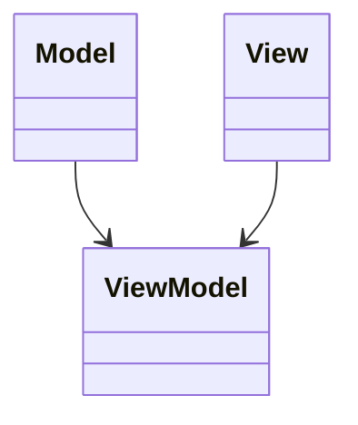

# Model-View-ViewModel (MVVM)
> Version: dp_20231231_202019

- [Builder Design Pattern](#builder-design-pattern)
   * [Summary](#summary)
      + [Essence](#essence)
      + [Real examples](#real-examples)
   * [Implementation](#implementation)
      + [How to use it?](#how-to-use-it)
      + [Python code examples:](#python-code-examples)
   * [Analysis](#analysis)
      + [Cleaner Code?](#cleaner-code)
      + [Readable Code?](#readable-code)
      + [Replaceable code?](#replaceable-code)
      + [Testable code?](#testable-code)
      + [Advantages?](#advantages)
      + [Disadvantages?](#disadvantages)
   * [Remarks](#remarks)
      + [Concerns and Tips?](#concerns-and-tips)
      + [Execrises](#execrises)

## Summary

### Essence
The essence of MVVM is to separate the user interface (View) from the business logic (Model) and provide a mediator (ViewModel) that connects the two. MVVM promotes separation of concerns, making the code clean and maintainable. It also improves testability and code reusability.

### Real examples

- Separating the data and business logic from the user interface.
- Enabling easier unit testing of the business logic.
- Facilitating code reusability by decoupling the components.
- Supporting multiple views for the same data.




## Implementation
### How to use it?
To use MVVM, follow these steps:
1. Define the Model, which represents the data and business logic.
2. Create the View, which represents the user interface.
3. Implement the ViewModel, which acts as a mediator between the Model and View.
4. Connect the View and ViewModel using data binding.
5. Handle user interactions and update the Model through the ViewModel.
6. Update the View based on changes in the Model.

### Python code examples:
```python
1. class Model:
     def __init__(self):
         self.data = ''

2. class View:
     def __init__(self):
         self.controller = None

3. class ViewModel:
     def __init__(self):
         self.model = None
         self.view = None
4. model = Model()
   view = View()
   view.controller = ViewModel()
   view.controller.model = model
   view.controller.view = view
```

- 1. The Model class represents the data and business logic.
- 2. The View class represents the user interface.
- 3. The ViewModel class acts as a mediator between the Model and View.
- 4. The code example demonstrates the initialization and connection of the Model, View, and ViewModel.   


## Analysis
### Cleaner Code?

- MVVM promotes separation of concerns, making it easier to understand and maintain the code.
- The Model encapsulates the data and business logic, ensuring a clean and organized structure.
- The ViewModel handles the interaction between the Model and View, keeping the code clean and focused on the user interface.
- Data binding reduces the need for manual updates, resulting in cleaner and more concise code.

### Readable Code?

- MVVM separates the user interface logic from the business logic, making the code more readable and easier to understand.
- The ViewModel acts as a bridge between the Model and View, providing a clear and organized structure for handling user interactions.
- Data binding simplifies the code by automatically updating the View based on changes in the Model, improving readability.

### Replaceable code?

- MVVM promotes loose coupling between the Model, View, and ViewModel.
- The Model does not depend on the View or ViewModel, making it reusable in different contexts.
- The ViewModel does not depend on the specific implementation of the View, allowing for easier maintenance and updates.
- Data binding provides a decoupled way of updating the View based on changes in the Model, reducing dependencies.

### Testable code?

- MVVM promotes testability by separating the business logic from the user interface.
- The Model can be easily tested in isolation, as it does not depend on the View or ViewModel.
- The ViewModel can be unit tested by mocking the Model and verifying the interactions with it.
- The View can be tested using UI testing frameworks, focusing on the user interface without the need to test the underlying business logic.

### Advantages?

- MVVM promotes separation of concerns, improving code maintainability and reusability.
- MVVM enables testability by allowing the Model and ViewModel to be tested independently.
- MVVM simplifies the code through data binding, automatically updating the View based on changes in the Model.
- MVVM supports code reusability and scalability.
- MVVM allows for multiple views for the same data, making it easier to add new features and screens.

### Disadvantages?

- MVVM may have a learning curve for developers new to the pattern.
- MVVM introduces additional layers of abstraction, increasing code complexity.
- Data binding in MVVM can have a performance impact, especially in large-scale applications.
- MVVM may be overkill for small and simple applications, adding unnecessary complexity.
- It is important to balance code reusability with the risk of over-engineering.


## Remarks
### Concerns and Tips?

- Performance impact of data binding in large-scale applications.
- Complexity introduced by additional layers of abstraction.
- Learning curve for developers new to the MVVM pattern.
- Balancing code reusability with the risk of over-engineering.
- Understand the responsibilities of each component (Model, View, ViewModel) and ensure clear separation of concerns.
- Use data binding judiciously, considering the performance impact and complexity.
- Write unit tests for the Model and ViewModel to ensure proper functionality and testability.
- Consider the size and complexity of the application when deciding whether to adopt MVVM.
- Study existing implementations and best practices to learn from real-world examples.


### Execrises

- 1. Q: What is the purpose of the MVVM design pattern?
   
  - A: The purpose of MVVM is to separate the user interface from the business logic and provide a mediator (ViewModel) that connects the two.
- 2. Q: How does MVVM promote code maintainability?
   
  - A: MVVM promotes code maintainability by separating concerns, allowing for easier understanding and updates.
- 3. Q: How does data binding work in MVVM?
   
  - A: Data binding in MVVM automatically updates the View based on changes in the Model, reducing the need for manual updates.
- 4. Q: What are the advantages of using MVVM?
   
  - A: The advantages of MVVM include separation of concerns, testability, code reusability, and scalability.
- 5. Q: What are the disadvantages of MVVM?
   
  - A: The disadvantages of MVVM include a learning curve, increased complexity, performance impact, and the risk of over-engineering.

